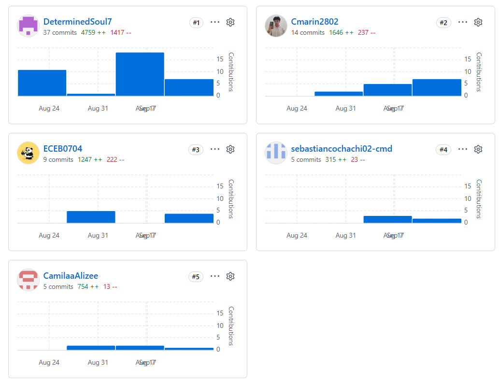

# Project Report Collaboration Insights

El repositorio público del informe se encuentra organizado bajo la organización de GitHub del equipo, siguiendo la
convención de nomenclatura establecida en el enunciado del trabajo final. El informe está redactado en formato
Markdown, con estructura de carpetas por capítulo.
Repositorio del informe:
https://github.com/UPC-RebooTech/FruitLogix-report.git

El repositorio aplica GitFlow como workflow de control de versiones y Conventional Commits para los mensajes de
commit, y Semantic Versioning para cada versión de release.

