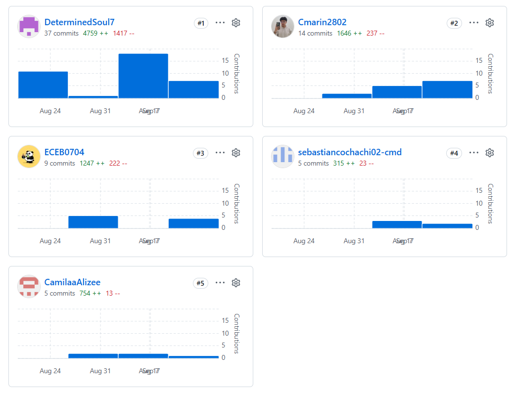

# Project Report Collaboration Insights

El repositorio público del informe se encuentra organizado bajo la organización de GitHub del equipo, siguiendo la
convención de nomenclatura establecida en el enunciado del trabajo final. El informe está redactado en formato
Markdown, con estructura de carpetas por capítulo.

Repositorio del informe:
https://github.com/UPC-RebooTech/FruitLogix-report.git

El repositorio aplica GitFlow como workflow de control de versiones y Conventional Commits para los mensajes de
commit, y Semantic Versioning para cada versión de release.

# AV1: Sprint Review

Durante la elaboración de la entrega AV1, el equipo se organizó trabajando colaborativamente en los dos capítulos
principales del informe, que son el capítulo 1 y el capítulo 2. Se realizaron reuniones de trabajo por Google Meet y
por cada capítulo se creó una rama para trabajar de manera independiente, con el objetivo de que cada integrante del equipo pueda aportar en paralelo a la redacción del informe.
Una vez que se finalizaba un capítulo, se procedía a aplicar los cambios a las ramas develop y main, con el apoyo de la herramienta GitFlow Helper.

| Integrantes | Actividades realizadas en el informe                                                                                                                                                                                                                                    |
| :-- |:------------------------------------------------------------------------------------------------------------------------------------------------------------------------------------------------------------------------------------------------------------------------|
| Bojórquez Bustinza, Renzo Alejandro | Elaboró la Carátula, Registro de Versiones del Informe, Project Report Collaboration Insights, Student Outcome, Objetivos SMART y dirigió a los miembros del grupo para completar los capítulos I y II. Además, puso alto énfasis en la especificación de User Stories. |
| Chavez Bardales, Esteban Eduardo | Colaborador de la propuesta original, se encargó de consolidar bien los contenidos del capítulo I, en particular del Lean UX Process. Asimismo, aportó en gran medida con la definición de las Technical Stories.                                                       |
| Cochachi Chagua, Sebastian Josue | Realizó principalmente el análisis de los segmentos objetivo y de las entrevistas realizadas, para obtener la información necesaria previo a la elaboración de los User Personas. Asimismo, estableció Spike Stories que se considerarán durante los sprints futuros.   |
| Marin Cueva, Cesar Fernando | En el capítulo II, mejoró a detalle el Event Storming del trabajo anterior, identificando los bounded contexts de dicho proyecto y cómo se relacionan entre sí, además de elaborar la extensa documentación.                                                            |
| Otiniano Rosales, Camila Alizeé | Se encargó de mantener el control de proyectos en Jira, así como de mejorar los análisis de competidores y preparar la presentación para la exposición.                                                                                                                 |

# TB1: Sprint Review

Durante el desarrollo de los entregables correspondientes al TB1, el equipo se organizó trabajando colaborativamente en los dos capítulos
asignados para este envío, que son el capítulo 3 y el capítulo 4, así como de la implementación inicial de la Landing Page, Backend y Mobile App.
Nuevamente, se realizaron reuniones de trabajo por Google Meet. El flujo de trabajo para el informe permaneció igual, y para la Mobile App
también se aplicaron ramas, aunque esta vez por cada funcionalidad, de manera que los integrantes puedan trabajar en diferentes Bounded Context sin conflictos a la hora de unir los cambios.
Cuando se finalizaba un feature, al igual que con el informe, se procedía a aplicar los cambios a las ramas develop y main, con el apoyo de la herramienta GitFlow Helper.

| Integrantes | Actividades realizadas en el informe                                                                                                                                                                                                                                                                       |
| :-- |:-----------------------------------------------------------------------------------------------------------------------------------------------------------------------------------------------------------------------------------------------------------------------------------------------------------|
| Bojórquez Bustinza, Renzo Alejandro | Se encargó de la planificación del sprint 1, y coordinó a los miembros del equipo para la asignación de tareas. Mejoró los Landing Page Wireframes y Mockups, y también adaptó la propia Landing Page al contexto de Mobile Applications. Finalmente, se encargó del Bounded Context Infrastructure & IoT. |
| Chavez Bardales, Esteban Eduardo | Tuvo la responsabilidad de desplegar el backend al 70% y de realizar varios mockups para la Mobile Application. Asimismo, tomó el cargo de dos Bounded Context: Fleet Management y Logistics & Monitoring.                                                                                                 |
| Cochachi Chagua, Sebastian Josue | Colaboró con la información de arquitectura de la solución y en elaborar wireframes y mockups para la Mobile Application, y además de diseñar la PPT, trabajó en el Bounded Context Payment Management.                                                                                                    |
| Marin Cueva, Cesar Fernando | Brindó un gran apoyo con la elaboración de wireframes y mockups, así como de los User Flows para el segmento de distribuidor. Se encargó también del Bounded Context Order Management.                                                                                                                     |
| Otiniano Rosales, Camila Alizeé | Fue la principal encargada de registrar los avances realizados para este sprint, tanto mediante control de proyectos en la herramienta Jira como en las documentaciones de sprints del mismo informe. Tomó también dos Bounded Context: Quality Control y Profiles Management.                             |
