### 2.3. Needfinding
#### 2.3.1. User Personas

En esta sección se presentan los User Personas correspondientes a los tres segmentos objetivo de FruitLogix. Estos arquetipos fueron construidos a partir del análisis de entrevistas, los patrones identificados en cada segmento y el análisis de la competencia, considerando principalmente características demográficas, roles dentro de la cadena de suministro, objetivos, motivaciones, frustraciones, canales de comunicación y uso de tecnología.

#### User Persona del 1er segmento objetivo – Clientes Comerciales

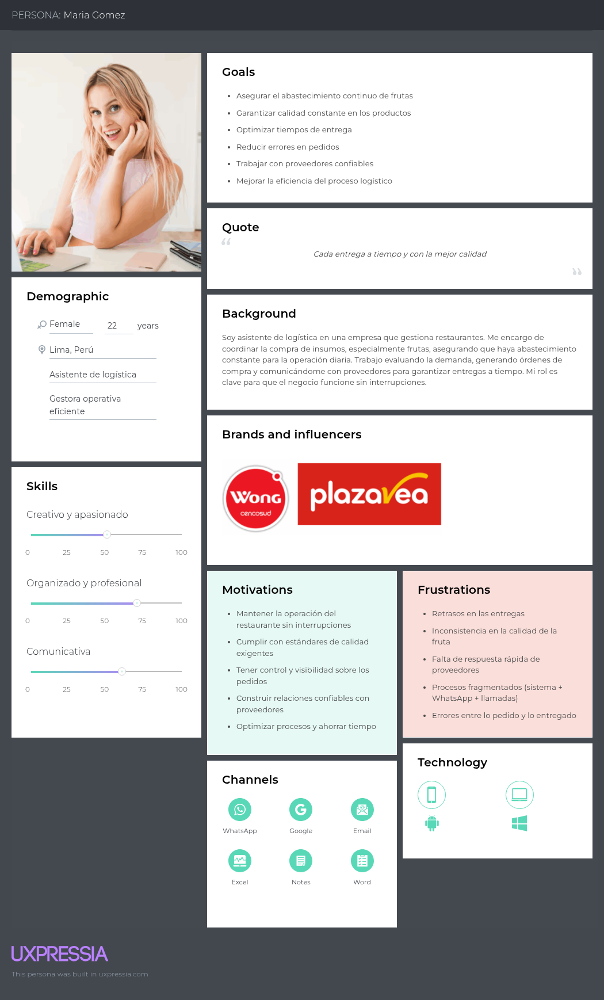

María Gómez representa al segmento de clientes comerciales y fue construida a partir de las entrevistas realizadas a Bianzel Noriega, Luciana Breña y Rosa Arana Medina. Se definió como una mujer de 22 años, ubicada en Lima y vinculada al área de logística, representando a responsables del abastecimiento de frutas en negocios del rubro gastronómico y comercial. Sus principales objetivos se centran en asegurar el abastecimiento continuo, garantizar la calidad constante de los productos, reducir errores en los pedidos y optimizar los tiempos de entrega, aspectos que coinciden con lo expresado por las entrevistadas en relación con la importancia de la puntualidad, la calidad y la confiabilidad de los proveedores. Sus frustraciones reflejan problemas frecuentes en este segmento, como retrasos en las entregas, inconsistencia en la calidad de la fruta, baja capacidad de respuesta de los proveedores y procesos fragmentados entre distintos medios de comunicación y registro. Asimismo, sus canales de interacción y herramientas tecnológicas representan el uso combinado de medios como WhatsApp, correo electrónico, notas y herramientas ofimáticas básicas, lo cual evidencia una gestión operativa todavía poco integrada.

#### User Persona del 2do segmento objetivo – Productores

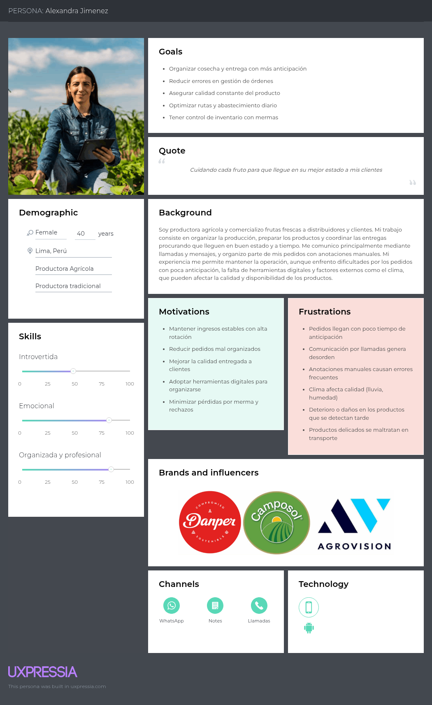

Alexandra Jiménez representa al segmento de productores agrícolas y fue construida a partir de las entrevistas realizadas a Renato Navarro, Karen Forcelledo y Jessica. Se definió como una mujer de 40 años, ubicada en Lima, que refleja el perfil de productores que organizan su operación mediante medios tradicionales y una comunicación directa con distribuidores y clientes. Sus objetivos principales son organizar la producción y las entregas con mayor anticipación, reducir errores en la gestión de órdenes, asegurar la calidad constante del producto y mantener un mejor control del inventario y las mermas. Sus motivaciones y frustraciones reflejan patrones recurrentes del segmento, como los pedidos con poca anticipación, el uso de anotaciones manuales, la dependencia de llamadas o mensajes, el impacto del clima en la calidad y disponibilidad del producto, y las pérdidas ocasionadas por mermas, rechazos o problemas en el transporte. Se incluyeron como referentes del sector marcas como Danper, Camposol y Agrovision, por su asociación con estándares de calidad y producción agrícola. Finalmente, sus canales y tecnología muestran un perfil con uso de herramientas móviles y medios informales de comunicación, sin una solución digital integrada para la gestión de sus procesos.

#### User Persona del 3er segmento objetivo - Distribuidores de Frutas

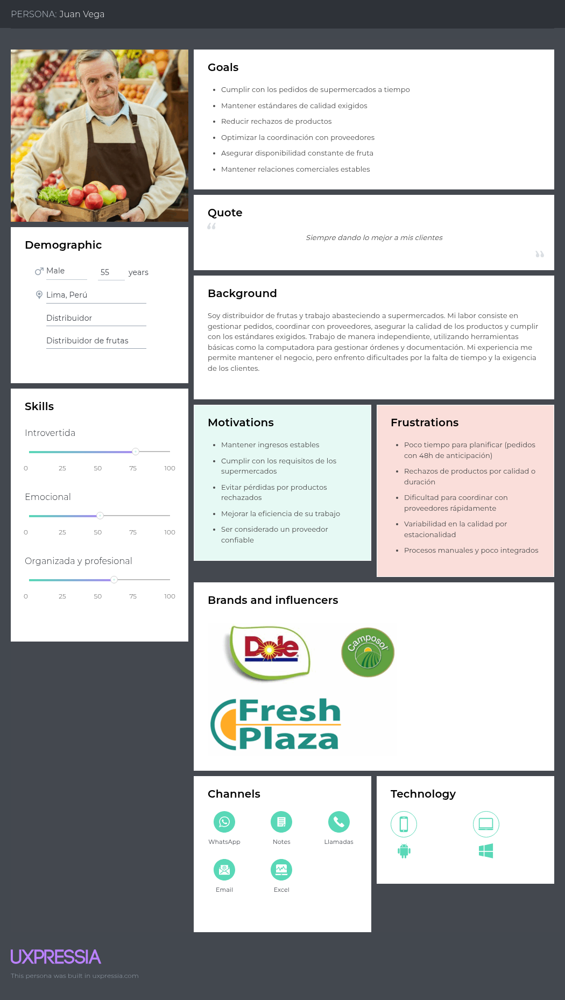

Juan Vega representa al segmento de distribuidores de frutas y fue construido a partir de las entrevistas realizadas a Jorge Contreras, Paola Jiménez y Edwin Lozano. Se definió como un hombre de 55 años, ubicado en Lima, que representa a distribuidores con experiencia en la gestión de pedidos, coordinación con proveedores y abastecimiento a clientes comerciales. Sus objetivos principales se enfocan en cumplir los pedidos a tiempo, mantener los estándares de calidad exigidos, reducir rechazos, asegurar la disponibilidad constante del producto y mejorar la coordinación con sus proveedores. Sus frustraciones reflejan problemas frecuentes del segmento, como la poca anticipación de algunos pedidos, la variabilidad del stock, la exigencia de calidad, las dificultades para coordinar rápidamente con proveedores y el uso de procesos manuales o poco integrados. Asimismo, sus canales y herramientas tecnológicas representan el uso combinado de llamadas, WhatsApp, correo electrónico, notas y herramientas ofimáticas básicas, lo cual evidencia una operación funcional, pero todavía fragmentada. Finalmente, se consideraron marcas como Dole, Camposol y Fresh Plaza como referentes del sector vinculados a estándares de calidad y comercialización.

#### 2.3.2. User Task Matrix

El User Task Matrix permite comparar las principales tareas que realizan los User Personas de FruitLogix dentro de la cadena de suministro de frutas, independientemente de la existencia de la solución. Para este análisis se consideran Alexandra Jiménez, representante de los productores agrícolas; Juan Vega, representante de los distribuidores de frutas; y María Gómez, representante de los clientes comerciales. Para cada tarea se evalúa su frecuencia de realización y su importancia dentro de las actividades habituales de cada User Persona.

## Tasks vs User Personas
| Tasks | Alexandra Jiménez (Frecuencia) | Alexandra Jiménez (Importancia) | Juan Vega (Frecuencia) | Juan Vega (Importancia) |
|---|---|---|---|---|
| Producir y preparar fruta | Muy frecuente | Alta | No aplica | No aplica |
| Buscar compradores | Frecuente | Alta | Frecuente | Alta |
| Buscar y evaluar proveedores | No aplica | No aplica | Frecuente | Alta |
| Evaluar demanda | Frecuente | Media | Frecuente | Alta |
| Gestionar pedidos de clientes | Frecuente | Alta | Muy frecuente | Alta |
| Realizar pedidos a proveedores | No aplica | No aplica | Frecuente | Alta |
| Coordinar entregas | Frecuente | Alta | Muy frecuente | Alta |
| Comunicarse con otros actores de la cadena | Frecuente | Media | Muy frecuente | Alta |
| Verificar la calidad del producto | Muy frecuente | Alta | Muy frecuente | Alta |
| Cumplir o verificar estándares y requisitos | Muy frecuente | Alta | Muy frecuente | Alta |
| Gestionar documentación | Ocasional | Media | Frecuente | Alta |
| Resolver problemas de pedidos, rechazos o retrasos | Ocasional | Media | Frecuente | Alta |
| Gestionar devoluciones | Ocasional | Media | Frecuente | Alta |
| Planificar producción o abastecimiento | Frecuente | Alta | Frecuente | Alta |

| Tasks | María Gómez (Frecuencia) | María Gómez (Importancia) |
|---|---|---|
| Producir y preparar fruta | No aplica | No aplica |
| Buscar compradores | No aplica | No aplica |
| Buscar y evaluar proveedores | Frecuente | Alta |
| Evaluar demanda | Frecuente | Alta |
| Gestionar pedidos de clientes | No aplica | No aplica |
| Realizar pedidos a proveedores | Muy frecuente | Alta |
| Coordinar entregas | Muy frecuente | Alta |
| Comunicarse con otros actores de la cadena | Muy frecuente | Alta |
| Verificar la calidad del producto | Muy frecuente | Alta |
| Cumplir o verificar estándares y requisitos | Muy frecuente | Alta |
| Gestionar documentación | Frecuente | Media |
| Resolver problemas de pedidos, rechazos o retrasos | Frecuente | Alta |
| Gestionar devoluciones | Ocasional | Media |
| Planificar producción o abastecimiento | Frecuente | Alta |

La matriz evidencia que las tres User Personas coinciden en otorgar una alta importancia a la verificación de la calidad, la coordinación de entregas y el cumplimiento de estándares o requisitos. Sin embargo, la frecuencia de sus actividades varía según el rol que desempeñan dentro de la cadena de suministro. Alexandra Jiménez concentra sus tareas en la producción, preparación y control de calidad de la fruta, además de la planificación de la producción. Juan Vega presenta una mayor frecuencia en la gestión de pedidos, coordinación con proveedores y entregas, debido a su función como intermediario entre productores y clientes comerciales. Por su parte, María Gómez se enfoca principalmente en evaluar la demanda, realizar pedidos a proveedores, verificar la calidad de los productos recibidos y asegurar la continuidad del abastecimiento. Estas diferencias reflejan que, aunque los tres actores comparten objetivos relacionados con calidad y cumplimiento, cada uno participa en etapas distintas del proceso de abastecimiento.

#### 2.3.3. User Journey Mapping

El User Journey Mapping permite representar de manera estructurada la experiencia actual de los User Personas durante las principales actividades que realizan dentro de la cadena de suministro de frutas. Se elaboraron tres User Journey Maps en su versión As-Is, uno para cada segmento objetivo. Estos mapas permiten identificar los objetivos de los usuarios, sus puntos de contacto, los problemas que enfrentan, los cambios en su experiencia y las principales oportunidades de mejora encontradas a partir de las entrevistas.

Los recorridos abarcan, para el cliente comercial, desde la planificación del abastecimiento hasta la resolución de incidencias; para el productor, desde la planificación de la producción hasta la gestión de pérdidas e incidencias; y para el distribuidor, desde la recepción del pedido hasta la resolución de rechazos o problemas en la entrega.

#### User Journey Map del 1er segmento objetivo – Clientes Comerciales
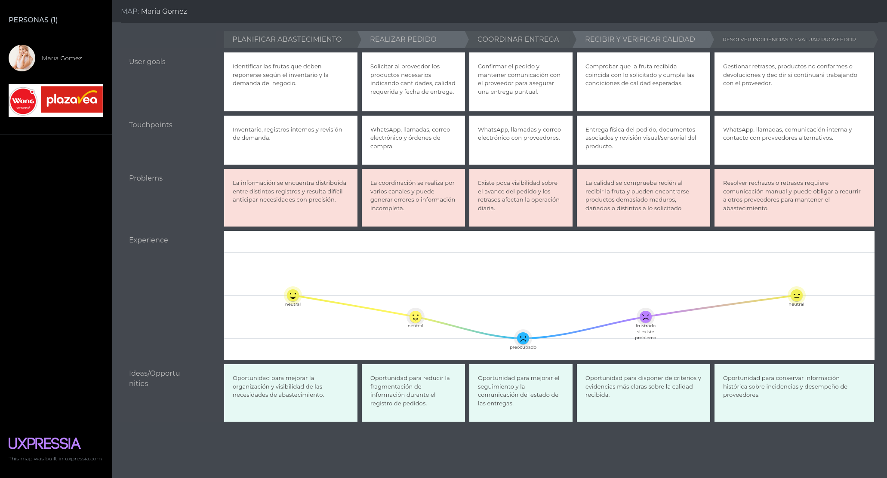
El User Journey Map de María Gómez representa el proceso actual de abastecimiento realizado por los clientes comerciales. El recorrido comienza con la planificación del abastecimiento, donde se revisan el inventario y la demanda del negocio para identificar los productos que deben reponerse. Posteriormente, María realiza el pedido utilizando canales como WhatsApp, llamadas, correo electrónico u órdenes de compra, enfrentándose a una gestión distribuida entre distintos medios. Durante la coordinación de la entrega, la limitada visibilidad sobre el avance del pedido puede generar preocupación debido al impacto que tendría un retraso en la operación diaria. Al recibir el producto, verifica visual y sensorialmente que la fruta coincida con lo solicitado y cumpla con las condiciones de calidad esperadas. Finalmente, cuando se presentan retrasos, productos no conformes o devoluciones, debe coordinar manualmente con el proveedor o recurrir a proveedores alternativos. Este recorrido permite identificar oportunidades relacionadas con una mejor organización del abastecimiento, seguimiento de entregas, control de calidad y registro histórico de incidencias.

#### User Journey Map del 2do segmento objetivo – Productores
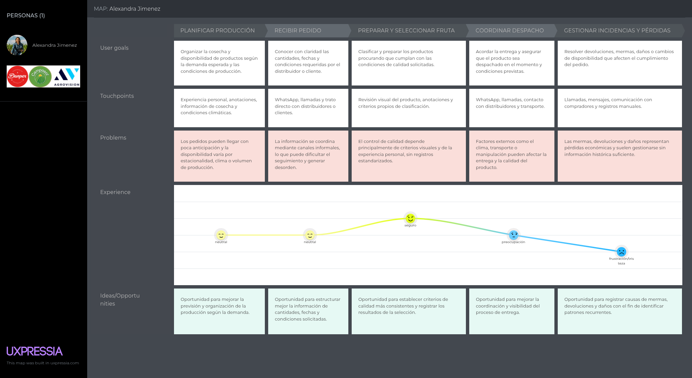
El User Journey Map de Alexandra Jiménez representa las actividades actuales de un productor agrícola desde la planificación de la producción hasta la gestión de incidencias y pérdidas. El proceso comienza organizando la cosecha y la disponibilidad de productos de acuerdo con la demanda esperada y las condiciones de producción. Posteriormente, recibe pedidos principalmente mediante llamadas, WhatsApp o trato directo, por lo que la información sobre cantidades, fechas y condiciones solicitadas puede encontrarse poco estructurada. Durante la preparación y selección de la fruta, el control de calidad depende principalmente de la revisión visual, la experiencia personal y criterios propios de clasificación. Luego, Alexandra coordina el despacho con distribuidores y transportistas, etapa en la que factores externos como el clima, la manipulación o el transporte pueden afectar el cumplimiento y la calidad del producto. Finalmente, las mermas, devoluciones, daños o cambios en la disponibilidad representan pérdidas económicas que suelen gestionarse sin suficiente información histórica. A partir de este recorrido se identifican oportunidades para mejorar la planificación, estructuración de pedidos, consistencia del control de calidad, coordinación del despacho y registro de pérdidas e incidencias.

#### User Journey Map del 3er segmento objetivo - Distribuidores de Frutas
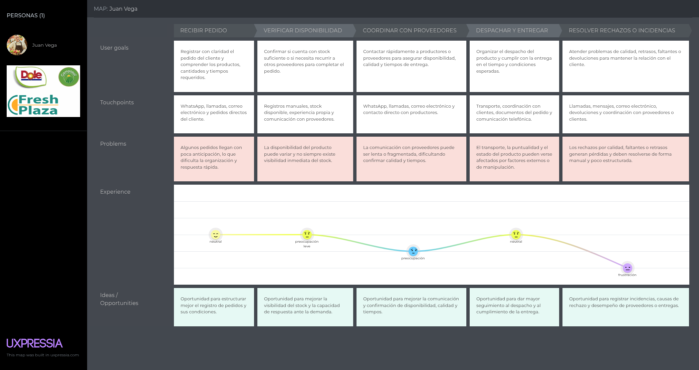
El User Journey Map de Juan Vega representa el proceso actual de los distribuidores de frutas desde la recepción de un pedido hasta la resolución de posibles rechazos o incidencias. El recorrido comienza cuando Juan recibe los requerimientos del cliente mediante canales como WhatsApp, llamadas, correo electrónico u otros medios directos. Después verifica la disponibilidad de los productos utilizando registros existentes, su experiencia y la comunicación con proveedores, enfrentándose a una disponibilidad variable y a una limitada visibilidad inmediata del stock. Cuando necesita completar un pedido, coordina directamente con productores o proveedores para confirmar disponibilidad, calidad y tiempos, lo que puede resultar lento debido a la fragmentación de la comunicación. Posteriormente organiza el despacho y la entrega, procurando cumplir con los tiempos y condiciones acordadas, aunque el transporte y la manipulación pueden afectar el estado del producto. Finalmente, si se presentan rechazos, faltantes, retrasos o problemas de calidad, debe resolverlos mediante comunicaciones y coordinaciones manuales con clientes y proveedores. Este recorrido evidencia oportunidades para mejorar el registro de pedidos, la visibilidad de disponibilidad, la coordinación entre actores, el seguimiento de entregas y el registro de incidencias.

#### 2.3.4. Empathy Mapping

El Empathy Mapping permite profundizar en la experiencia de los User Personas considerando no solo las actividades que realizan, sino también sus percepciones, preocupaciones, necesidades y expectativas dentro de su contexto actual. Se elaboró un Empathy Map para cada segmento objetivo a partir de los patrones identificados en las entrevistas y su análisis. Cada mapa considera a quién se busca comprender, qué necesita hacer, qué observa, qué escucha, qué dice y hace, qué piensa y siente, además de sus principales Pains y Gains.

**Empathy Mapping del 1er segmento objetivo – Clientes Comerciales** 

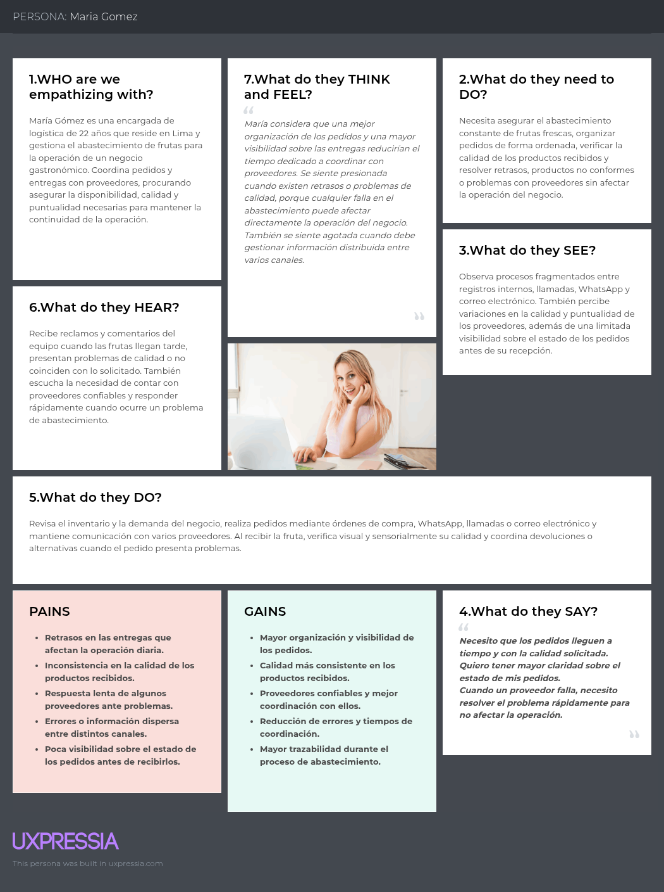

El Empathy Map de María Gómez representa la experiencia de una encargada de logística responsable del abastecimiento de frutas para la operación de un negocio gastronómico. María necesita organizar los pedidos, asegurar la disponibilidad de productos y verificar que la calidad y puntualidad de las entregas cumplan con lo esperado. En su entorno observa información distribuida entre distintos registros y canales de comunicación, además de variaciones en la calidad y cumplimiento de los proveedores. Durante su trabajo revisa la demanda y el inventario, realiza pedidos mediante órdenes de compra, WhatsApp, llamadas o correo electrónico y verifica visual y sensorialmente la fruta al momento de recibirla. Los retrasos, productos no conformes, poca visibilidad del estado de los pedidos y respuestas tardías de proveedores generan presión porque pueden afectar directamente la continuidad de la operación. Por ello, sus principales expectativas se relacionan con una mayor organización y visibilidad de los pedidos, una calidad más consistente, mejor coordinación con proveedores y reducción de errores durante el abastecimiento.

**Empathy Map del 2do segmento objetivo – Productores**

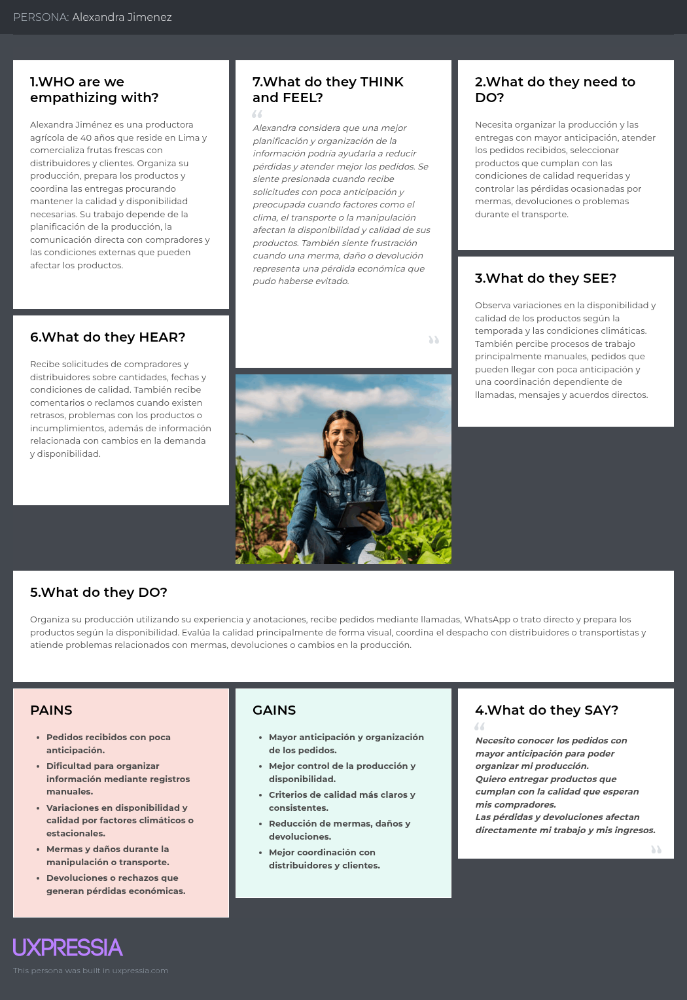

El Empathy Map de Alexandra Jiménez representa la experiencia de una productora agrícola que organiza su producción y comercializa frutas frescas a distribuidores y clientes. Alexandra necesita planificar la producción y las entregas con mayor anticipación, atender los pedidos recibidos, seleccionar productos que cumplan con las condiciones de calidad requeridas y controlar las pérdidas asociadas a mermas, devoluciones o problemas durante el transporte. Su operación se apoya principalmente en la experiencia, anotaciones y medios de comunicación directa como llamadas y WhatsApp. También enfrenta variaciones en la disponibilidad y calidad de los productos debido a la estacionalidad, el clima y otros factores externos. Estas condiciones generan preocupación cuando los pedidos llegan con poca anticipación y frustración cuando los daños, mermas o devoluciones producen pérdidas económicas. Sus principales expectativas se concentran en una mejor planificación de los pedidos, mayor control de la producción y disponibilidad, criterios de calidad más consistentes, reducción de pérdidas y una mejor coordinación con distribuidores y clientes.

**Empathy Map del 3er segmento objetivo - Distribuidores de Frutas**

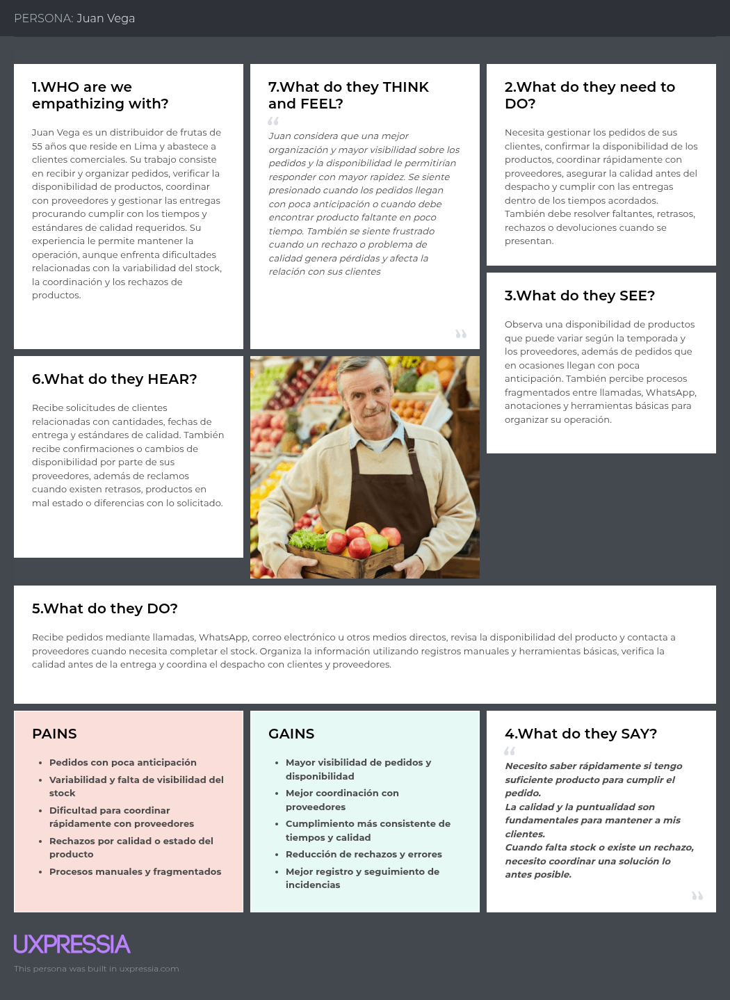

El Empathy Map de Juan Vega representa la experiencia de un distribuidor encargado de recibir pedidos, verificar disponibilidad, coordinar con proveedores y gestionar entregas a clientes comerciales. Juan necesita responder a los requerimientos de sus clientes dentro de los tiempos acordados, asegurar la calidad de los productos y encontrar alternativas cuando el stock disponible no es suficiente. Para desarrollar estas actividades combina llamadas, WhatsApp, correo electrónico, registros manuales y otras herramientas básicas, manteniendo comunicación constante con proveedores y clientes. La variabilidad del stock, los pedidos con poca anticipación, la coordinación fragmentada y los posibles rechazos por problemas de calidad generan presión y dificultan la organización de su operación. Además, cuando se presenta un faltante, retraso o rechazo, debe coordinar una solución rápidamente para evitar pérdidas y mantener la relación comercial. Sus principales expectativas se relacionan con una mayor visibilidad de pedidos y disponibilidad, mejor coordinación con proveedores, cumplimiento más consistente de tiempos y calidad, reducción de rechazos y un mejor seguimiento de las incidencias.

#### 2.3.5. Big Picture EventStorming

### Introducción y Proceso:

Como primera aproximación al dominio de negocio de FruitLogix, el equipo realizó una sesión de Big Picture EventStorming con el objetivo de comprender de manera visual y colaborativa los principales eventos que ocurren dentro de la cadena de suministro de frutas. Esta técnica permitió explorar procesos relacionados con el registro y participación de los distintos actores, la gestión de pedidos, el abastecimiento de productos, el control de calidad, la gestión de recursos logísticos y el proceso de entrega.

Durante la sesión se trabajó inicialmente con eventos de dominio representados mediante notas naranjas. Posteriormente, estos eventos fueron organizados cronológicamente en líneas de tiempo y complementados con los actores involucrados en cada proceso. Finalmente, se incorporaron Hotspots para identificar dudas, riesgos y puntos críticos que requieren mayor análisis.

### Resultados y Hallazgos:

A través del Big Picture EventStorming se identificaron los siguientes elementos relevantes:

* **Eventos de Dominio (Naranja):** Se identificaron eventos relacionados con diferentes momentos del dominio, como User Registration Initiated, Distributor Profile Completed, Registered Order, Producer Assigned to Order, Fruit Supplied, Quality Verified, Order Dispatched, Shipment In Transit y Shipment Successfully Delivered.

* **Actores del Dominio (Amarillo):** Se identificaron actores que participan en los distintos procesos, principalmente Commercial Client, Distributor, Producer y Driver, permitiendo visualizar en qué momentos interviene cada uno dentro de la cadena.

* **Flujos Principales:** La organización cronológica permitió distinguir procesos relacionados con el registro y configuración de usuarios y recursos logísticos, así como un flujo operativo principal que conecta la gestión del pedido con el abastecimiento, control de calidad, despacho y entrega.

* **Hotspots (Rosado):** Se identificaron puntos que requieren mayor atención, como la disponibilidad insuficiente para completar pedidos, la consistencia de los criterios de calidad entre actores, la disponibilidad de recursos para realizar entregas, los retrasos o incidentes durante el transporte y los posibles rechazos del cliente al momento de recibir el producto.

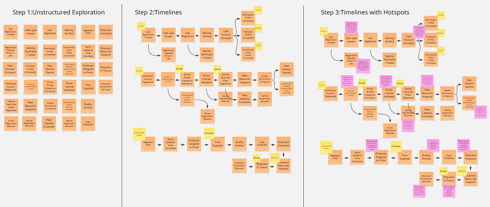

### Paso 1: Exploración Desestructurada (Unstructured Exploration)

Esta fase inicial consistió en una sesión de "lluvia de ideas" para identificar Eventos de Dominio significativos dentro del dominio de FruitLogix. El equipo inició con eventos relacionados con perfiles y gestión de flota, incorporando posteriormente eventos vinculados con los procesos principales de pedidos, abastecimiento, calidad y distribución.

* **Incorporación de Usuarios:** Eventos como `User Registration Initiated`, `Identity Verified` y `User Account Activated`.
* **Completitud de Perfiles Específicos:** Hitos como `Distributor Profile Completed`, `Producer Profile Completed` y `Commercial Client Profile Completed`.
* **Gestión de Flota:** Eventos críticos para la cadena logística, incluyendo `Driver License Validated`, `Vehicle Technical Sheet Registered` y `Fleet Resource Assigned`.
* **Manejo de Excepciones:** Identificación preliminar de estados de falla como `Driver Registration Rejected` y `Vehicle Maintenance Required`.

Además de los eventos relacionados con registro, perfiles y gestión de flota, se incorporaron eventos correspondientes al flujo central del negocio, tales como `Registered Order`, `Items Added & Total Calculated`, `Producer Assigned to Order`, `Fruit Supplied`, `Quality Verified`, `Order Dispatched`, `Shipment Initialized`, `Shipment Resources Assigned`, `Shipment In Transit` y `Shipment Successfully Delivered`.

Esta exploración permitió ampliar la representación inicial del dominio y considerar tanto los procesos de soporte necesarios para la operación como los eventos relacionados directamente con pedidos, calidad y distribución.

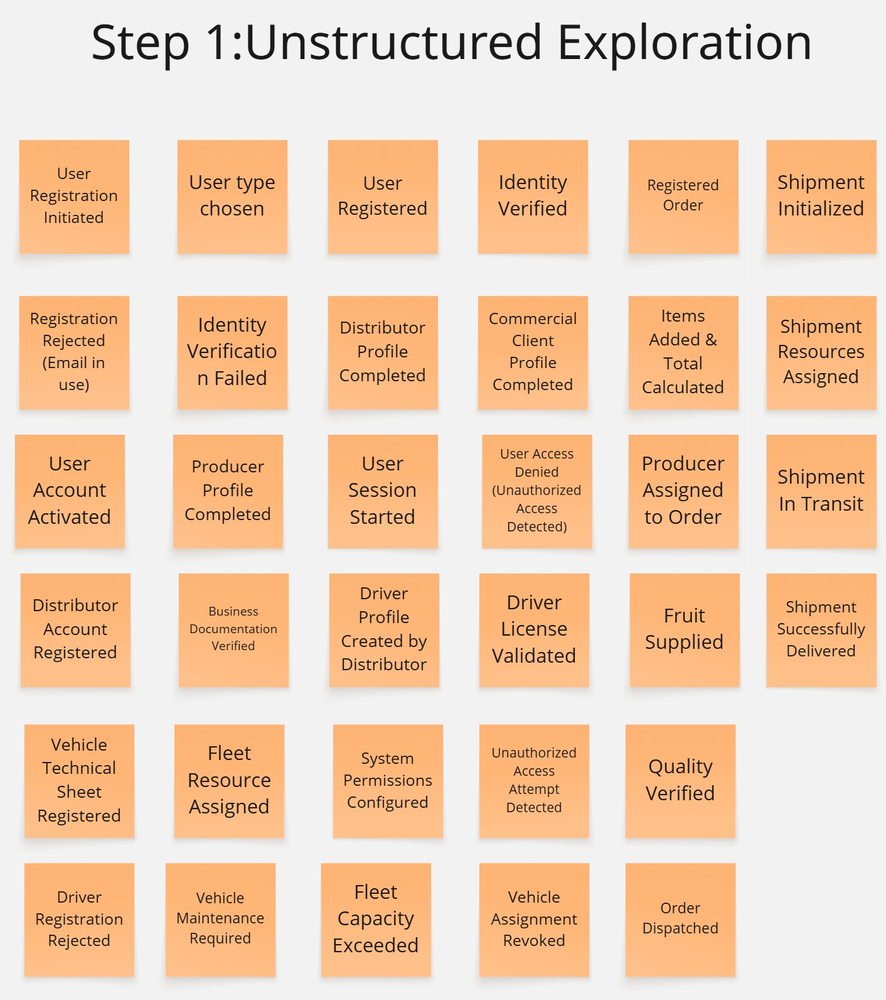

### Paso 2: Líneas de Tiempo (Timelines)

En este paso, los eventos desestructurados se organizaron en un flujo cronológico para definir el **Happy Path** (camino ideal) y las ramas principales.

* **Lógica Secuencial:** La línea de tiempo establece una dependencia clara donde la elección del tipo de usuario (*User type chosen*) conduce a la completitud de perfiles específicos para Distribuidores, Productores o Clientes Comerciales.
* **Prerrequisitos Operativos:** Para el segmento logístico, se ilustra que el registro de la cuenta del distribuidor (*Distributor Account Registered*) debe preceder a la creación de perfiles de conductores y al registro de vehículos.
* **Acceso al Sistema:** El flujo culmina en un inicio de sesión exitoso (*User Session Started*) o en una denegación de acceso por motivos de seguridad (*User Access Denied*).

Asimismo, se estructuró el flujo operativo principal de la cadena de suministro. Este comienza con `Registered Order`, cuando el cliente comercial genera un pedido, y continúa con `Items Added & Total Calculated`. Posteriormente, el distribuidor participa en `Producer Assigned to Order`, tras lo cual el productor abastece los productos mediante `Fruit Supplied`. Luego se realiza `Quality Verified` y el pedido avanza hacia `Order Dispatched`.

A partir del despacho se inicia el proceso logístico mediante `Shipment Initialized`. El distribuidor participa en la asignación de los recursos necesarios en `Shipment Resources Assigned`, mientras que el conductor interviene durante `Shipment In Transit`. Finalmente, el recorrido culmina con `Shipment Successfully Delivered`.

La incorporación de actores como `Commercial Client`, `Distributor`, `Producer` y `Driver` permitió relacionar cada parte del timeline con los roles que participan en el proceso y comprender con mayor claridad la interacción entre ellos.

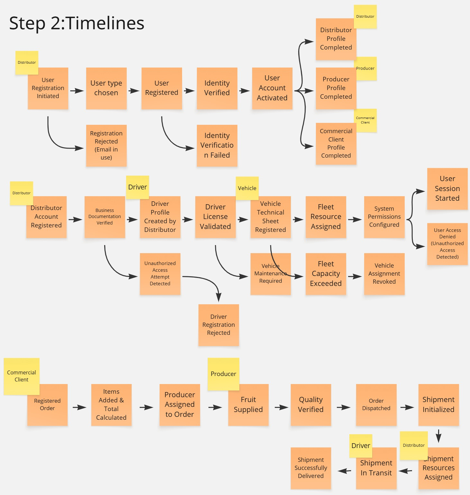

### Paso 3: Líneas de Tiempo con Puntos Críticos (Timelines with Hotspots)

El refinamiento final de la línea de tiempo incorpora **Hotspots** (representados en rosado), que identifican "puntos de dolor", riesgos o aspectos del dominio que requieren mayor análisis y discusión. Las observaciones clave incluyen:

* **Cuellos de Botella en Verificación:** Se identifica que la validación manual de la documentación empresarial es actualmente demasiado lenta.
* **Riesgos de Integridad de Datos:** Se señala la falta de una conexión API en tiempo real con bases de datos gubernamentales para la verificación de identidad y licencias.
* **Fricción Operativa y de UX:** Se resalta la confusión durante la selección del rol (*User type chosen*) y la dificultad para resolver conflictos entre productores y distribuidores respecto a los tiempos de llegada debido a la falta de registros de auditoría.
* **Limitaciones Técnicas:** Se aborda la falta de alertas automatizadas para las fichas técnicas de vehículos que vencen, lo que puede provocar eventos abruptos de revocación de asignación de vehículos (*Vehicle Assignment Revoked*).

En los procesos de registro, perfiles y flota se conservaron puntos críticos relacionados con la selección de roles, validación de documentación, coordinación entre actores y disponibilidad de recursos. A estos hallazgos se añadieron Hotspots asociados al flujo principal de negocio:

* **Disponibilidad de productos:** Se planteó qué ocurre cuando no existe suficiente stock para completar un pedido antes de asignarlo a un productor.
* **Consistencia en la calidad:** Se identificó la necesidad de determinar cómo asegurar que los diferentes actores compartan criterios de calidad consistentes.
* **Disponibilidad logística:** Se señaló la incertidumbre sobre qué ocurre cuando no existen recursos disponibles para realizar una entrega.
* **Incidentes durante el transporte:** Se consideró cómo deben gestionarse posibles retrasos o incidentes mientras el envío se encuentra en tránsito.
* **Rechazos en la entrega:** Se planteó qué ocurre cuando el cliente comercial detecta problemas de calidad o decide rechazar la entrega.

Estos Hotspots permiten hacer visibles situaciones críticas dentro de la cadena de suministro y constituyen puntos de discusión que podrán ser refinados en las siguientes etapas de análisis y diseño del dominio.

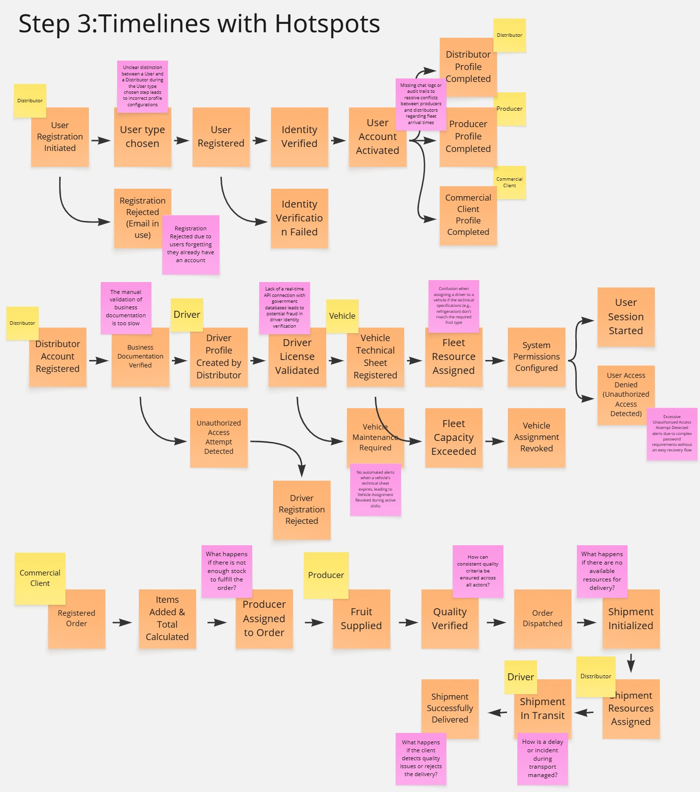

#### 2.3.6. Ubiquitous Language

El *Ubiquitous Language* define un conjunto de términos y conceptos compartidos entre los miembros del equipo y los stakeholders del dominio de negocio de FruitLogix. Su propósito es reducir ambigüedades y mantener una comunicación consistente al referirse a los actores, procesos y elementos que forman parte de la cadena de suministro de frutas.

A continuación, se presenta el glosario de términos clave utilizado dentro del dominio de FruitLogix.

---

## Glosario de términos

**Order (Pedido):**  
Solicitud realizada por un cliente comercial a un distribuidor para adquirir una cantidad específica de frutas bajo determinadas condiciones de cantidad, calidad y entrega.

**Order Item (Ítem de pedido):**  
Producto específico incluido dentro de un pedido, junto con la cantidad y las condiciones requeridas para su abastecimiento.

**Order Management (Gestión de pedidos):**  
Proceso de registro, organización, seguimiento y actualización de los pedidos dentro de la cadena de suministro.

**Supplier (Proveedor):**  
Actor que abastece productos al distribuidor para atender los pedidos. Puede tratarse de un productor agrícola u otro proveedor disponible.

**Producer (Productor):**  
Persona o entidad encargada de producir, cosechar, preparar y abastecer frutas para su posterior distribución.

**Distributor (Distribuidor):**  
Actor responsable de recibir y gestionar pedidos, coordinar con productores o proveedores y organizar el abastecimiento y entrega de los productos al cliente comercial.

**Commercial Client (Cliente Comercial):**  
Empresa o negocio que adquiere frutas para abastecer su operación, como restaurantes, juguerías, comercios u otros establecimientos del rubro alimentario.

**Driver (Conductor):**  
Persona responsable de realizar el traslado de los productos durante una entrega asignada.

**Vehicle (Vehículo):**  
Medio de transporte utilizado para movilizar los productos desde el punto de despacho hasta el destino correspondiente.

**Fleet (Flota):**  
Conjunto de vehículos y recursos de transporte disponibles para realizar las operaciones de distribución y entrega.

**Inventory (Inventario):**  
Cantidad de productos disponibles para su venta, abastecimiento o distribución en un momento determinado.

**Stock Availability (Disponibilidad de stock):**  
Capacidad de un productor, proveedor o distribuidor para cubrir las cantidades requeridas en un pedido con los productos disponibles.

**Batch (Lote):**  
Conjunto de frutas agrupadas que comparten un origen o características determinadas y que son gestionadas como una unidad durante los procesos de calidad y distribución.

**Quality Control (Control de calidad):**  
Proceso mediante el cual se revisan las características y condiciones de los productos con el propósito de determinar si cumplen con los estándares establecidos.

**Quality Verification (Verificación de calidad):**  
Comprobación realizada sobre un producto o lote para confirmar que cumple con los criterios de calidad requeridos antes de continuar con su distribución o entrega.

**Quality Standards (Estándares de calidad):**  
Criterios utilizados para determinar si las características de las frutas, como estado, tamaño, color o madurez, cumplen con las condiciones requeridas.

**Dispatch (Despacho):**  
Proceso mediante el cual un pedido preparado es autorizado y dispuesto para iniciar su traslado hacia el cliente.

**Shipment (Envío):**  
Conjunto de productos asociados a un pedido que se encuentran dentro de un proceso de transporte desde su punto de despacho hasta el destino.

**Delivery (Entrega):**  
Proceso mediante el cual el pedido es trasladado y finalmente recibido por el cliente comercial.

**Delivery Status (Estado de entrega):**  
Condición en la que se encuentra una entrega durante su recorrido, por ejemplo, pendiente, en preparación, en tránsito o entregada.

**Preparation Time (Tiempo de preparación):**  
Tiempo necesario para preparar un pedido desde que comienza su atención hasta que se encuentra listo para ser despachado.

**Traceability (Trazabilidad):**  
Capacidad de seguir el recorrido y antecedentes de un producto o lote desde su origen hasta su entrega al cliente.

**Rejection (Rechazo):**  
Situación en la que un pedido, producto o lote no es aceptado debido al incumplimiento de las condiciones o estándares requeridos.

**Incident (Incidencia):**  
Situación no prevista que afecta el desarrollo normal de un pedido, despacho o entrega, como un retraso, daño en el producto o inconveniente durante el transporte.

**Supply Chain (Cadena de suministro):**  
Conjunto de actores, actividades y procesos involucrados desde la producción y abastecimiento de las frutas hasta su distribución y entrega al cliente comercial.

**Order Fulfillment (Cumplimiento de pedido):**  
Proceso completo mediante el cual un pedido es atendido desde su recepción hasta que los productos solicitados son entregados satisfactoriamente al cliente.

**Route Planning (Planificación de rutas):**  
Proceso de organización de los recorridos de entrega considerando los destinos y condiciones necesarias para realizar el transporte de los productos de manera eficiente.