### 2.5. Strategic-Level Domain-Driven Design

#### 2.5.1. EventStorming

Como parte del Strategic-Level Domain-Driven Design de FruitLogix, el equipo continuó el proceso de EventStorming iniciado previamente durante el Big Picture EventStorming. El propósito de esta etapa es profundizar progresivamente en el dominio, partiendo de los principales eventos del negocio para posteriormente identificar acciones, reglas, información requerida, sistemas externos, aggregates y límites relevantes dentro del modelo.

Los primeros tres pasos corresponden a la exploración general desarrollada previamente, donde se identificaron los eventos del dominio, se organizaron en líneas de tiempo y se reconocieron los principales Pain Points. A partir de esta base, el modelo se refinó mediante Pivotal Points, Commands, Policies, Read Models, External Systems, Aggregates y finalmente Bounded Contexts.

##### Step 1: Unstructured Exploration

El proceso inició con una exploración desestructurada de los principales Eventos de Dominio de FruitLogix. En esta etapa se identificaron eventos relacionados con el registro y configuración de usuarios, la gestión de perfiles y flota, así como eventos del flujo central del negocio relacionados con pedidos, abastecimiento, control de calidad, despacho y entregas.

Esta exploración permitió representar el dominio sin establecer inicialmente restricciones sobre el orden de los eventos o sobre los límites de los diferentes procesos.

##### Step 2: Timelines

En el segundo paso, los Eventos de Dominio identificados fueron organizados cronológicamente para representar las principales historias del negocio. También se incorporaron los actores responsables o participantes en diferentes momentos del proceso, como Commercial Client, Distributor, Producer y Driver.

La organización temporal permitió observar tanto los procesos relacionados con registro, perfiles y gestión de recursos, como el flujo principal que conecta la creación de un pedido con su abastecimiento, verificación de calidad, despacho, transporte y entrega.

##### Step 3: Timelines with Pain Points

Una vez definidas las principales líneas de tiempo, se identificaron Pain Points asociados con situaciones problemáticas o incertidumbres relevantes del dominio. Entre ellos se encuentran dificultades relacionadas con validaciones manuales, disponibilidad de productos, consistencia de los criterios de calidad, disponibilidad de recursos logísticos, incidentes durante el transporte y posibles rechazos durante la entrega.

La identificación de estos puntos permitió reconocer áreas del dominio que requerían mayor análisis antes de continuar con el refinamiento del EventStorm.

##### Resultados de la exploración inicial

Los tres primeros pasos del EventStorming permitieron establecer una visión general del dominio de FruitLogix. La exploración desestructurada permitió identificar los principales Domain Events; posteriormente, estos fueron organizados cronológicamente mediante Timelines y complementados con los actores involucrados. Finalmente, la incorporación de Pain Points permitió reconocer problemas, riesgos e incertidumbres relevantes dentro de los distintos procesos del negocio.

Esta primera aproximación constituye la base para continuar con el Candidate Context Discovery, donde el EventStorm será refinado progresivamente con el propósito de reconocer cambios de responsabilidad y posibles límites naturales dentro del dominio.

#### 2.5.1.1. Candidate Context Discovery

##### Introducción y estrategia utilizada

A partir del EventStorm desarrollado en la sección anterior, el equipo realizó el proceso de Candidate Context Discovery con el objetivo de reconocer límites naturales dentro del dominio de FruitLogix y agrupar responsabilidades que comparten eventos, reglas, información y lenguaje relacionado.

Para este proceso se utilizó la estrategia `look-for-pivotal-events`, debido a que durante el EventStorming se identificaron momentos relevantes donde cambia la naturaleza o responsabilidad de los procesos. Estos cambios, representados mediante Pivotal Points dentro del EventStorm, fueron utilizados como señales para analizar posibles límites entre diferentes áreas del dominio.

El proceso no partió de una descomposición técnica de la solución, sino del comportamiento observado en el dominio. A medida que el EventStorm fue refinado, se incorporaron Commands, Policies, Read Models, External Systems y Aggregates, permitiendo comprender con mayor precisión las responsabilidades involucradas y reconocer agrupaciones con suficiente coherencia interna para ser consideradas Candidate Bounded Contexts.

##### Step 4: Pivotal Points

Como primera actividad del Candidate Context Discovery, se revisaron los Pivotal Points identificados dentro del EventStorm con el propósito de reconocer momentos donde cambia de forma significativa la naturaleza o responsabilidad del proceso.

Estos puntos permiten observar transiciones entre diferentes capacidades del dominio y funcionan como señales iniciales para identificar posibles límites. En esta etapa todavía no se definen Bounded Contexts de manera definitiva, sino que se reconocen cambios relevantes que serán refinados progresivamente en los pasos posteriores.

En el flujo analizado se observa una transición desde el proceso general de registro, verificación de identidad y activación de la cuenta hacia procesos más específicos relacionados con la configuración de los perfiles de los diferentes actores. Posteriormente, el flujo continúa hacia responsabilidades particulares del distribuidor relacionadas con el registro de su cuenta y la administración de recursos logísticos, como conductores y vehículos.

La identificación de estos cambios permite separar conceptualmente responsabilidades que, aunque colaboran dentro de FruitLogix, responden a necesidades diferentes del negocio. Estos Pivotal Points constituyen una de las principales evidencias utilizadas para reconocer y refinar los Candidate Bounded Contexts durante el proceso de descubrimiento.

##### Step 5: Commands

En este paso se incorporaron Commands al EventStorm con el propósito de representar las acciones o intenciones que provocan cambios relevantes dentro del dominio. Estos elementos, representados mediante notas azules, permiten comprender qué acciones preceden a determinados Eventos de Dominio y ayudan a hacer explícitas las responsabilidades existentes dentro de los flujos analizados.

En el proceso de registro y configuración de usuarios se identificaron Commands como `Register new User`, `Assign Role & Permissions` y `Validate Documentation`, los cuales se relacionan con eventos posteriores como `User Registration Initiated`, `User Registered` e `Identity Verified`. Asimismo, se incorporaron acciones específicas relacionadas con la creación y configuración de perfiles.

En el flujo asociado a la gestión de recursos logísticos se identificaron Commands como `Add Driver to Fleet` y `Register Vehicle`. Estas acciones permiten relacionar las decisiones del distribuidor con eventos como `Driver Profile Created by Distributor` y `Vehicle Technical Sheet Registered`, haciendo más explícita la secuencia que permite incorporar conductores y vehículos a la operación.

La incorporación de Commands permitió enriquecer el EventStorm al establecer una relación más clara entre las acciones realizadas por los actores y los cambios que ocurren posteriormente dentro del dominio. Este refinamiento sirve además como base para identificar las reglas y decisiones que serán representadas mediante Policies en el siguiente paso.

##### Step 6: Policies

En este paso se incorporaron Policies al EventStorm con el propósito de representar reglas y condiciones que determinan cómo deben ejecutarse determinadas acciones dentro del dominio. Estas políticas, representadas mediante notas moradas, permiten hacer explícitas restricciones que deben cumplirse antes de que ciertos procesos puedan continuar.

Dentro del flujo relacionado con la gestión de conductores se identificó la política `A Driver cannot be activated unless their LicenseNumber is verified and current`. Esta regla establece que un conductor no puede ser habilitado dentro de la operación si previamente no se ha comprobado que su licencia sea válida y se encuentre vigente, reforzando así la consistencia del proceso de incorporación de recursos de transporte.

Asimismo, en el flujo de registro de vehículos se incorporó la política `Whenever a Vehicle is registered, its CapacityKg must be validated against the VehicleType standards`. Esta condición establece que, al registrar un vehículo, su capacidad debe ser validada de acuerdo con las características o restricciones correspondientes a su tipo antes de considerarlo disponible para la operación.

La incorporación de Policies permitió complementar los Commands y Domain Events previamente identificados, haciendo explícitas reglas que condicionan el comportamiento del dominio. Estas reglas ayudan a comprender con mayor precisión las responsabilidades asociadas a la gestión de perfiles y recursos logísticos, y sirven como base para identificar posteriormente la información que los actores necesitan consultar mediante Read Models.

##### Step 7: Read Models

En este paso se incorporaron Read Models al EventStorm con el propósito de representar la información que los actores necesitan consultar para comprender el estado actual del dominio y tomar decisiones durante los diferentes procesos. Estos elementos, representados mediante notas verdes, permiten visualizar qué información debe estar disponible a partir de los eventos y reglas previamente identificados.

Dentro del proceso de incorporación de usuarios se identificó el Read Model `Registration Forms`, que reúne la información necesaria para iniciar y completar el registro de un nuevo usuario. Asimismo, se incorporó `Verification Status View`, que permite consultar el estado asociado al proceso de verificación de identidad y documentación.

En el flujo relacionado con la gestión de recursos logísticos se identificó `Driver Profile Card`, que representa la información relevante de un conductor registrado dentro de la operación. También se incorporó `Fleet Management Dashboard`, orientado a proporcionar una vista consolidada sobre los recursos de flota y su situación dentro del proceso operativo.

La incorporación de Read Models permitió complementar los Commands, Domain Events y Policies previamente identificados, mostrando qué información resulta necesaria para que los actores puedan continuar sus actividades y tomar decisiones. Este refinamiento contribuye a comprender mejor las necesidades de consulta del dominio antes de identificar las dependencias con sistemas externos en el siguiente paso.

##### Step 8: External Systems

En este paso se incorporaron External Systems al EventStorm con el propósito de identificar dependencias externas que pueden participar en determinados procesos del dominio. Estos elementos permiten distinguir aquellas responsabilidades que requieren información o servicios proporcionados fuera de FruitLogix de las capacidades gestionadas directamente por la solución.

Dentro del proceso relacionado con la identidad y autenticación de usuarios se modeló `Auth0 / Firebase Auth` como un servicio externo considerado durante el análisis para apoyar actividades relacionadas con el acceso y la seguridad de los usuarios.

La representación de `Auth0 / Firebase Auth` corresponde al modelado realizado durante el análisis del dominio y no establece necesariamente la tecnología definitiva utilizada para implementar la autenticación de la solución.

Asimismo, en el flujo relacionado con conductores y vehículos se identificó `Vehicle & License API` como una dependencia externa orientada a proporcionar información necesaria para la validación de licencias y características asociadas a los vehículos antes de su incorporación a la operación logística.

Este refinamiento contribuye a delimitar con mayor claridad las responsabilidades internas y externas del sistema antes de continuar con la identificación de Aggregates.

##### Step 9: Aggregates

En este paso se incorporaron Aggregates al EventStorm con el propósito de identificar conjuntos de elementos del dominio que deben mantenerse consistentes durante la ejecución de determinadas operaciones. Los Aggregates permiten comenzar a reconocer qué información y reglas deben ser gestionadas como una unidad dentro de los procesos analizados.

En el flujo relacionado con la gestión de perfiles se identificó `Distributor` como Aggregate asociado a la información y responsabilidades del distribuidor dentro de la operación. Su incorporación permite relacionar la configuración de los diferentes perfiles y las acciones posteriores que dependen de la participación del distribuidor en FruitLogix.

La identificación de este Aggregate constituye un refinamiento adicional del modelo, ya que permite pasar de una visión centrada únicamente en eventos, acciones y reglas hacia una representación donde también se consideran unidades de consistencia del dominio.

Este paso no busca definir todavía de manera definitiva la estructura interna de cada Bounded Context. Los Aggregates identificados durante el EventStorming constituyen una de las evidencias utilizadas durante el Candidate Context Discovery para reconocer límites y responsabilidades dentro del dominio. Asimismo, otros Aggregates asociados a procesos como pedidos, calidad y logística son desarrollados con mayor detalle en los flujos específicos correspondientes a dichas áreas. Los demás elementos presentes en el diagrama se conservan como parte del modelado progresivo realizado durante las etapas anteriores.

##### Step 10: Bounded Contexts

En el último paso del EventStorming se delimitaron los principales Bounded Contexts de FruitLogix a partir del refinamiento progresivo realizado mediante Domain Events, Commands, Policies, Read Models, External Systems y Aggregates. El objetivo de esta etapa fue reconocer grupos de responsabilidades que comparten un lenguaje, reglas y procesos relacionados dentro del dominio.

Como resultado del análisis se identificaron siete Bounded Contexts principales:

* **Profiles Management:** concentra las responsabilidades relacionadas con los perfiles de los diferentes actores que participan en FruitLogix y la información necesaria para su participación dentro del dominio.
* **Fleet Management:** agrupa las responsabilidades asociadas con conductores, vehículos, documentación, capacidad y administración de los recursos de transporte utilizados durante las operaciones logísticas.
* **Order Management:** comprende el ciclo de gestión de los pedidos, desde su registro y composición hasta la asignación de productores, abastecimiento y preparación para su posterior despacho.
* **Payment Management:** reúne las responsabilidades relacionadas con facturación, pagos y demás procesos financieros asociados a las operaciones realizadas dentro de FruitLogix.
* **Logistics and Monitoring:** concentra los procesos relacionados con la preparación y seguimiento de los envíos, asignación de recursos, transporte, tracking e incidencias que pueden ocurrir durante la entrega.
* **Quality Control Context:** agrupa las actividades y reglas relacionadas con la inspección de productos y lotes, validación de criterios de calidad y registro de resultados o incidencias asociadas.
* **Infrastructure & IoT:** reúne las responsabilidades relacionadas con dispositivos, sensores, telemetría y monitoreo de condiciones relevantes durante la operación logística.

La identificación de estos Bounded Contexts representa el resultado del refinamiento progresivo realizado durante el Candidate Context Discovery. A partir de los Pivotal Points y de los elementos incorporados posteriormente al EventStorm, fue posible reconocer agrupaciones de responsabilidades con límites diferenciados dentro del dominio de FruitLogix.

Los siete contextos identificados serán analizados individualmente para validar la coherencia de sus responsabilidades y comprender con mayor precisión los límites existentes entre ellos.

### Candidate Bounded Contexts Identificados

A partir del refinamiento progresivo del EventStorm se identificaron siete Candidate Bounded Contexts. Cada candidato agrupa elementos que presentan una responsabilidad común dentro del dominio y que pueden distinguirse de otras capacidades mediante su lenguaje, reglas y procesos asociados.

A continuación, se analiza cada candidato de manera individual con el propósito de validar la coherencia de sus responsabilidades y los límites identificados durante el Candidate Context Discovery.

#### Profiles Management

`Profiles Management` concentra las responsabilidades relacionadas con el registro, verificación y configuración de los perfiles de los diferentes actores que participan en FruitLogix.

Dentro del EventStorm se observa un flujo que comienza con el Command `Register new User` y el Domain Event `User Registration Initiated`. Posteriormente se incorporan acciones como `Assign Role & Permissions` y `Validate Documentation`, seguidas por eventos como `User type chosen`, `User Registered`, `Identity Verified` y `User Account Activated`.

Una vez activada la cuenta, el flujo diferencia la configuración de los perfiles correspondientes a los principales actores del dominio, representados mediante los eventos `Distributor Profile Completed`, `Producer Profile Completed` y `Commercial Client Profile Completed`. Asimismo, los Read Models `Registration Forms` y `Verification Status View` evidencian la información necesaria durante los procesos de registro y verificación.

Estos elementos presentan una responsabilidad común centrada en permitir que los diferentes actores sean registrados, verificados y representados mediante un perfil dentro de FruitLogix. Por esta razón, fueron agrupados dentro del Candidate Bounded Context `Profiles Management`.

El límite de este contexto se distingue especialmente de `Fleet Management`. Aunque un Distributor participa posteriormente en la administración de recursos logísticos, las responsabilidades relacionadas con Drivers, Vehicles, licencias, documentación y capacidad de la flota pertenecen a un proceso diferente. De esta manera, `Profiles Management` mantiene su enfoque en los perfiles de los actores, mientras que la administración de los recursos de transporte queda fuera de su responsabilidad.

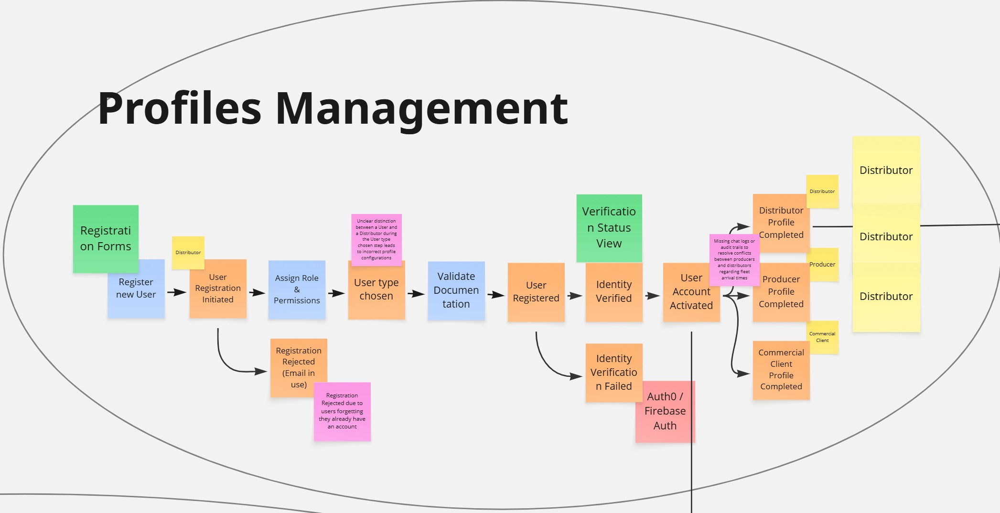

#### Fleet Management

`Fleet Management` concentra las responsabilidades relacionadas con la incorporación y administración de los recursos de transporte utilizados dentro de FruitLogix, principalmente conductores y vehículos asociados a la operación logística.

Dentro del EventStorm se observa la incorporación del Distributor al flujo y, posteriormente, acciones específicas asociadas a la gestión de la flota. Entre ellas se encuentra el Command `Add Driver to Fleet`, seguido por eventos como `Driver Profile Created by Distributor` y `Driver License Validated`. También se identifica el Read Model `Driver Profile Card`, que permite representar la información relevante del conductor dentro de este proceso.

Para la administración de vehículos se incorpora el Command `Register Vehicle`, seguido por eventos como `Vehicle Technical Sheet Registered` y `Fleet Resource Assigned`. El flujo también contempla situaciones relacionadas con el estado operativo de los vehículos, como `Vehicle Maintenance Required`, `Fleet Capacity Exceeded` y `Vehicle Assignment Revoked`. Asimismo, el Read Model `Fleet Management Dashboard` permite consultar información consolidada relacionada con los recursos de la flota.

Las Policies identificadas refuerzan la responsabilidad particular de este contexto. Entre ellas se establece que un Driver no puede ser activado mientras su `LicenseNumber` no haya sido verificado y se encuentre vigente. También se considera la validación de la capacidad de un Vehicle de acuerdo con los estándares correspondientes a su tipo.

La agrupación de estos elementos evidencia una responsabilidad común centrada en administrar conductores, vehículos y las condiciones necesarias para que puedan participar como recursos de transporte dentro de FruitLogix. Por esta razón, fueron agrupados dentro del Candidate Bounded Context `Fleet Management`.

Aunque el flujo presenta una relación directa con el Distributor previamente registrado, la responsabilidad de `Fleet Management` comienza cuando se gestionan los recursos asociados a su operación logística. De esta manera, la información general y configuración de los perfiles permanece en `Profiles Management`, mientras que la gestión específica de Drivers, Vehicles y recursos de flota corresponde a `Fleet Management`.

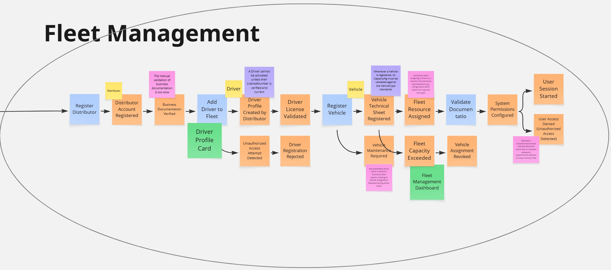

#### Order Management

`Order Management` concentra las responsabilidades relacionadas con la creación, composición, actualización y gestión del ciclo de vida de los pedidos realizados dentro de FruitLogix.

Dentro del EventStorm, el flujo comienza con el Commercial Client y el Command `Register order`, seguido por el Aggregate `order` y el Domain Event `registered order`. Posteriormente, mediante `add items`, se incorporan productos al pedido a través de `order item`, generando eventos como `items added` y `Items Added & Total Calculated`. El Read Model `Order details` permite consultar la información asociada al pedido durante este proceso.

El contexto también contempla la administración posterior del pedido. Se identifican acciones como `Manage order`, `assign producer`, `Update details` y `Cancel order`. Estas acciones se relacionan con eventos como `order managed`, `Producer Assigned to Order`, `Updated details`, `Order Cancelled` y `Order Rejected`, además de información de consulta como `Change history`.

El EventStorm muestra además la participación del Producer en actividades asociadas al cumplimiento del pedido. El Command `Supply fruit` produce el evento `Fruit Supplied`, mientras que la posterior verificación de calidad genera `Quality Verified`. Estos elementos permiten determinar si el pedido se encuentra preparado para continuar hacia su despacho.

La responsabilidad principal de `Order Management` se mantiene centrada en coordinar el estado y evolución del pedido, desde su registro y composición hasta su preparación y despacho. Una vez que el proceso requiere una gestión especializada de la calidad de los productos o la administración detallada de un Shipment y su transporte, aparecen responsabilidades que corresponden a otros Candidate Bounded Contexts.

Por esta razón, `Order Management` se diferencia de `Quality Control`, encargado del proceso específico de inspección y validación de la calidad, y de `Logistics and Monitoring`, encargado de la gestión y seguimiento del envío durante la operación logística. Las conexiones representadas en el EventStorm evidencian la colaboración entre estos contextos sin eliminar la separación de sus responsabilidades.

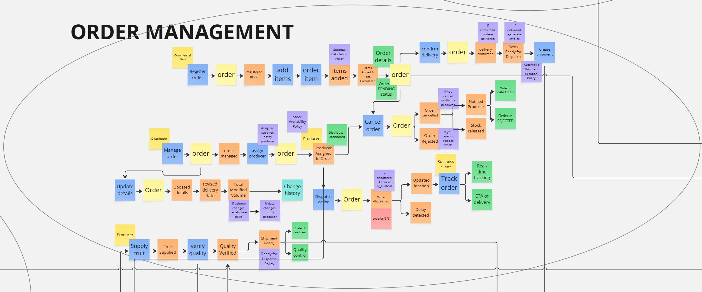

#### Quality Control Context

`Quality Control Context` concentra las responsabilidades relacionadas con el registro, evaluación y validación de la calidad de los lotes de fruta dentro de FruitLogix, así como con la gestión de incidencias detectadas durante este proceso.

Dentro del EventStorm se observa la participación del Producer mediante el Command `Register batch`, seguido por el Aggregate `Batch` y el Domain Event `Batch Registered`. Posteriormente, el Command `Record harvest` produce el evento `Batch Harvested`, permitiendo registrar información asociada al estado del lote antes de continuar con las actividades de control de calidad.

El flujo de inspección incorpora al Quality Inspector, quien ejecuta el Command `Create quality report`, generando el evento `Quality report created`. A partir de este punto se realizan acciones como `Validate report`, `Approve report` y `Reject report`, relacionadas con eventos como `Report Validated`, `Report rejected`, `Approved batches` y `Rejected batches`. El Aggregate `QualityReport` concentra la información correspondiente al proceso de evaluación realizado sobre el lote.

El contexto también contempla el registro de información adicional asociada a la calidad del producto. En el EventStorm se identifican acciones como `Record maturity level`, `Register caliber` y `Record batch quality`, que generan eventos como `recorded maturity level`, `Registered caliber` y `registered batch quality`. El Read Model `Batch report` permite consultar información consolidada relacionada con la calidad registrada para el lote.

Además del proceso de validación, `Quality Control Context` incluye la gestión de incidencias relacionadas con la calidad. El flujo contempla Commands como `Report incident`, `Attach evidence`, `Review incident` y `Escalate incident`, junto con eventos como `incident recorded`, `Evidence attached`, `Incident under review` y `Escalated incident`. Cuando una incidencia requiere una restricción adicional, el EventStorm también representa el estado `Blocked batch`.

La agrupación de estos elementos evidencia una responsabilidad común centrada en determinar y registrar las condiciones de calidad de los lotes, aprobar o rechazar su continuidad dentro del proceso y gestionar las incidencias asociadas. Por esta razón, fueron agrupados dentro del Candidate Bounded Context `Quality Control Context`.

Este contexto se diferencia de `Order Management` porque no administra el ciclo de vida general del pedido, sino la evaluación especializada de la calidad de los productos y lotes asociados. Asimismo, mantiene relación con `Infrastructure & IoT`, ya que determinados datos utilizados durante la evaluación pueden provenir de dispositivos IoT, mientras que la gestión técnica de dichos dispositivos permanece fuera de la responsabilidad de `Quality Control Context`.

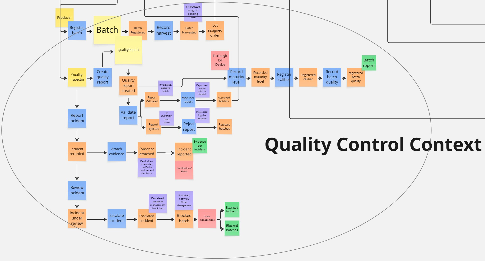

#### Infrastructure & IoT

`Infrastructure & IoT` concentra las responsabilidades relacionadas con el registro, configuración, conexión y monitoreo de dispositivos IoT utilizados dentro de FruitLogix, así como con la recepción de datos provenientes de sensores y la generación de alertas a partir de dichas mediciones.

Dentro del EventStorm se observa la participación del Technician / Admin mediante el Command `Register IoT Device`, seguido por el Aggregate `IoT Device` y el Domain Event `IoT Device Registered`. Posteriormente, el Command `Calibrate device` permite registrar resultados como `Calibration Completed` o `Calibration Failed`, mientras que el Read Model `Device Status Dashboard` permite consultar el estado del dispositivo.

El proceso también contempla la conexión de los dispositivos mediante el Command `Connect device`. A partir de esta acción se representan estados como `connected device` y `Connection failed`, además de la actualización posterior del dispositivo mediante el evento `Device Status Updated`. En este flujo también se identifica `IoT/MQTT` como un External System relacionado con la comunicación de los dispositivos.

Una vez operativo el dispositivo, el EventStorm representa el envío y registro de información proveniente de sensores. El Command `Send sensor data` se relaciona con `SensorReading` y genera el evento `Data sent`. Posteriormente, mediante `Record reading`, se registra una lectura del sensor, produciendo el evento `Recorded reading`. A partir de esta información se puede obtener una `Validated reading` o detectar una `Reading out of range`. Los Read Models `Latest readings` y `Sensor time series` permiten consultar las mediciones registradas.

El contexto también incluye la evaluación de reglas de alerta. El Command `Evaluate alert rule` utiliza el Aggregate `AlertRule` y genera el evento `Rule evaluated`. Cuando una medición supera los límites establecidos, se representan eventos como `Threshold exceeded` o `Maximum Threshold exceeded`, que pueden activar el Command `Generate alert`. El flujo contempla posteriormente eventos como `Alert generated`, `Alert sent` y `Failure alert`, junto con los Read Models `Active alerts` y `Alerts History`.

Asimismo, el EventStorm contempla la administración de las propias reglas de alerta mediante acciones como `Create alert rule`, `Modify threshold` y `Deactivate rule`, relacionadas con eventos como `alert rule created`, `Modified threshold` y `Rule deactivated`.

La agrupación de estos elementos evidencia una responsabilidad común centrada en administrar la infraestructura IoT, recopilar datos de sensores, controlar el estado de los dispositivos y detectar condiciones que requieren una alerta. Por esta razón, fueron agrupados dentro del Candidate Bounded Context `Infrastructure & IoT`.

Este contexto se diferencia de `Quality Control Context` porque su responsabilidad se encuentra en la captura y procesamiento técnico de datos provenientes de dispositivos y sensores, mientras que la interpretación de dichos datos dentro de procesos específicos de evaluación de calidad corresponde al contexto de Quality Control.

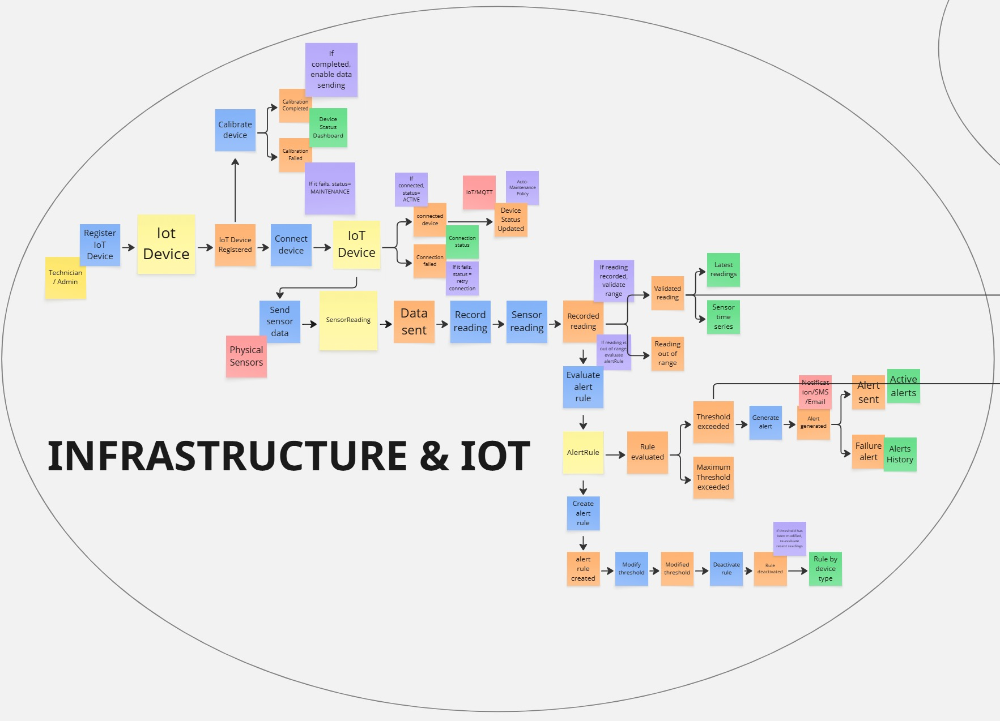

#### Logistics and Monitoring

`Logistics and Monitoring` concentra las responsabilidades relacionadas con la preparación, ejecución y seguimiento de los envíos dentro de FruitLogix, incluyendo la asignación de recursos de transporte, el monitoreo de la ubicación y la gestión de incidencias durante la entrega.

Dentro del EventStorm, el flujo comienza con acciones como `Confirm Shipment Receipt` e `Initialize Shipment`, asociadas al Aggregate `Shipment` y al evento `Shipment Initialized`. Posteriormente, se incorpora la planificación de la ruta, representada mediante el evento `Optimal Route Calculated`, apoyado por la `Route Optimization Policy` y el External System `Google Maps API / Route Service`.

La asignación de recursos logísticos se realiza mediante el Command `Assign Driver & Vehicle`, donde participa el Distributor. Esta acción genera el evento `Shipment Resources Assigned`, permitiendo vincular al Shipment con los recursos necesarios para ejecutar la entrega.

Una vez asignados los recursos, el Driver ejecuta el Command `Start Delivery Journey`, generando el evento `Shipment In Transit`. Durante el recorrido, el contexto contempla el seguimiento de la ubicación mediante el Command `Update GPS Coordinates`, relacionado con el Aggregate `Tracking`. Como resultado pueden producirse eventos como `GPS Location Updated` y `Route Deviation Detected`. Para este proceso también se identifica `GPS Tracker / Mobile App GPS` como un External System y el Read Model `Real-Time Delivery Map` como una vista para consultar el estado del recorrido.

El EventStorm también representa la finalización del proceso mediante el evento `Shipment Successfully Delivered`, acompañado por la `Completion Workflow Policy` y el Read Model `Delivery Performance Analytics`, que permite consultar información relacionada con el desempeño de las entregas.

Asimismo, `Logistics and Monitoring` contempla la gestión de incidencias ocurridas durante el transporte. El Command `Report Transit Incident` se relaciona con el Aggregate `Incident` y genera el evento `Transit Incident Logged`. Esta información puede consultarse mediante el Read Model `Incident & Delay Dashboard`, mientras que Policies como `Geofence Alert Policy` y `Delay Notification Policy` representan reglas asociadas al monitoreo de desviaciones y retrasos.

La agrupación de estos elementos evidencia una responsabilidad común centrada en gestionar el Shipment desde su inicialización hasta su entrega, supervisar el recorrido y responder ante incidencias producidas durante la operación logística. Por esta razón, fueron agrupados dentro del Candidate Bounded Context `Logistics and Monitoring`.

Este contexto se diferencia de `Fleet Management` porque no administra el registro o estado general de Drivers y Vehicles, sino que utiliza dichos recursos para ejecutar un Shipment específico. Asimismo, se diferencia de `Order Management`, cuya responsabilidad principal se encuentra en administrar el pedido antes de que la operación pase al proceso especializado de envío y seguimiento.

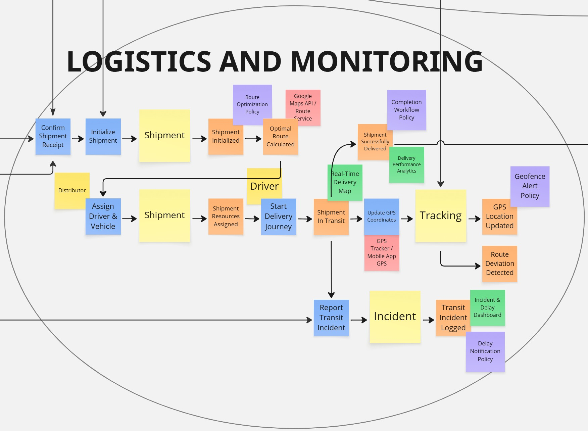

#### Payment Management

`Payment Management` concentra las responsabilidades relacionadas con la facturación, administración de métodos de pago, procesamiento de transacciones, reembolsos y consulta del historial financiero asociado a las operaciones realizadas dentro de FruitLogix.

Dentro del EventStorm se observa inicialmente el proceso de facturación mediante el Command `create invoice`, asociado al Aggregate `Invoice Aggregate` y al evento `Invoice created`. Posteriormente, el Command `Issue invoice` genera el evento `Invoice issued`. Durante este proceso se dispone de información de consulta relacionada con los detalles e historial de las facturas.

El contexto también contempla la configuración de los medios utilizados para realizar los pagos. El Commercial Client participa mediante el Command `Register payment method`, asociado al Aggregate `BillingInfo Aggregate`, permitiendo registrar la información necesaria para posteriormente iniciar una transacción. Entre los elementos de consulta identificados se encuentra `active payment method`.

Una vez configurada la información de pago, el flujo permite iniciar el proceso mediante `Start payment`. Posteriormente se representa el evento `payment initiated` y la ejecución de `Initiate Payment Transaction`, que interactúa con el External System `Payment Gateway`. Como resultado de este proceso pueden generarse eventos como `transaction confirmed` o `Transaction Failed`.

Cuando el pago se completa correctamente, el EventStorm representa el evento `Payment completed` y la actualización correspondiente de la factura. Los Read Models `Transaction Status` y `Payment attempts` permiten consultar el estado de las transacciones y los intentos realizados durante el proceso de pago.

`Payment Management` también contempla la generación y entrega de documentos asociados a la facturación. El Command `Generate PDF` produce el evento `Invoice PDF generated`, mientras que `Send invoice by email` permite generar el evento `Invoice Sent via Email`. Para estas actividades se identifican dependencias externas como `S3 / Document Storage` y `Email service`.

Asimismo, el contexto incluye el proceso de reembolso. El Command `Request a refund` inicia un flujo que puede producir resultados como `Refund confirmed` o `Refund rejected`, permitiendo representar las modificaciones financieras posteriores a un pago ya procesado.

La agrupación de estos elementos evidencia una responsabilidad común centrada en administrar la facturación y el ciclo financiero asociado a las operaciones de FruitLogix, desde el registro de información de pago hasta el procesamiento de transacciones, emisión de comprobantes y gestión de reembolsos. Por esta razón, fueron agrupados dentro del Candidate Bounded Context `Payment Management`.

Este contexto se diferencia de `Order Management` porque no administra la composición, asignación o evolución operativa de los pedidos. Aunque una operación comercial puede originar posteriormente procesos de facturación y pago, `Payment Management` mantiene la responsabilidad específica sobre las operaciones financieras asociadas.

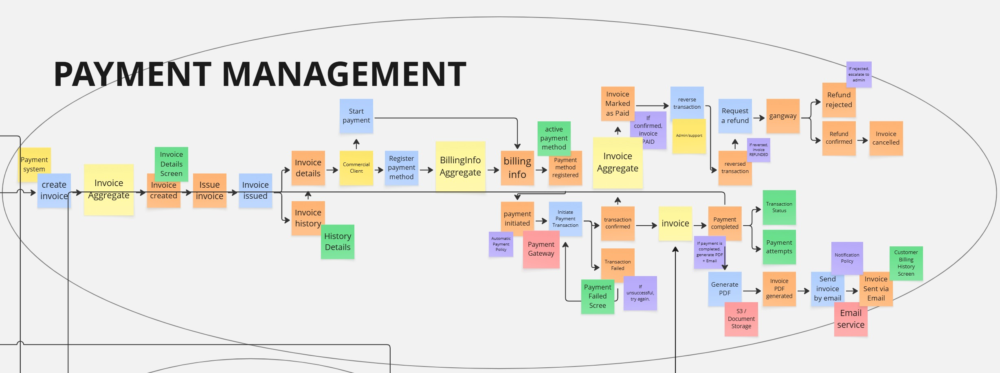

##### Resultados del Candidate Context Discovery

El proceso de Candidate Context Discovery permitió refinar progresivamente el EventStorm y reconocer límites naturales entre las principales responsabilidades del dominio de FruitLogix. La estrategia `look-for-pivotal-events` permitió utilizar los cambios de responsabilidad identificados durante el modelado como señales para analizar posibles separaciones dentro del dominio.

A partir de los Pivotal Points y del refinamiento posterior mediante Commands, Policies, Read Models, External Systems y Aggregates, se identificaron siete Candidate Bounded Contexts: `Profiles Management`, `Fleet Management`, `Order Management`, `Quality Control Context`, `Infrastructure & IoT`, `Logistics and Monitoring` y `Payment Management`.

El análisis individual de cada candidato permitió comprobar que cada agrupación mantiene una responsabilidad principal diferenciada y un conjunto coherente de conceptos, reglas y procesos. Al mismo tiempo, el EventStorm evidenció que estos contextos no funcionan de manera aislada, sino que necesitan colaborar durante los principales procesos de negocio de FruitLogix.

Los Candidate Bounded Contexts obtenidos constituyen la base para el Domain Message Flows Modeling, donde se analizará cómo estos contextos colaboran entre sí para resolver los diferentes casos que se presentan dentro del dominio.

#### 2.5.1.2. Domain Message Flows Modeling

A partir de los Candidate Bounded Contexts identificados previamente, se realizó el Domain Message Flows Modeling con el propósito de representar cómo colaboran las diferentes áreas del dominio de FruitLogix para completar procesos de negocio que involucran a múltiples actores y responsabilidades.

Para este análisis se utilizó Domain Storytelling, permitiendo representar de manera secuencial la participación de los actores, las actividades realizadas y los objetos de negocio involucrados en cada historia. El objetivo no es describir la comunicación técnica entre componentes, sino visualizar cómo las responsabilidades pasan de un contexto a otro durante la ejecución de un proceso del dominio.

Las historias seleccionadas se basan en los procesos ya identificados durante el EventStorming, evitando incorporar funcionalidades o relaciones que no hayan sido previamente evidenciadas en el modelo.

##### Domain Story 1: Order Management to Delivery

La primera Domain Story representa el proceso principal mediante el cual un pedido gestionado por un Distributor avanza a través de diferentes responsabilidades del dominio hasta completar su entrega al Commercial Client.

El flujo comienza en `Order Management`, donde el Distributor registra un Order y posteriormente asigna un Producer encargado de suministrar el Batch asociado. El lote pasa entonces al `Quality Control Context`, donde el Distributor verifica su calidad y aprueba su continuidad para que el proceso pueda avanzar hacia el despacho.

Una vez aprobada la calidad del Batch, `Order Management` continúa con la creación del Shipment. A partir de este punto, `Logistics and Monitoring` asume la responsabilidad de inicializar y gestionar el envío. Para su ejecución se utilizan recursos administrados por `Fleet Management`, principalmente Drivers y Vehicles disponibles para la operación logística.

Durante la entrega, el Driver inicia el recorrido y el seguimiento de la ubicación se realiza mediante información proporcionada por `GPS Tracker / Mobile App GPS`, que alimenta el Tracking del Shipment. Finalmente, el Driver completa la entrega al Commercial Client.

Esta historia permite visualizar la colaboración entre `Order Management`, `Quality Control Context`, `Fleet Management` y `Logistics and Monitoring`, manteniendo separadas las responsabilidades de cada contexto durante el desarrollo del proceso.

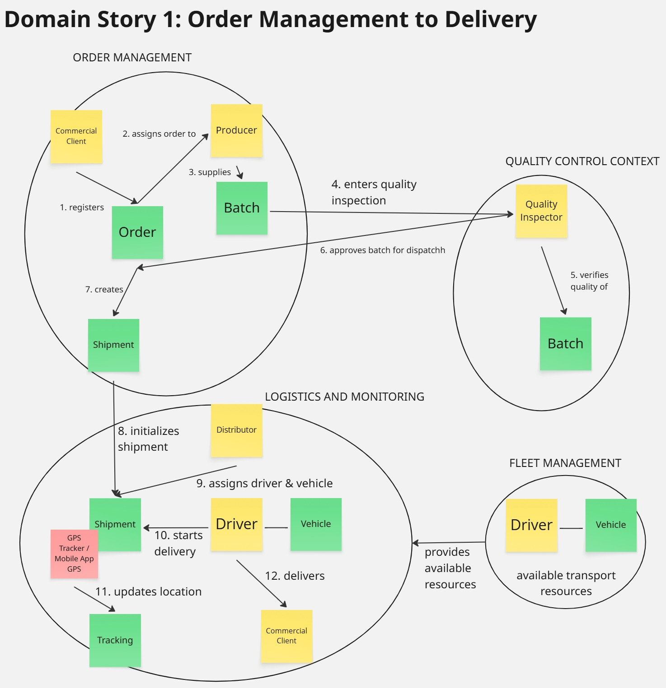

##### Domain Story 2: Distributor Profile and Fleet Setup

La segunda Domain Story representa la transición desde la configuración del perfil de un Distributor hasta la incorporación de los recursos necesarios para gestionar su flota dentro de FruitLogix.

El proceso inicia en `Profiles Management`, donde el Distributor realiza su registro, selecciona el rol correspondiente, proporciona la documentación requerida y completa la configuración de su perfil. Una vez completado este proceso, el Distributor puede continuar con las actividades relacionadas con la administración de su flota.

En `Fleet Management`, el Distributor registra su cuenta asociada a la operación logística y se valida la documentación correspondiente. Posteriormente, puede incorporar Drivers a la flota, cuya licencia debe ser validada antes de que puedan participar en la operación.

El mismo contexto permite registrar Vehicles, almacenar su información técnica y posteriormente incorporarlos como recursos disponibles de la flota. De esta manera, `Fleet Management` mantiene las responsabilidades específicas relacionadas con Drivers, Vehicles y recursos de transporte.

Esta historia permite visualizar la colaboración entre `Profiles Management` y `Fleet Management`, mostrando cómo la configuración inicial del perfil del Distributor precede a las responsabilidades específicas relacionadas con la administración de sus recursos logísticos.

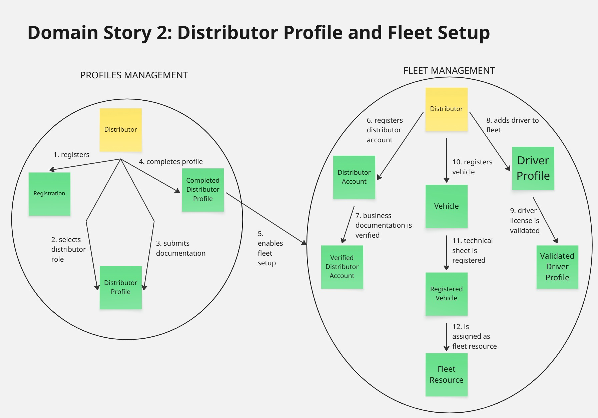

##### Domain Story 3: Order Billing and Payment

La tercera Domain Story representa la colaboración entre `Order Management` y `Payment Management` durante el proceso de facturación y pago asociado a una operación realizada dentro de FruitLogix.

El flujo inicia cuando la información relacionada con el Order pasa desde `Order Management` hacia `Payment Management` para dar soporte al proceso de facturación. Esta transición se representa de manera general debido a que el EventStorm evidencia la conexión entre ambos contextos, aunque no especifica de forma inequívoca un único evento del Order como responsable del inicio de la facturación.

Dentro de `Payment Management`, el Commercial Client registra la información correspondiente a su método de pago y posteriormente inicia el proceso de pago de la Invoice. A partir de esta acción se inicia una Transaction que es procesada mediante el External System `Payment Gateway`.

Cuando la transacción es confirmada, el pago se considera completado y la Invoice pasa a representar una operación pagada. Posteriormente se genera el documento correspondiente en formato PDF y este es enviado al Commercial Client. Para esta última actividad se utiliza `Email Service` como External System de soporte para la entrega del comprobante.

Esta historia permite visualizar cómo `Order Management` proporciona la información necesaria para iniciar el proceso financiero, mientras que `Payment Management` mantiene la responsabilidad sobre la facturación, métodos de pago, procesamiento de transacciones y generación y envío del comprobante.

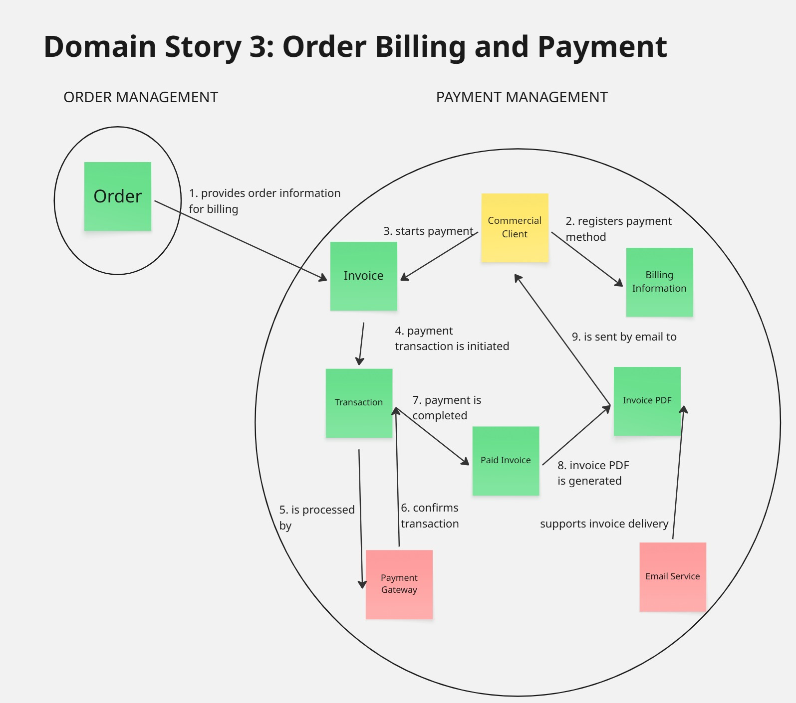

##### Domain Story 4: IoT Telemetry During Delivery

La cuarta Domain Story representa la colaboración entre `Infrastructure & IoT` y `Logistics and Monitoring` para proporcionar información de telemetría durante la ejecución de un Shipment y detectar condiciones que requieren atención durante la entrega.

El flujo comienza en `Infrastructure & IoT`, donde los Physical Sensors generan información que es representada mediante una Sensor Reading. Esta lectura es posteriormente registrada y validada, permitiendo obtener una `Validated Reading` que puede ser utilizada como información de telemetría asociada a un Shipment activo.

A partir de esta información, `Logistics and Monitoring` permite relacionar el Shipment con sus condiciones actuales de operación. El Distributor puede consultar la Telemetry correspondiente durante el desarrollo de la entrega, manteniendo visibilidad sobre la información relevante proporcionada por los sensores.

El flujo también contempla situaciones en las que una lectura registrada se encuentra fuera del rango esperado. En estos casos, `Infrastructure & IoT` identifica una `Out-of-Range Reading` y proporciona la información necesaria para generar una alerta asociada al Shipment. Dentro de `Logistics and Monitoring`, esta situación es representada mediante un `Shipment Alert`, que permite notificar al Distributor sobre la condición detectada.

Esta historia permite visualizar cómo `Infrastructure & IoT` mantiene la responsabilidad sobre la captura, registro y validación de las lecturas provenientes de sensores, mientras que `Logistics and Monitoring` utiliza dicha información dentro del seguimiento operativo de un Shipment y de las alertas relacionadas con su entrega.

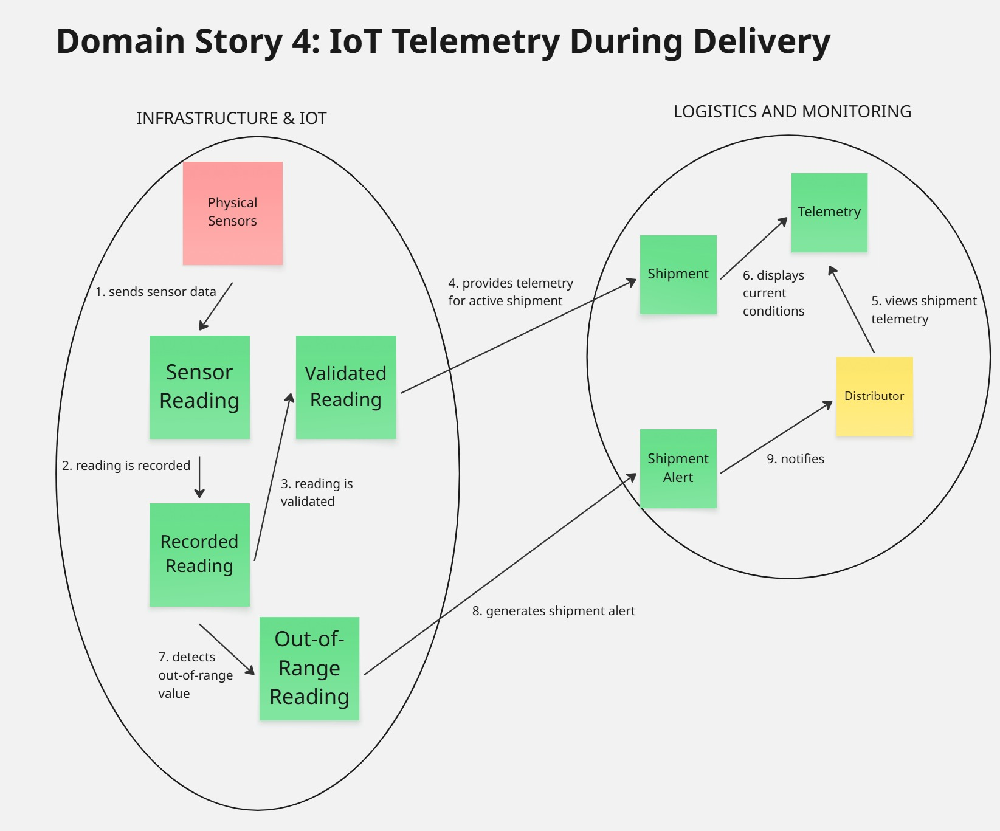

##### Resultados del Domain Message Flows Modeling

El Domain Message Flows Modeling permitió representar cómo los Candidate Bounded Contexts identificados previamente colaboran durante diferentes procesos del negocio de FruitLogix. Mediante Domain Storytelling se modelaron historias específicas en lugar de intentar representar todas las responsabilidades del dominio dentro de un único flujo.

La primera historia mostró la colaboración entre `Order Management`, `Quality Control Context`, `Fleet Management` y `Logistics and Monitoring` durante el proceso que inicia con la gestión de un pedido y finaliza con su entrega al Commercial Client.

La segunda historia permitió representar la relación entre `Profiles Management` y `Fleet Management`, mostrando cómo la configuración inicial del perfil del Distributor precede a las actividades relacionadas con la incorporación y administración de Drivers y Vehicles.

La tercera historia representó la colaboración entre `Order Management` y `Payment Management` durante el proceso de facturación y pago asociado a una operación.

Finalmente, la cuarta historia permitió representar la colaboración entre `Infrastructure & IoT` y `Logistics and Monitoring`, mostrando cómo las lecturas obtenidas mediante sensores pueden ser utilizadas durante el seguimiento de un Shipment y cómo una condición fuera de rango puede originar una alerta para el Distributor.

En conjunto, estas historias permiten observar cómo las responsabilidades permanecen separadas entre los diferentes Bounded Contexts, pero colaboran cuando los procesos de negocio requieren información o capacidades pertenecientes a más de un contexto. De esta manera, el Domain Message Flows Modeling complementa el Candidate Context Discovery al hacer visibles las principales interacciones de negocio existentes entre los contextos identificados.
