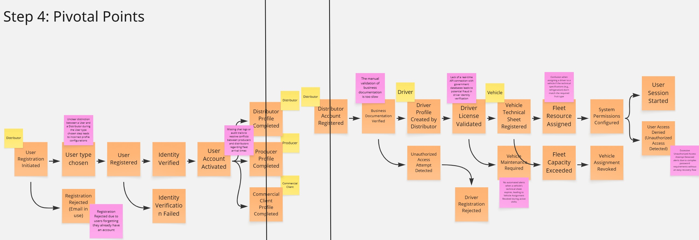
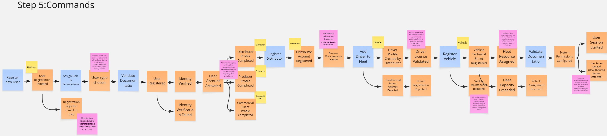
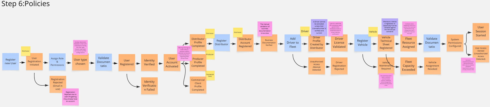
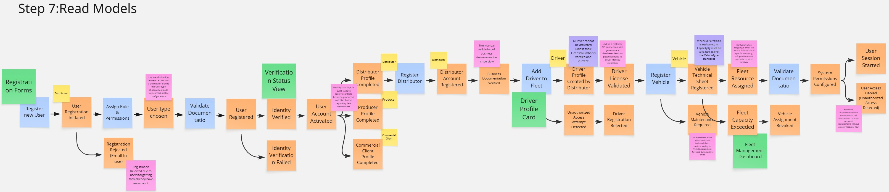
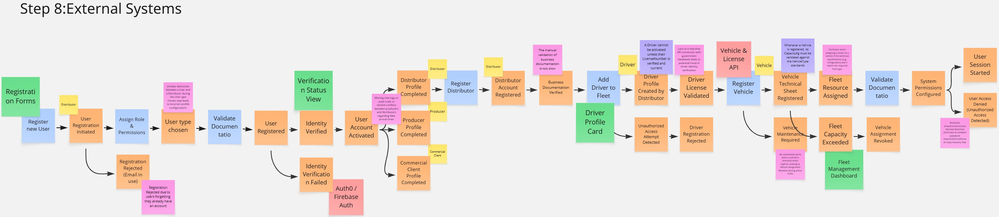
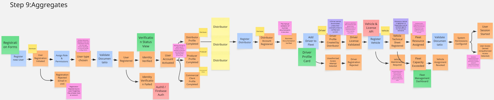
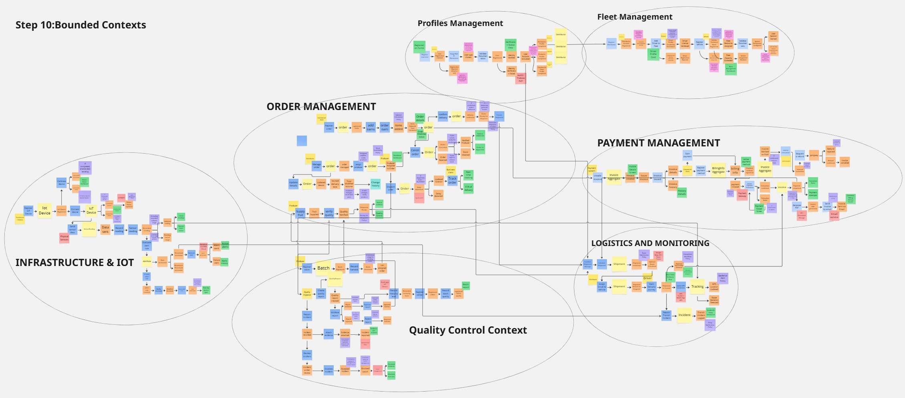

### 2.5. Strategic-Level Domain-Driven Design

#### 2.5.1. EventStorming

Como parte del Strategic-Level Domain-Driven Design de FruitLogix, el equipo continuó el proceso de EventStorming iniciado previamente durante el Big Picture EventStorming. El propósito de esta etapa es profundizar progresivamente en el dominio, partiendo de los principales eventos del negocio para posteriormente identificar acciones, reglas, información requerida, sistemas externos, aggregates y límites relevantes dentro del modelo.

Los primeros tres pasos corresponden a la exploración general desarrollada previamente, donde se identificaron los eventos del dominio, se organizaron en líneas de tiempo y se reconocieron los principales Pain Points. A partir de esta base, el modelo se refinó mediante Pivotal Points, Commands, Policies, Read Models, External Systems, Aggregates y finalmente Bounded Contexts.

##### Step 1: Unstructured Exploration

El proceso inició con una exploración desestructurada de los principales Eventos de Dominio de FruitLogix. En esta etapa se identificaron eventos relacionados con el registro y configuración de usuarios, la gestión de perfiles y flota, así como eventos del flujo central del negocio relacionados con pedidos, abastecimiento, control de calidad, despacho y entregas.

Esta exploración permitió representar el dominio sin establecer inicialmente restricciones sobre el orden de los eventos o sobre los límites de los diferentes procesos.

##### Step 2: Timelines

En el segundo paso, los Eventos de Dominio identificados fueron organizados cronológicamente para representar las principales historias del negocio. También se incorporaron los actores responsables o participantes en diferentes momentos del proceso, como Commercial Client, Distributor, Producer y Driver.

La organización temporal permitió observar tanto los procesos relacionados con registro, perfiles y gestión de recursos, como el flujo principal que conecta la creación de un pedido con su abastecimiento, verificación de calidad, despacho, transporte y entrega.

##### Step 3: Timelines with Pain Points

Una vez definidas las principales líneas de tiempo, se identificaron Pain Points asociados con situaciones problemáticas o incertidumbres relevantes del dominio. Entre ellos se encuentran dificultades relacionadas con validaciones manuales, disponibilidad de productos, consistencia de los criterios de calidad, disponibilidad de recursos logísticos, incidentes durante el transporte y posibles rechazos durante la entrega.

La identificación de estos puntos permitió reconocer áreas del dominio que requerían mayor análisis antes de continuar con el refinamiento del EventStorm.

Los tres primeros pasos permitieron construir una visión general del dominio de FruitLogix. A partir de esta base, el equipo continuó el proceso de refinamiento mediante la identificación de Pivotal Points, que permiten reconocer cambios significativos dentro de los flujos analizados.

##### Step 4: Pivotal Points

En este paso se incorporaron Pivotal Points con el propósito de identificar momentos relevantes donde cambia la naturaleza o responsabilidad del proceso representado en el EventStorm. Estos puntos permiten comenzar a reconocer posibles límites naturales dentro del dominio sin definir todavía de manera definitiva los Bounded Contexts.

En el flujo analizado se observa una transición desde el proceso general de registro, verificación de identidad y activación de la cuenta hacia procesos más específicos relacionados con la configuración de los perfiles de los diferentes actores. Posteriormente, el flujo continúa hacia responsabilidades particulares del distribuidor relacionadas con el registro de su cuenta y la administración de recursos logísticos, como conductores y vehículos.

La identificación de estos cambios permite separar conceptualmente responsabilidades que, aunque colaboran dentro de FruitLogix, responden a necesidades diferentes del negocio. Estos Pivotal Points serán utilizados posteriormente como una de las evidencias para el proceso de Candidate Context Discovery.

##### Step 5: Commands

En este paso se incorporaron Commands al EventStorm con el propósito de representar las acciones o intenciones que provocan cambios relevantes dentro del dominio. Estos elementos, representados mediante notas azules, permiten comprender qué acciones preceden a determinados Eventos de Dominio y ayudan a hacer explícitas las responsabilidades existentes dentro de los flujos analizados.

En el proceso de registro y configuración de usuarios se identificaron Commands como `Register new User`, `Assign Role & Permissions` y `Validate Documentation`, los cuales se relacionan con eventos posteriores como `User Registration Initiated`, `User Registered` e `Identity Verified`. Asimismo, se incorporaron acciones específicas relacionadas con la creación y configuración de perfiles.

En el flujo asociado a la gestión de recursos logísticos se identificaron Commands como `Add Driver to Fleet` y `Register Vehicle`. Estas acciones permiten relacionar las decisiones del distribuidor con eventos como `Driver Profile Created by Distributor` y `Vehicle Technical Sheet Registered`, haciendo más explícita la secuencia que permite incorporar conductores y vehículos a la operación.

La incorporación de Commands permitió enriquecer el EventStorm al establecer una relación más clara entre las acciones realizadas por los actores y los cambios que ocurren posteriormente dentro del dominio. Este refinamiento sirve además como base para identificar las reglas y decisiones que serán representadas mediante Policies en el siguiente paso.

##### Step 6: Policies

En este paso se incorporaron Policies al EventStorm con el propósito de representar reglas y condiciones que determinan cómo deben ejecutarse determinadas acciones dentro del dominio. Estas políticas, representadas mediante notas moradas, permiten hacer explícitas restricciones que deben cumplirse antes de que ciertos procesos puedan continuar.

Dentro del flujo relacionado con la gestión de conductores se identificó la política `A Driver cannot be activated unless their LicenseNumber is verified and current`. Esta regla establece que un conductor no puede ser habilitado dentro de la operación si previamente no se ha comprobado que su licencia sea válida y se encuentre vigente, reforzando así la consistencia del proceso de incorporación de recursos de transporte.

Asimismo, en el flujo de registro de vehículos se incorporó la política `Whenever a Vehicle is registered, its CapacityKg must be validated against the VehicleType standards`. Esta condición establece que, al registrar un vehículo, su capacidad debe ser validada de acuerdo con las características o restricciones correspondientes a su tipo antes de considerarlo disponible para la operación.

La incorporación de Policies permitió complementar los Commands y Domain Events previamente identificados, haciendo explícitas reglas que condicionan el comportamiento del dominio. Estas reglas ayudan a comprender con mayor precisión las responsabilidades asociadas a la gestión de perfiles y recursos logísticos, y sirven como base para identificar posteriormente la información que los actores necesitan consultar mediante Read Models.

##### Step 7: Read Models

En este paso se incorporaron Read Models al EventStorm con el propósito de representar la información que los actores necesitan consultar para comprender el estado actual del dominio y tomar decisiones durante los diferentes procesos. Estos elementos, representados mediante notas verdes, permiten visualizar qué información debe estar disponible a partir de los eventos y reglas previamente identificados.

Dentro del proceso de incorporación de usuarios se identificó el Read Model `Registration Forms`, que reúne la información necesaria para iniciar y completar el registro de un nuevo usuario. Asimismo, se incorporó `Verification Status View`, que permite consultar el estado asociado al proceso de verificación de identidad y documentación.

En el flujo relacionado con la gestión de recursos logísticos se identificó `Driver Profile Card`, que representa la información relevante de un conductor registrado dentro de la operación. También se incorporó `Fleet Management Dashboard`, orientado a proporcionar una vista consolidada sobre los recursos de flota y su situación dentro del proceso operativo.

La incorporación de Read Models permitió complementar los Commands, Domain Events y Policies previamente identificados, mostrando qué información resulta necesaria para que los actores puedan continuar sus actividades y tomar decisiones. Este refinamiento contribuye a comprender mejor las necesidades de consulta del dominio antes de identificar las dependencias con sistemas externos en el siguiente paso.

##### Step 8: External Systems

En este paso se incorporaron External Systems al EventStorm con el propósito de identificar dependencias externas que pueden participar en determinados procesos del dominio. Estos elementos permiten distinguir aquellas responsabilidades que requieren información o servicios proporcionados fuera de FruitLogix de las capacidades gestionadas directamente por la solución.

Dentro del proceso relacionado con la identidad y autenticación de usuarios se modeló `Auth0 / Firebase Auth` como un servicio externo considerado durante el análisis para apoyar actividades relacionadas con el acceso y la seguridad de los usuarios.

Asimismo, en el flujo relacionado con conductores y vehículos se identificó `Vehicle & License API` como una dependencia externa orientada a proporcionar información necesaria para la validación de licencias y características asociadas a los vehículos antes de su incorporación a la operación logística.

Este refinamiento contribuye a delimitar con mayor claridad las responsabilidades internas y externas del sistema antes de continuar con la identificación de Aggregates.

##### Step 9: Aggregates

En este paso se incorporaron Aggregates al EventStorm con el propósito de identificar conjuntos de elementos del dominio que deben mantenerse consistentes durante la ejecución de determinadas operaciones. Los Aggregates permiten comenzar a reconocer qué información y reglas deben ser gestionadas como una unidad dentro de los procesos analizados.

En el flujo relacionado con la gestión de perfiles se identificó `Distributor` como Aggregate asociado a la información y responsabilidades del distribuidor dentro de la operación. Su incorporación permite relacionar la configuración de los diferentes perfiles y las acciones posteriores que dependen de la participación del distribuidor en FruitLogix.

La identificación de este Aggregate constituye un refinamiento adicional del modelo, ya que permite pasar de una visión centrada únicamente en eventos, acciones y reglas hacia una representación donde también se consideran unidades de consistencia del dominio.

Este paso no busca definir todavía de manera definitiva la estructura interna de cada Bounded Context. Los Aggregates identificados durante el EventStorming sirven como una de las evidencias utilizadas posteriormente para reconocer límites y responsabilidades dentro del dominio. Asimismo, otros Aggregates asociados a procesos como pedidos, calidad y logística son desarrollados con mayor detalle en los flujos específicos correspondientes a dichas áreas. Los demás elementos presentes en el diagrama se conservan como parte del modelado progresivo realizado durante las etapas anteriores.

##### Step 10: Bounded Contexts

En el último paso del EventStorming se delimitaron los principales Bounded Contexts de FruitLogix a partir del refinamiento progresivo realizado mediante Domain Events, Commands, Policies, Read Models, External Systems y Aggregates. El objetivo de esta etapa fue reconocer grupos de responsabilidades que comparten un lenguaje, reglas y procesos relacionados dentro del dominio.

Como resultado del análisis se identificaron siete Bounded Contexts principales:

* **Profiles Management:** concentra las responsabilidades relacionadas con los perfiles de los diferentes actores que participan en FruitLogix y la información necesaria para su participación dentro del dominio.
* **Fleet Management:** agrupa las responsabilidades asociadas con conductores, vehículos, documentación, capacidad y administración de los recursos de transporte utilizados durante las operaciones logísticas.
* **Order Management:** comprende el ciclo de gestión de los pedidos, desde su registro y composición hasta la asignación de productores, abastecimiento y preparación para su posterior despacho.
* **Payment Management:** reúne las responsabilidades relacionadas con facturación, pagos y demás procesos financieros asociados a las operaciones realizadas dentro de FruitLogix.
* **Logistics and Monitoring:** concentra los procesos relacionados con la preparación y seguimiento de los envíos, asignación de recursos, transporte, tracking e incidencias que pueden ocurrir durante la entrega.
* **Quality Control Context:** agrupa las actividades y reglas relacionadas con la inspección de productos y lotes, validación de criterios de calidad y registro de resultados o incidencias asociadas.
* **Infrastructure & IoT:** reúne las responsabilidades relacionadas con dispositivos, sensores, telemetría y monitoreo de condiciones relevantes durante la operación logística.

La identificación de estos Bounded Contexts representa el resultado del refinamiento realizado durante el EventStorming y constituye la base para el Candidate Context Discovery, donde se analizarán con mayor detalle sus límites, responsabilidades y relaciones dentro del dominio.

##### Resultados del EventStorming

El proceso de EventStorming permitió evolucionar desde una exploración general de los principales eventos del dominio hacia una representación progresivamente más detallada de las acciones, reglas, información requerida, dependencias externas, Aggregates y límites existentes dentro de FruitLogix.

A través de los diez pasos realizados se obtuvo una visión compartida de los principales procesos del dominio y se identificaron siete Bounded Contexts que permiten organizar las responsabilidades del dominio de FruitLogix. Estos resultados serán utilizados como entrada para el Candidate Context Discovery, donde se evaluará con mayor profundidad la delimitación y relación entre los contextos identificados.

