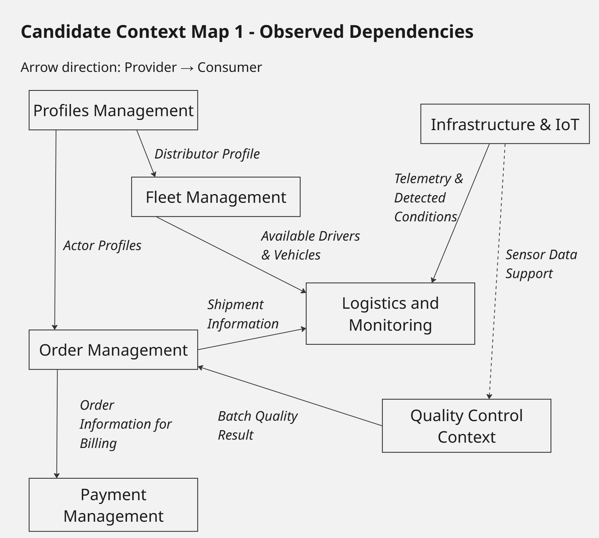
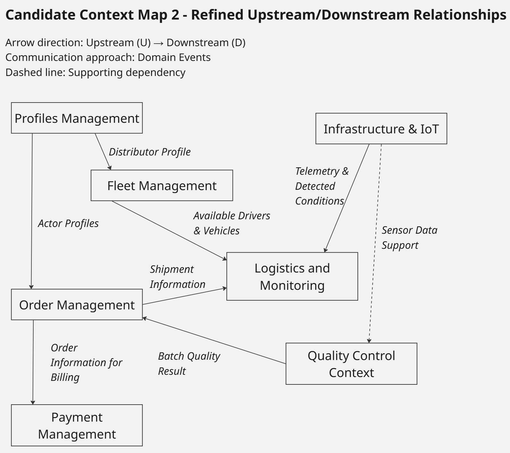

### 2.5. Strategic-Level Domain-Driven Design

#### 2.5.1. EventStorming

Como parte del Strategic-Level Domain-Driven Design de FruitLogix, el equipo continuó el proceso de EventStorming iniciado previamente durante el Big Picture EventStorming. El propósito de esta etapa es profundizar progresivamente en el dominio, partiendo de los principales eventos del negocio para posteriormente identificar acciones, reglas, información requerida, sistemas externos, aggregates y límites relevantes dentro del modelo.

Los primeros tres pasos corresponden a la exploración general desarrollada previamente, donde se identificaron los eventos del dominio, se organizaron en líneas de tiempo y se reconocieron los principales Pain Points. A partir de esta base, el modelo se refinó mediante Pivotal Points, Commands, Policies, Read Models, External Systems, Aggregates y finalmente Bounded Contexts.

##### Step 1: Unstructured Exploration

El proceso inició con una exploración desestructurada de los principales Eventos de Dominio de FruitLogix. En esta etapa se identificaron eventos relacionados con el registro y configuración de usuarios, la gestión de perfiles y flota, así como eventos del flujo central del negocio relacionados con pedidos, abastecimiento, control de calidad, despacho y entregas.

Esta exploración permitió representar el dominio sin establecer inicialmente restricciones sobre el orden de los eventos o sobre los límites de los diferentes procesos.

##### Step 2: Timelines

En el segundo paso, los Eventos de Dominio identificados fueron organizados cronológicamente para representar las principales historias del negocio. También se incorporaron los actores responsables o participantes en diferentes momentos del proceso, como Commercial Client, Distributor, Producer y Driver.

La organización temporal permitió observar tanto los procesos relacionados con registro, perfiles y gestión de recursos, como el flujo principal que conecta la creación de un pedido con su abastecimiento, verificación de calidad, despacho, transporte y entrega.

##### Step 3: Timelines with Pain Points

Una vez definidas las principales líneas de tiempo, se identificaron Pain Points asociados con situaciones problemáticas o incertidumbres relevantes del dominio. Entre ellos se encuentran dificultades relacionadas con validaciones manuales, disponibilidad de productos, consistencia de los criterios de calidad, disponibilidad de recursos logísticos, incidentes durante el transporte y posibles rechazos durante la entrega.

La identificación de estos puntos permitió reconocer áreas del dominio que requerían mayor análisis antes de continuar con el refinamiento del EventStorming.

##### Resultados de la exploración inicial

Los tres primeros pasos del EventStorming permitieron establecer una visión general del dominio de FruitLogix. La exploración desestructurada permitió identificar los principales Domain Events; posteriormente, estos fueron organizados cronológicamente mediante Timelines y complementados con los actores involucrados. Finalmente, la incorporación de Pain Points permitió reconocer problemas, riesgos e incertidumbres relevantes dentro de los distintos procesos del negocio.

Esta primera aproximación constituye la base para continuar con el Candidate Context Discovery, donde el EventStorming será refinado progresivamente con el propósito de reconocer cambios de responsabilidad y posibles límites naturales dentro del dominio.

#### 2.5.1.1. Candidate Context Discovery

##### Introducción y estrategia utilizada

A partir del EventStorming desarrollado en la sección anterior, el equipo realizó el proceso de Candidate Context Discovery con el objetivo de reconocer límites naturales dentro del dominio de FruitLogix y agrupar responsabilidades que comparten eventos, reglas, información y lenguaje relacionado.

Para este proceso se utilizó la estrategia `look-for-pivotal-events`, debido a que durante el EventStorming se identificaron momentos relevantes donde cambia la naturaleza o responsabilidad de los procesos. Estos cambios, representados mediante Pivotal Points dentro del EventStorming, fueron utilizados como señales para analizar posibles límites entre diferentes áreas del dominio.

El proceso no partió de una descomposición técnica de la solución, sino del comportamiento observado en el dominio. A medida que el EventStorming fue refinado, se incorporaron Commands, Policies, Read Models, External Systems y Aggregates, permitiendo comprender con mayor precisión las responsabilidades involucradas y reconocer agrupaciones con suficiente coherencia interna para ser consideradas Candidate Bounded Contexts.

##### Step 4: Pivotal Points

Como primera actividad del Candidate Context Discovery, se revisaron los Pivotal Points identificados dentro del EventStorming con el propósito de reconocer momentos donde cambia de forma significativa la naturaleza o responsabilidad del proceso.

Estos puntos permiten observar transiciones entre diferentes capacidades del dominio y funcionan como señales iniciales para identificar posibles límites. En esta etapa todavía no se definen Bounded Contexts de manera definitiva, sino que se reconocen cambios relevantes que serán refinados progresivamente en los pasos posteriores.

En el flujo analizado se observa una transición desde el proceso general de registro, verificación de identidad y activación de la cuenta hacia procesos más específicos relacionados con la configuración de los perfiles de los diferentes actores. Posteriormente, el flujo continúa hacia responsabilidades particulares del distribuidor relacionadas con el registro de su cuenta y la administración de recursos logísticos, como conductores y vehículos.

La identificación de estos cambios permite separar conceptualmente responsabilidades que, aunque colaboran dentro de FruitLogix, responden a necesidades diferentes del negocio. Estos Pivotal Points constituyen una de las principales evidencias utilizadas para reconocer y refinar los Candidate Bounded Contexts durante el proceso de descubrimiento.

##### Step 5: Commands

En este paso se incorporaron Commands al EventStorming con el propósito de representar las acciones o intenciones que provocan cambios relevantes dentro del dominio. Estos elementos, representados mediante notas azules, permiten comprender qué acciones preceden a determinados Eventos de Dominio y ayudan a hacer explícitas las responsabilidades existentes dentro de los flujos analizados.

En el proceso de registro y configuración de usuarios se identificaron Commands como `Register new User`, `Assign Role & Permissions` y `Validate Documentation`, los cuales se relacionan con eventos posteriores como `User Registration Initiated`, `User Registered` e `Identity Verified`. Asimismo, se incorporaron acciones específicas relacionadas con la creación y configuración de perfiles.

En el flujo asociado a la gestión de recursos logísticos se identificaron Commands como `Add Driver to Fleet` y `Register Vehicle`. Estas acciones permiten relacionar las decisiones del distribuidor con eventos como `Driver Profile Created by Distributor` y `Vehicle Technical Sheet Registered`, haciendo más explícita la secuencia que permite incorporar conductores y vehículos a la operación.

La incorporación de Commands permitió enriquecer el EventStorming al establecer una relación más clara entre las acciones realizadas por los actores y los cambios que ocurren posteriormente dentro del dominio. Este refinamiento sirve además como base para identificar las reglas y decisiones que serán representadas mediante Policies en el siguiente paso.

##### Step 6: Policies

En este paso se incorporaron Policies al EventStorming con el propósito de representar reglas y condiciones que determinan cómo deben ejecutarse determinadas acciones dentro del dominio. Estas políticas, representadas mediante notas moradas, permiten hacer explícitas restricciones que deben cumplirse antes de que ciertos procesos puedan continuar.

Dentro del flujo relacionado con la gestión de conductores se identificó la política `A Driver cannot be activated unless their LicenseNumber is verified and current`. Esta regla establece que un conductor no puede ser habilitado dentro de la operación si previamente no se ha comprobado que su licencia sea válida y se encuentre vigente, reforzando así la consistencia del proceso de incorporación de recursos de transporte.

Asimismo, en el flujo de registro de vehículos se incorporó la política `Whenever a Vehicle is registered, its CapacityKg must be validated against the VehicleType standards`. Esta condición establece que, al registrar un vehículo, su capacidad debe ser validada de acuerdo con las características o restricciones correspondientes a su tipo antes de considerarlo disponible para la operación.

La incorporación de Policies permitió complementar los Commands y Domain Events previamente identificados, haciendo explícitas reglas que condicionan el comportamiento del dominio. Estas reglas ayudan a comprender con mayor precisión las responsabilidades asociadas a la gestión de perfiles y recursos logísticos, y sirven como base para identificar posteriormente la información que los actores necesitan consultar mediante Read Models.

##### Step 7: Read Models

En este paso se incorporaron Read Models al EventStorming con el propósito de representar la información que los actores necesitan consultar para comprender el estado actual del dominio y tomar decisiones durante los diferentes procesos. Estos elementos, representados mediante notas verdes, permiten visualizar qué información debe estar disponible a partir de los eventos y reglas previamente identificados.

Dentro del proceso de incorporación de usuarios se identificó el Read Model `Registration Forms`, que reúne la información necesaria para iniciar y completar el registro de un nuevo usuario. Asimismo, se incorporó `Verification Status View`, que permite consultar el estado asociado al proceso de verificación de identidad y documentación.

En el flujo relacionado con la gestión de recursos logísticos se identificó `Driver Profile Card`, que representa la información relevante de un conductor registrado dentro de la operación. También se incorporó `Fleet Management Dashboard`, orientado a proporcionar una vista consolidada sobre los recursos de flota y su situación dentro del proceso operativo.

La incorporación de Read Models permitió complementar los Commands, Domain Events y Policies previamente identificados, mostrando qué información resulta necesaria para que los actores puedan continuar sus actividades y tomar decisiones. Este refinamiento contribuye a comprender mejor las necesidades de consulta del dominio antes de identificar las dependencias con sistemas externos en el siguiente paso.

##### Step 8: External Systems

En este paso se incorporaron External Systems al EventStorming con el propósito de identificar dependencias externas que pueden participar en determinados procesos del dominio. Estos elementos permiten distinguir aquellas responsabilidades que requieren información o servicios proporcionados fuera de FruitLogix de las capacidades gestionadas directamente por la solución.

Dentro del proceso relacionado con la identidad y autenticación de usuarios se modeló `Auth0 / Firebase Auth` como un servicio externo considerado durante el análisis para apoyar actividades relacionadas con el acceso y la seguridad de los usuarios.

La representación de `Auth0 / Firebase Auth` corresponde al modelado realizado durante el análisis del dominio y no establece necesariamente la tecnología definitiva utilizada para implementar la autenticación de la solución.

Asimismo, en el flujo relacionado con conductores y vehículos se identificó `Vehicle & License API` como una dependencia externa orientada a proporcionar información necesaria para la validación de licencias y características asociadas a los vehículos antes de su incorporación a la operación logística.

Este refinamiento contribuye a delimitar con mayor claridad las responsabilidades internas y externas del sistema antes de continuar con la identificación de Aggregates.

##### Step 9: Aggregates

En este paso se incorporaron Aggregates al EventStorming con el propósito de identificar conjuntos de elementos del dominio que deben mantenerse consistentes durante la ejecución de determinadas operaciones. Los Aggregates permiten comenzar a reconocer qué información y reglas deben ser gestionadas como una unidad dentro de los procesos analizados.

En el flujo relacionado con la gestión de perfiles se identificó `Distributor` como Aggregate asociado a la información y responsabilidades del distribuidor dentro de la operación. Su incorporación permite relacionar la configuración de los diferentes perfiles y las acciones posteriores que dependen de la participación del distribuidor en FruitLogix.

La identificación de este Aggregate constituye un refinamiento adicional del modelo, ya que permite pasar de una visión centrada únicamente en eventos, acciones y reglas hacia una representación donde también se consideran unidades de consistencia del dominio.

Este paso no busca definir todavía de manera definitiva la estructura interna de cada Bounded Context. Los Aggregates identificados durante el EventStorming constituyen una de las evidencias utilizadas durante el Candidate Context Discovery para reconocer límites y responsabilidades dentro del dominio. Asimismo, otros Aggregates asociados a procesos como pedidos, calidad y logística son desarrollados con mayor detalle en los flujos específicos correspondientes a dichas áreas. Los demás elementos presentes en el diagrama se conservan como parte del modelado progresivo realizado durante las etapas anteriores.

##### Step 10: Bounded Contexts

En el último paso del EventStorming se delimitaron los principales Bounded Contexts de FruitLogix a partir del refinamiento progresivo realizado mediante Domain Events, Commands, Policies, Read Models, External Systems y Aggregates. El objetivo de esta etapa fue reconocer grupos de responsabilidades que comparten un lenguaje, reglas y procesos relacionados dentro del dominio.

Como resultado del análisis se identificaron siete Bounded Contexts principales:

* **Profiles Management:** concentra las responsabilidades relacionadas con los perfiles de los diferentes actores que participan en FruitLogix y la información necesaria para su participación dentro del dominio.
* **Fleet Management:** agrupa las responsabilidades asociadas con conductores, vehículos, documentación, capacidad y administración de los recursos de transporte utilizados durante las operaciones logísticas.
* **Order Management:** comprende el ciclo de gestión de los pedidos, desde su registro y composición hasta la asignación de productores, abastecimiento y preparación para su posterior despacho.
* **Payment Management:** reúne las responsabilidades relacionadas con facturación, pagos y demás procesos financieros asociados a las operaciones realizadas dentro de FruitLogix.
* **Logistics and Monitoring:** concentra los procesos relacionados con la preparación y seguimiento de los envíos, asignación de recursos, transporte, tracking e incidencias que pueden ocurrir durante la entrega.
* **Quality Control Context:** agrupa las actividades y reglas relacionadas con la inspección de productos y lotes, validación de criterios de calidad y registro de resultados o incidencias asociadas.
* **Infrastructure & IoT:** reúne las responsabilidades relacionadas con dispositivos, sensores, telemetría y monitoreo de condiciones relevantes durante la operación logística.

La identificación de estos Bounded Contexts representa el resultado del refinamiento progresivo realizado durante el Candidate Context Discovery. A partir de los Pivotal Points y de los elementos incorporados posteriormente al EventStorming, fue posible reconocer agrupaciones de responsabilidades con límites diferenciados dentro del dominio de FruitLogix.

Los siete contextos identificados serán analizados individualmente para validar la coherencia de sus responsabilidades y comprender con mayor precisión los límites existentes entre ellos.

##### Candidate Bounded Contexts Identificados

A partir del refinamiento progresivo del EventStorming se identificaron siete Candidate Bounded Contexts. Cada candidato agrupa elementos que presentan una responsabilidad común dentro del dominio y que pueden distinguirse de otras capacidades mediante su lenguaje, reglas y procesos asociados.

A continuación, se analiza cada candidato de manera individual con el propósito de validar la coherencia de sus responsabilidades y los límites identificados durante el Candidate Context Discovery.

###### Profiles Management

`Profiles Management` concentra las responsabilidades relacionadas con el registro, verificación y configuración de los perfiles de los diferentes actores que participan en FruitLogix.

Dentro del EventStorming se observa un flujo que comienza con el Command `Register new User` y el Domain Event `User Registration Initiated`. Posteriormente se incorporan acciones como `Assign Role & Permissions` y `Validate Documentation`, seguidas por eventos como `User type chosen`, `User Registered`, `Identity Verified` y `User Account Activated`.

Una vez activada la cuenta, el flujo diferencia la configuración de los perfiles correspondientes a los principales actores del dominio, representados mediante los eventos `Distributor Profile Completed`, `Producer Profile Completed` y `Commercial Client Profile Completed`. Asimismo, los Read Models `Registration Forms` y `Verification Status View` evidencian la información necesaria durante los procesos de registro y verificación.

Estos elementos presentan una responsabilidad común centrada en permitir que los diferentes actores sean registrados, verificados y representados mediante un perfil dentro de FruitLogix. Por esta razón, fueron agrupados dentro del Candidate Bounded Context `Profiles Management`.

El límite de este contexto se distingue especialmente de `Fleet Management`. Aunque un Distributor participa posteriormente en la administración de recursos logísticos, las responsabilidades relacionadas con Drivers, Vehicles, licencias, documentación y capacidad de la flota pertenecen a un proceso diferente. De esta manera, `Profiles Management` mantiene su enfoque en los perfiles de los actores, mientras que la administración de los recursos de transporte queda fuera de su responsabilidad.

###### Fleet Management

`Fleet Management` concentra las responsabilidades relacionadas con la incorporación y administración de los recursos de transporte utilizados dentro de FruitLogix, principalmente conductores y vehículos asociados a la operación logística.

Dentro del EventStorming se observa la incorporación del Distributor al flujo y, posteriormente, acciones específicas asociadas a la gestión de la flota. Entre ellas se encuentra el Command `Add Driver to Fleet`, seguido por eventos como `Driver Profile Created by Distributor` y `Driver License Validated`. También se identifica el Read Model `Driver Profile Card`, que permite representar la información relevante del conductor dentro de este proceso.

Para la administración de vehículos se incorpora el Command `Register Vehicle`, seguido por eventos como `Vehicle Technical Sheet Registered` y `Fleet Resource Assigned`. El flujo también contempla situaciones relacionadas con el estado operativo de los vehículos, como `Vehicle Maintenance Required`, `Fleet Capacity Exceeded` y `Vehicle Assignment Revoked`. Asimismo, el Read Model `Fleet Management Dashboard` permite consultar información consolidada relacionada con los recursos de la flota.

Las Policies identificadas refuerzan la responsabilidad particular de este contexto. Entre ellas se establece que un Driver no puede ser activado mientras su `LicenseNumber` no haya sido verificado y se encuentre vigente. También se considera la validación de la capacidad de un Vehicle de acuerdo con los estándares correspondientes a su tipo.

La agrupación de estos elementos evidencia una responsabilidad común centrada en administrar conductores, vehículos y las condiciones necesarias para que puedan participar como recursos de transporte dentro de FruitLogix. Por esta razón, fueron agrupados dentro del Candidate Bounded Context `Fleet Management`.

Aunque el flujo presenta una relación directa con el Distributor previamente registrado, la responsabilidad de `Fleet Management` comienza cuando se gestionan los recursos asociados a su operación logística. De esta manera, la información general y configuración de los perfiles permanece en `Profiles Management`, mientras que la gestión específica de Drivers, Vehicles y recursos de flota corresponde a `Fleet Management`.

###### Order Management

`Order Management` concentra las responsabilidades relacionadas con la creación, composición, actualización y gestión del ciclo de vida de los pedidos realizados dentro de FruitLogix.

Dentro del EventStorming, el flujo comienza con el Commercial Client y el Command `Register order`, seguido por el Aggregate `order` y el Domain Event `registered order`. Posteriormente, mediante `add items`, se incorporan productos al pedido a través de `order item`, generando eventos como `items added` y `Items Added & Total Calculated`. El Read Model `Order details` permite consultar la información asociada al pedido durante este proceso.

El contexto también contempla la administración posterior del pedido. Se identifican acciones como `Manage order`, `assign producer`, `Update details` y `Cancel order`. Estas acciones se relacionan con eventos como `order managed`, `Producer Assigned to Order`, `Updated details`, `Order Cancelled` y `Order Rejected`, además de información de consulta como `Change history`.

El EventStorming muestra además la participación del Producer en actividades asociadas al cumplimiento del pedido. El Command `Supply fruit` produce el evento `Fruit Supplied`, mientras que la posterior verificación de calidad genera `Quality Verified`. Estos elementos permiten determinar si el pedido se encuentra preparado para continuar hacia su despacho.

La responsabilidad principal de `Order Management` se mantiene centrada en coordinar el estado y evolución del pedido, desde su registro y composición hasta su preparación y despacho. Una vez que el proceso requiere una gestión especializada de la calidad de los productos o la administración detallada de un Shipment y su transporte, aparecen responsabilidades que corresponden a otros Candidate Bounded Contexts.

Por esta razón, `Order Management` se diferencia de `Quality Control Context`, encargado del proceso específico de inspección y validación de la calidad, y de `Logistics and Monitoring`, encargado de la gestión y seguimiento del envío durante la operación logística. Las conexiones representadas en el EventStorming evidencian la colaboración entre estos contextos sin eliminar la separación de sus responsabilidades.

###### Quality Control Context

`Quality Control Context` concentra las responsabilidades relacionadas con el registro, evaluación y validación de la calidad de los lotes de fruta dentro de FruitLogix, así como con la gestión de incidencias detectadas durante este proceso.

Dentro del EventStorming se observa la participación del Producer mediante el Command `Register batch`, seguido por el Aggregate `Batch` y el Domain Event `Batch Registered`. Posteriormente, el Command `Record harvest` produce el evento `Batch Harvested`, permitiendo registrar información asociada al estado del lote antes de continuar con las actividades de control de calidad.

El flujo de inspección incorpora al Quality Inspector, quien ejecuta el Command `Create quality report`, generando el evento `Quality report created`. A partir de este punto se realizan acciones como `Validate report`, `Approve report` y `Reject report`, relacionadas con eventos como `Report Validated`, `Report rejected`, `Approved batches` y `Rejected batches`. El Aggregate `QualityReport` concentra la información correspondiente al proceso de evaluación realizado sobre el lote.

El contexto también contempla el registro de información adicional asociada a la calidad del producto. En el EventStorming se identifican acciones como `Record maturity level`, `Register caliber` y `Record batch quality`, que generan eventos como `recorded maturity level`, `Registered caliber` y `registered batch quality`. El Read Model `Batch report` permite consultar información consolidada relacionada con la calidad registrada para el lote.

Además del proceso de validación, `Quality Control Context` incluye la gestión de incidencias relacionadas con la calidad. El flujo contempla Commands como `Report incident`, `Attach evidence`, `Review incident` y `Escalate incident`, junto con eventos como `incident recorded`, `Evidence attached`, `Incident under review` y `Escalated incident`. Cuando una incidencia requiere una restricción adicional, el EventStorming también representa el estado `Blocked batch`.

La agrupación de estos elementos evidencia una responsabilidad común centrada en determinar y registrar las condiciones de calidad de los lotes, aprobar o rechazar su continuidad dentro del proceso y gestionar las incidencias asociadas. Por esta razón, fueron agrupados dentro del Candidate Bounded Context `Quality Control Context`.

Este contexto se diferencia de `Order Management` porque no administra el ciclo de vida general del pedido, sino la evaluación especializada de la calidad de los productos y lotes asociados. Asimismo, mantiene relación con `Infrastructure & IoT`, ya que determinados datos utilizados durante la evaluación pueden provenir de dispositivos IoT, mientras que la gestión técnica de dichos dispositivos permanece fuera de la responsabilidad de `Quality Control Context`.

###### Infrastructure & IoT

`Infrastructure & IoT` concentra las responsabilidades relacionadas con el registro, configuración, conexión y monitoreo de dispositivos IoT utilizados dentro de FruitLogix, así como con la recepción de datos provenientes de sensores y la generación de alertas a partir de dichas mediciones.

Dentro del EventStorming se observa la participación del Technician / Admin mediante el Command `Register IoT Device`, seguido por el Aggregate `IoT Device` y el Domain Event `IoT Device Registered`. Posteriormente, el Command `Calibrate device` permite registrar resultados como `Calibration Completed` o `Calibration Failed`, mientras que el Read Model `Device Status Dashboard` permite consultar el estado del dispositivo.

El proceso también contempla la conexión de los dispositivos mediante el Command `Connect device`. A partir de esta acción se representan estados como `connected device` y `Connection failed`, además de la actualización posterior del dispositivo mediante el evento `Device Status Updated`. En este flujo también se identifica `IoT/MQTT` como un External System relacionado con la comunicación de los dispositivos.

Una vez operativo el dispositivo, el EventStorming representa el envío y registro de información proveniente de sensores. El Command `Send sensor data` se relaciona con `SensorReading` y genera el evento `Data sent`. Posteriormente, mediante `Record reading`, se registra una lectura del sensor, produciendo el evento `Recorded reading`. A partir de esta información se puede obtener una `Validated reading` o detectar una `Reading out of range`. Los Read Models `Latest readings` y `Sensor time series` permiten consultar las mediciones registradas.

El contexto también incluye la evaluación de reglas de alerta. El Command `Evaluate alert rule` utiliza el Aggregate `AlertRule` y genera el evento `Rule evaluated`. Cuando una medición supera los límites establecidos, se representan eventos como `Threshold exceeded` o `Maximum Threshold exceeded`, que pueden activar el Command `Generate alert`. El flujo contempla posteriormente eventos como `Alert generated`, `Alert sent` y `Failure alert`, junto con los Read Models `Active alerts` y `Alerts History`.

Asimismo, el EventStorming contempla la administración de las propias reglas de alerta mediante acciones como `Create alert rule`, `Modify threshold` y `Deactivate rule`, relacionadas con eventos como `alert rule created`, `Modified threshold` y `Rule deactivated`.

La agrupación de estos elementos evidencia una responsabilidad común centrada en administrar la infraestructura IoT, recopilar datos de sensores, controlar el estado de los dispositivos y detectar condiciones que requieren una alerta. Por esta razón, fueron agrupados dentro del Candidate Bounded Context `Infrastructure & IoT`.

Este contexto se diferencia de `Quality Control Context` porque su responsabilidad se encuentra en la captura y procesamiento técnico de datos provenientes de dispositivos y sensores, mientras que la interpretación de dichos datos dentro de procesos específicos de evaluación de calidad corresponde al contexto de Quality Control.

###### Logistics and Monitoring

`Logistics and Monitoring` concentra las responsabilidades relacionadas con la preparación, ejecución y seguimiento de los envíos dentro de FruitLogix, incluyendo la asignación de recursos de transporte, el monitoreo de la ubicación y la gestión de incidencias durante la entrega.

Dentro del EventStorming, el flujo comienza con acciones como `Confirm Shipment Receipt` e `Initialize Shipment`, asociadas al Aggregate `Shipment` y al evento `Shipment Initialized`. Posteriormente, se incorpora la planificación de la ruta, representada mediante el evento `Optimal Route Calculated`, apoyado por la `Route Optimization Policy` y el External System `Google Maps API / Route Service`.

La asignación de recursos logísticos se realiza mediante el Command `Assign Driver & Vehicle`, donde participa el Distributor. Esta acción genera el evento `Shipment Resources Assigned`, permitiendo vincular al Shipment con los recursos necesarios para ejecutar la entrega.

Una vez asignados los recursos, el Driver ejecuta el Command `Start Delivery Journey`, generando el evento `Shipment In Transit`. Durante el recorrido, el contexto contempla el seguimiento de la ubicación mediante el Command `Update GPS Coordinates`, relacionado con el Aggregate `Tracking`. Como resultado pueden producirse eventos como `GPS Location Updated` y `Route Deviation Detected`. Para este proceso también se identifica `GPS Tracker / Mobile App GPS` como un External System y el Read Model `Real-Time Delivery Map` como una vista para consultar el estado del recorrido.

El EventStorming también representa la finalización del proceso mediante el evento `Shipment Successfully Delivered`, acompañado por la `Completion Workflow Policy` y el Read Model `Delivery Performance Analytics`, que permite consultar información relacionada con el desempeño de las entregas.

Asimismo, `Logistics and Monitoring` contempla la gestión de incidencias ocurridas durante el transporte. El Command `Report Transit Incident` se relaciona con el Aggregate `Incident` y genera el evento `Transit Incident Logged`. Esta información puede consultarse mediante el Read Model `Incident & Delay Dashboard`, mientras que Policies como `Geofence Alert Policy` y `Delay Notification Policy` representan reglas asociadas al monitoreo de desviaciones y retrasos.

La agrupación de estos elementos evidencia una responsabilidad común centrada en gestionar el Shipment desde su inicialización hasta su entrega, supervisar el recorrido y responder ante incidencias producidas durante la operación logística. Por esta razón, fueron agrupados dentro del Candidate Bounded Context `Logistics and Monitoring`.

Este contexto se diferencia de `Fleet Management` porque no administra el registro o estado general de Drivers y Vehicles, sino que utiliza dichos recursos para ejecutar un Shipment específico. Asimismo, se diferencia de `Order Management`, cuya responsabilidad principal se encuentra en administrar el pedido antes de que la operación pase al proceso especializado de envío y seguimiento.

###### Payment Management

`Payment Management` concentra las responsabilidades relacionadas con la facturación, administración de métodos de pago, procesamiento de transacciones, reembolsos y consulta del historial financiero asociado a las operaciones realizadas dentro de FruitLogix.

Dentro del EventStorming se observa inicialmente el proceso de facturación mediante el Command `create invoice`, asociado al Aggregate `Invoice Aggregate` y al evento `Invoice created`. Posteriormente, el Command `Issue invoice` genera el evento `Invoice issued`. Durante este proceso se dispone de información de consulta relacionada con los detalles e historial de las facturas.

El contexto también contempla la configuración de los medios utilizados para realizar los pagos. El Commercial Client participa mediante el Command `Register payment method`, asociado al Aggregate `BillingInfo Aggregate`, permitiendo registrar la información necesaria para posteriormente iniciar una transacción. Entre los elementos de consulta identificados se encuentra `active payment method`.

Una vez configurada la información de pago, el flujo permite iniciar el proceso mediante `Start payment`. Posteriormente se representa el evento `payment initiated` y la ejecución de `Initiate Payment Transaction`, que interactúa con el External System `Payment Gateway`. Como resultado de este proceso pueden generarse eventos como `transaction confirmed` o `Transaction Failed`.

Cuando el pago se completa correctamente, el EventStorming representa el evento `Payment completed` y la actualización correspondiente de la factura. Los Read Models `Transaction Status` y `Payment attempts` permiten consultar el estado de las transacciones y los intentos realizados durante el proceso de pago.

`Payment Management` también contempla la generación y entrega de documentos asociados a la facturación. El Command `Generate PDF` produce el evento `Invoice PDF generated`, mientras que `Send invoice by email` permite generar el evento `Invoice Sent via Email`. Para estas actividades se identifican dependencias externas como `S3 / Document Storage` y `Email service`.

Asimismo, el contexto incluye el proceso de reembolso. El Command `Request a refund` inicia un flujo que puede producir resultados como `Refund confirmed` o `Refund rejected`, permitiendo representar las modificaciones financieras posteriores a un pago ya procesado.

La agrupación de estos elementos evidencia una responsabilidad común centrada en administrar la facturación y el ciclo financiero asociado a las operaciones de FruitLogix, desde el registro de información de pago hasta el procesamiento de transacciones, emisión de comprobantes y gestión de reembolsos. Por esta razón, fueron agrupados dentro del Candidate Bounded Context `Payment Management`.

Este contexto se diferencia de `Order Management` porque no administra la composición, asignación o evolución operativa de los pedidos. Aunque una operación comercial puede originar posteriormente procesos de facturación y pago, `Payment Management` mantiene la responsabilidad específica sobre las operaciones financieras asociadas.

##### Resultados del Candidate Context Discovery

El proceso de Candidate Context Discovery permitió refinar progresivamente el EventStorming y reconocer límites naturales entre las principales responsabilidades del dominio de FruitLogix. La estrategia `look-for-pivotal-events` permitió utilizar los cambios de responsabilidad identificados durante el modelado como señales para analizar posibles separaciones dentro del dominio.

A partir de los Pivotal Points y del refinamiento posterior mediante Commands, Policies, Read Models, External Systems y Aggregates, se identificaron siete Candidate Bounded Contexts: `Profiles Management`, `Fleet Management`, `Order Management`, `Quality Control Context`, `Infrastructure & IoT`, `Logistics and Monitoring` y `Payment Management`.

El análisis individual de cada candidato permitió comprobar que cada agrupación mantiene una responsabilidad principal diferenciada y un conjunto coherente de conceptos, reglas y procesos. Al mismo tiempo, el EventStorming evidenció que estos contextos no funcionan de manera aislada, sino que necesitan colaborar durante los principales procesos de negocio de FruitLogix.

Los Candidate Bounded Contexts obtenidos constituyen la base para el Domain Message Flows Modeling, donde se analizará cómo estos contextos colaboran entre sí para resolver los diferentes casos que se presentan dentro del dominio.

#### 2.5.1.2. Domain Message Flows Modeling

A partir de los Candidate Bounded Contexts identificados previamente, se realizó el Domain Message Flows Modeling con el propósito de representar cómo colaboran las diferentes áreas del dominio de FruitLogix para completar procesos de negocio que involucran a múltiples actores y responsabilidades.

Para este análisis se utilizó Domain Storytelling, permitiendo representar de manera secuencial la participación de los actores, las actividades realizadas y los objetos de negocio involucrados en cada historia. El objetivo no es describir la comunicación técnica entre componentes, sino visualizar cómo las responsabilidades pasan de un contexto a otro durante la ejecución de un proceso del dominio.

Las historias seleccionadas parten de los procesos identificados durante el EventStorming y fueron contrastadas con la Requirements Specification para precisar actores e interacciones. Como resultado, algunos actores de las historias fueron ajustados respecto de la exploración inicial, sin modificar los límites ni las responsabilidades de los Candidate Bounded Contexts identificados.

##### Domain Story 1: Order Management to Delivery

La primera Domain Story representa el proceso principal mediante el cual un pedido gestionado por un Distributor avanza a través de diferentes responsabilidades del dominio hasta completar su entrega al Commercial Client.

El flujo comienza en `Order Management`, donde el Distributor registra un Order y posteriormente asigna un Producer encargado de suministrar el Batch asociado. El lote pasa entonces al `Quality Control Context`, donde el Distributor verifica su calidad y aprueba su continuidad para que el proceso pueda avanzar hacia el despacho.

Una vez aprobada la calidad del Batch, `Order Management` continúa con la creación del Shipment. A partir de este punto, `Logistics and Monitoring` asume la responsabilidad de inicializar y gestionar el envío. Para su ejecución se utilizan recursos administrados por `Fleet Management`, principalmente Drivers y Vehicles disponibles para la operación logística.

Durante la entrega, el Driver inicia el recorrido y el seguimiento de la ubicación se realiza mediante información proporcionada por `GPS Tracker / Mobile App GPS`, que alimenta el Tracking del Shipment. Finalmente, el Driver completa la entrega al Commercial Client.

Esta historia permite visualizar la colaboración entre `Order Management`, `Quality Control Context`, `Fleet Management` y `Logistics and Monitoring`, manteniendo separadas las responsabilidades de cada contexto durante el desarrollo del proceso.

##### Domain Story 2: Distributor Profile and Fleet Setup

La segunda Domain Story representa la transición desde la configuración del perfil de un Distributor hasta la incorporación de los recursos necesarios para gestionar su flota dentro de FruitLogix.

El proceso inicia en `Profiles Management`, donde el Distributor realiza su registro, selecciona el rol correspondiente, proporciona la documentación requerida y completa la configuración de su perfil. Una vez completado este proceso, el Distributor puede continuar con las actividades relacionadas con la administración de su flota.

En `Fleet Management`, el Distributor registra su cuenta asociada a la operación logística y se valida la documentación correspondiente. Posteriormente, puede incorporar Drivers a la flota, cuya licencia debe ser validada antes de que puedan participar en la operación.

El mismo contexto permite registrar Vehicles, almacenar su información técnica y posteriormente incorporarlos como recursos disponibles de la flota. De esta manera, `Fleet Management` mantiene las responsabilidades específicas relacionadas con Drivers, Vehicles y recursos de transporte.

Esta historia permite visualizar la colaboración entre `Profiles Management` y `Fleet Management`, mostrando cómo la configuración inicial del perfil del Distributor precede a las responsabilidades específicas relacionadas con la administración de sus recursos logísticos.

##### Domain Story 3: Order Billing and Payment

La tercera Domain Story representa la colaboración entre `Order Management` y `Payment Management` durante el proceso de facturación y pago asociado a una operación realizada dentro de FruitLogix.

El flujo inicia cuando la información relacionada con el Order pasa desde `Order Management` hacia `Payment Management` para dar soporte al proceso de facturación. Esta transición se representa de manera general debido a que el EventStorming evidencia la conexión entre ambos contextos, aunque no especifica de forma inequívoca un único evento del Order como responsable del inicio de la facturación.

Dentro de `Payment Management`, el Commercial Client registra la información correspondiente a su método de pago y posteriormente inicia el proceso de pago de la Invoice. A partir de esta acción se inicia una Transaction que es procesada mediante el External System `Payment Gateway`.

Cuando la transacción es confirmada, el pago se considera completado y la Invoice pasa a representar una operación pagada. Posteriormente se genera el documento correspondiente en formato PDF y este es enviado al Commercial Client. Para esta última actividad se utiliza `Email Service` como External System de soporte para la entrega del comprobante.

Esta historia permite visualizar cómo `Order Management` proporciona la información necesaria para iniciar el proceso financiero, mientras que `Payment Management` mantiene la responsabilidad sobre la facturación, métodos de pago, procesamiento de transacciones y generación y envío del comprobante.

##### Domain Story 4: IoT Telemetry During Delivery

La cuarta Domain Story representa la colaboración entre `Infrastructure & IoT` y `Logistics and Monitoring` para proporcionar información de telemetría durante la ejecución de un Shipment y detectar condiciones que requieren atención durante la entrega.

El flujo comienza en `Infrastructure & IoT`, donde los Physical Sensors generan información que es representada mediante una Sensor Reading. Esta lectura es posteriormente registrada y validada, permitiendo obtener una `Validated Reading` que puede ser utilizada como información de telemetría asociada a un Shipment activo.

A partir de esta información, `Logistics and Monitoring` permite relacionar el Shipment con sus condiciones actuales de operación. El Distributor puede consultar la Telemetry correspondiente durante el desarrollo de la entrega, manteniendo visibilidad sobre la información relevante proporcionada por los sensores.

El flujo también contempla situaciones en las que una lectura registrada se encuentra fuera del rango esperado. En estos casos, `Infrastructure & IoT` identifica una `Out-of-Range Reading` y proporciona la información necesaria para generar una alerta asociada al Shipment. Dentro de `Logistics and Monitoring`, esta situación es representada mediante un `Shipment Alert`, que permite notificar al Distributor sobre la condición detectada.

Esta historia permite visualizar cómo `Infrastructure & IoT` mantiene la responsabilidad sobre la captura, registro y validación de las lecturas provenientes de sensores, mientras que `Logistics and Monitoring` utiliza dicha información dentro del seguimiento operativo de un Shipment y de las alertas relacionadas con su entrega.

##### Resultados del Domain Message Flows Modeling

El Domain Message Flows Modeling permitió representar cómo los Candidate Bounded Contexts identificados previamente colaboran durante diferentes procesos del negocio de FruitLogix. Mediante Domain Storytelling se modelaron historias específicas en lugar de intentar representar todas las responsabilidades del dominio dentro de un único flujo.

La primera historia mostró la colaboración entre `Order Management`, `Quality Control Context`, `Fleet Management` y `Logistics and Monitoring` durante el proceso que inicia con la gestión de un pedido y finaliza con su entrega al Commercial Client.

La segunda historia permitió representar la relación entre `Profiles Management` y `Fleet Management`, mostrando cómo la configuración inicial del perfil del Distributor precede a las actividades relacionadas con la incorporación y administración de Drivers y Vehicles.

La tercera historia representó la colaboración entre `Order Management` y `Payment Management` durante el proceso de facturación y pago asociado a una operación.

Finalmente, la cuarta historia permitió representar la colaboración entre `Infrastructure & IoT` y `Logistics and Monitoring`, mostrando cómo las lecturas obtenidas mediante sensores pueden ser utilizadas durante el seguimiento de un Shipment y cómo una condición fuera de rango puede originar una alerta para el Distributor.

En conjunto, estas historias permiten observar cómo las responsabilidades permanecen separadas entre los diferentes Bounded Contexts, pero colaboran cuando los procesos de negocio requieren información o capacidades pertenecientes a más de un contexto. De esta manera, el Domain Message Flows Modeling complementa el Candidate Context Discovery al hacer visibles las principales interacciones de negocio existentes entre los contextos identificados.

#### 2.5.1.3. Bounded Context Canvases

A partir de los Candidate Bounded Contexts identificados durante el Candidate Context Discovery y de las relaciones analizadas mediante Domain Storytelling, se elaboraron los Bounded Context Canvases de FruitLogix. El propósito de esta actividad es profundizar en el diseño de cada contexto, describiendo su propósito, reglas de negocio, lenguaje ubicuo, capacidades, dependencias y principales decisiones de diseño.

Para cada Bounded Context se siguió un proceso compuesto por Context Overview Definition, Business Rules Distillation & Ubiquitous Language Capture, Capability Analysis, Capability Layering, Dependencies Capture y Design Critique. Este análisis permite validar que las responsabilidades asignadas a cada contexto mantengan cohesión interna y que sus límites respecto a otros contextos permanezcan claramente definidos.

Para esta iteración, el equipo priorizó los contextos considerando su incidencia en la habilitación y ejecución de los principales flujos del dominio, manteniendo además la trazabilidad con el orden utilizado durante el proceso de Candidate Context Discovery.

##### Profiles Management Bounded Context Canvas

###### Context Overview Definition

`Profiles Management` tiene como propósito gestionar el registro, verificación y configuración de los perfiles correspondientes a los diferentes actores que participan dentro de FruitLogix.

Su responsabilidad comienza con el registro de un nuevo usuario y continúa con la selección del tipo de usuario, la validación de la información requerida, la verificación de identidad y la activación de la cuenta. Posteriormente, el contexto permite completar la configuración del perfil específico correspondiente a un Distributor, Producer o Commercial Client.

El límite del contexto se mantiene centrado en la información general que permite identificar y representar a los actores dentro del dominio. La administración específica de Drivers, Vehicles y demás recursos de transporte no forma parte de este contexto, debido a que dichas responsabilidades corresponden a `Fleet Management`.

###### Business Rules Distillation & Ubiquitous Language Capture

A partir del EventStorming desarrollado previamente se identificaron las siguientes reglas relevantes dentro de `Profiles Management`:

- Un registro puede ser rechazado cuando el correo electrónico utilizado ya se encuentra registrado.
- La identidad y documentación del usuario deben ser verificadas como parte del proceso previo a la activación de su cuenta.
- El tipo de usuario seleccionado determina la configuración del perfil que corresponde completar dentro de FruitLogix.
- Los perfiles de Distributor, Producer y Commercial Client representan responsabilidades y participaciones diferentes dentro del dominio.

El Ubiquitous Language principal utilizado dentro de este contexto está compuesto por los siguientes términos:

| Term | Meaning within the context |
|---|---|
| `User` | Persona que inicia el proceso de registro dentro de FruitLogix. |
| `User Type` | Clasificación utilizada para determinar el tipo de perfil que corresponde al usuario. |
| `Profile` | Información que representa al actor y permite su participación dentro del dominio. |
| `Distributor` | Actor cuyo perfil permite posteriormente participar en procesos relacionados con pedidos y operación logística. |
| `Producer` | Actor cuyo perfil representa al responsable del suministro de productos dentro de FruitLogix. |
| `Commercial Client` | Actor que participa como destinatario o cliente dentro de las operaciones comerciales de FruitLogix. |
| `Identity Verification` | Proceso mediante el cual se comprueba la identidad e información necesaria del usuario antes de continuar con su activación. |
| `Account Activation` | Estado alcanzado una vez completadas satisfactoriamente las verificaciones requeridas para habilitar la participación del usuario. |

###### Capability Analysis

Las principales capacidades identificadas dentro de `Profiles Management` son:

| Capability | Description |
|---|---|
| User Registration | Permite iniciar y registrar la participación de un nuevo usuario en FruitLogix. |
| User Type Configuration | Permite determinar el tipo de actor que será representado mediante el perfil. |
| Documentation Validation | Permite validar la información y documentación necesaria durante el proceso de incorporación. |
| Identity Verification | Permite comprobar la identidad del usuario antes de habilitar su cuenta. |
| Account Activation | Permite habilitar la cuenta luego de completar las validaciones correspondientes. |
| Profile Configuration | Permite completar la información específica correspondiente a Distributor, Producer o Commercial Client. |

###### Capability Layering

Dentro del contexto, las capacidades se organizan según su responsabilidad principal en el proceso de incorporación de actores:

| Layer | Capabilities |
|---|---|
| Primary Capabilities | User Registration, User Type Configuration, Profile Configuration |
| Supporting Capabilities | Documentation Validation, Identity Verification, Account Activation |

Las capacidades principales representan el propósito central de `Profiles Management`, mientras que las capacidades de soporte permiten validar y habilitar correctamente a los actores antes de su participación dentro de los demás procesos de FruitLogix.

###### Dependencies Capture

`Profiles Management` mantiene relaciones con otros elementos del dominio debido a que los perfiles configurados en este contexto son posteriormente utilizados durante distintos procesos de FruitLogix.

| Dependency | Relationship |
|---|---|
| `Fleet Management` | Utiliza al Distributor previamente registrado y configurado para continuar con la administración de Drivers, Vehicles y recursos de flota. |
| `Order Management` | Utiliza actores como Distributor, Producer y Commercial Client durante los procesos relacionados con la gestión de pedidos. |
| `Auth0 / Firebase Auth` | Fue representado durante el EventStorming como un External System considerado para apoyar actividades relacionadas con autenticación y acceso. Su presencia en el modelo no establece necesariamente la tecnología definitiva utilizada en la implementación. |

###### Design Critique

La delimitación de `Profiles Management` mantiene una responsabilidad coherente centrada en el registro, verificación y configuración de los actores del dominio. Separar estas responsabilidades de `Fleet Management` evita que el contexto de perfiles asuma también la administración especializada de Drivers, Vehicles y recursos logísticos.

Asimismo, mantener la autenticación tecnológica como una consideración externa al propósito principal del contexto permite evitar que una decisión específica de implementación determine los límites del dominio. Con la evidencia disponible, no se identifica actualmente la necesidad de dividir este contexto ni de trasladar sus capacidades principales hacia otro Bounded Context.

##### Fleet Management Bounded Context Canvas

###### Context Overview Definition

`Fleet Management` tiene como propósito gestionar la incorporación, validación y administración de los recursos de transporte utilizados dentro de FruitLogix, principalmente Drivers y Vehicles asociados a la operación logística.

Su responsabilidad comienza cuando un Distributor previamente registrado incorpora recursos a su flota. El contexto permite registrar Drivers, validar la información relacionada con sus licencias, registrar Vehicles, almacenar su información técnica y controlar las condiciones necesarias para que dichos recursos puedan participar dentro de las operaciones logísticas.

El límite de este contexto se mantiene centrado en la administración general de los recursos de transporte. La configuración general del perfil del Distributor pertenece a `Profiles Management`, mientras que la utilización de Drivers y Vehicles para ejecutar y monitorear un Shipment específico corresponde a `Logistics and Monitoring`.

###### Business Rules Distillation & Ubiquitous Language Capture

A partir del EventStorming desarrollado previamente se identificaron las siguientes reglas relevantes dentro de `Fleet Management`:

- Un Driver no puede ser activado mientras su `LicenseNumber` no haya sido verificado y se encuentre vigente.
- Cuando un Vehicle es registrado, su `CapacityKg` debe ser validada de acuerdo con los estándares correspondientes a su `VehicleType`.
- Los Drivers y Vehicles deben encontrarse registrados y validados antes de ser considerados recursos disponibles de la flota.
- Un Vehicle puede dejar de estar disponible cuando requiere mantenimiento o cuando su asignación es revocada.
- La capacidad de la flota debe ser considerada antes de asignar recursos a una operación.

El Ubiquitous Language principal utilizado dentro de este contexto está compuesto por los siguientes términos:

| Term | Meaning within the context |
|---|---|
| `Distributor` | Actor responsable de administrar los recursos de transporte asociados a su operación logística. |
| `Driver` | Conductor registrado dentro de la flota y habilitado para participar en operaciones de transporte. |
| `Driver Profile` | Información que representa al Driver y permite administrar los datos necesarios para su participación en la flota. |
| `LicenseNumber` | Identificador de la licencia del Driver utilizado durante su proceso de validación. |
| `Vehicle` | Recurso de transporte registrado para participar en operaciones logísticas. |
| `VehicleType` | Clasificación utilizada para determinar las características y restricciones aplicables a un Vehicle. |
| `CapacityKg` | Capacidad de carga de un Vehicle utilizada para validar su disponibilidad de acuerdo con su tipo. |
| `Fleet Resource` | Driver o Vehicle validado y disponible para participar como recurso de transporte. |
| `Fleet` | Conjunto de recursos de transporte administrados por un Distributor. |
| `Vehicle Maintenance` | Condición que indica que un Vehicle requiere mantenimiento antes de continuar participando normalmente en la operación. |

###### Capability Analysis

Las principales capacidades identificadas dentro de `Fleet Management` son:

| Capability | Description |
|---|---|
| Distributor Fleet Registration | Permite incorporar al Distributor al proceso de administración de recursos de transporte. |
| Driver Management | Permite incorporar y administrar Drivers asociados a la flota del Distributor. |
| Driver License Validation | Permite comprobar que la licencia de un Driver se encuentre verificada y vigente antes de habilitarlo para la operación. |
| Vehicle Registration | Permite registrar Vehicles y almacenar la información técnica necesaria para su administración. |
| Vehicle Capacity Validation | Permite comprobar que la capacidad registrada de un Vehicle sea coherente con los estándares definidos para su tipo. |
| Fleet Resource Assignment | Permite incorporar Drivers y Vehicles validados como recursos disponibles dentro de la flota. |
| Fleet Resource Status Management | Permite representar condiciones que afectan la disponibilidad de los recursos, como mantenimiento, exceso de capacidad o revocación de una asignación. |

###### Capability Layering

Dentro del contexto, las capacidades se organizan de acuerdo con su participación en la administración de los recursos de transporte:

| Layer | Capabilities |
|---|---|
| Primary Capabilities | Driver Management, Vehicle Registration, Fleet Resource Assignment |
| Supporting Capabilities | Distributor Fleet Registration, Driver License Validation, Vehicle Capacity Validation, Fleet Resource Status Management |

Las capacidades principales representan la responsabilidad central de `Fleet Management` sobre Drivers, Vehicles y recursos de flota. Las capacidades de soporte permiten verificar que dichos recursos cumplan las condiciones necesarias antes y durante su participación en las operaciones logísticas.

###### Dependencies Capture

`Fleet Management` mantiene dependencias con otros contextos y sistemas debido a que administra recursos que posteriormente son utilizados durante las operaciones logísticas de FruitLogix.

| Dependency | Relationship |
|---|---|
| `Profiles Management` | Proporciona la información del Distributor previamente registrado y configurado antes de que este pueda administrar sus recursos de transporte. |
| `Logistics and Monitoring` | Utiliza Drivers y Vehicles administrados por `Fleet Management` para asignarlos a Shipments específicos durante la operación logística. |
| `Vehicle & License API` | Fue representado durante el EventStorming como un External System relacionado con la obtención o validación de información asociada a licencias y características de los vehículos. |

Las dependencias anteriores mantienen separada la administración general de los recursos de transporte de su utilización dentro de un Shipment específico.

###### Design Critique

La delimitación de `Fleet Management` mantiene una responsabilidad coherente centrada en la administración de Drivers, Vehicles y recursos de transporte. Su separación respecto de `Profiles Management` evita mezclar la configuración general de los actores del dominio con las reglas especializadas necesarias para administrar una flota.

Asimismo, la separación respecto de `Logistics and Monitoring` permite distinguir entre la administración general y disponibilidad de los recursos de transporte y su utilización dentro de un Shipment específico. `Fleet Management` mantiene la información y condiciones de los recursos, mientras que `Logistics and Monitoring` los utiliza para ejecutar una operación de entrega.

Las reglas específicas relacionadas con licencias, capacidad y estado operativo refuerzan la cohesión interna del contexto. Con la evidencia disponible no se identifica la necesidad de dividir `Fleet Management` ni de trasladar sus capacidades principales hacia otro Bounded Context.

##### Order Management Bounded Context Canvas

###### Context Overview Definition

`Order Management` tiene como propósito gestionar el ciclo de vida de los pedidos dentro de FruitLogix, incluyendo su registro, composición, actualización, asignación de productores y preparación para su posterior despacho.

Su responsabilidad comprende la administración del Order desde su creación y configuración inicial hasta el punto en que se encuentra preparado para continuar hacia el proceso logístico. Durante este proceso se gestionan los productos incluidos en el pedido, la asignación del Producer, las modificaciones realizadas y los posibles estados de cancelación o rechazo.

El límite del contexto se mantiene centrado en la gestión operativa del pedido. La evaluación especializada de la calidad corresponde a `Quality Control Context`, la ejecución y seguimiento de los Shipments pertenece a `Logistics and Monitoring`, y los procesos financieros posteriores corresponden a `Payment Management`.

###### Business Rules Distillation & Ubiquitous Language Capture

A partir del EventStorming desarrollado previamente se identificaron las siguientes reglas relevantes dentro de `Order Management`:

- La incorporación o modificación de Items dentro de un Order requiere mantener actualizado el total correspondiente del pedido.
- La asignación de un Producer debe considerar la disponibilidad necesaria para atender el Order.
- Cuando se modifica información relevante del pedido, como el volumen o la fecha de entrega, deben actualizarse las condiciones correspondientes del Order.
- La cancelación o rechazo de un Order puede requerir notificar al Producer y liberar los recursos o stock asociados.
- El Order debe cumplir las condiciones de preparación definidas antes de continuar hacia su despacho.
- La información del estado y cambios del Order debe mantenerse disponible durante su ciclo de vida.

El Ubiquitous Language principal utilizado dentro de este contexto está compuesto por los siguientes términos:

| Term | Meaning within the context |
|---|---|
| `Order` | Pedido administrado dentro de FruitLogix durante su ciclo de vida comercial y operativo. |
| `Order Item` | Producto o elemento incorporado como parte de un Order. |
| `Producer` | Actor asignado para atender el suministro requerido por un Order. |
| `Distributor` | Actor que participa en la gestión y coordinación del Order dentro de la operación. |
| `Commercial Client` | Actor relacionado con la operación comercial y destinatario final del pedido. |
| `Order Details` | Información asociada a la composición y condiciones actuales de un Order. |
| `Stock Availability` | Disponibilidad considerada durante la asignación y abastecimiento correspondiente a un Order. |
| `Delivery Date` | Fecha asociada a la entrega prevista del pedido. |
| `Order Status` | Estado que representa la situación actual del Order durante su ciclo de vida. |
| `Dispatch` | Transición mediante la cual un Order preparado continúa hacia el proceso logístico. |
| `Change History` | Información que permite consultar las modificaciones realizadas sobre un Order. |

###### Capability Analysis

Las principales capacidades identificadas dentro de `Order Management` son:

| Capability | Description |
|---|---|
| Order Registration | Permite incorporar un nuevo Order al proceso de gestión de FruitLogix. |
| Order Composition Management | Permite agregar y administrar los Items que forman parte de un Order y mantener actualizada su información económica. |
| Producer Assignment | Permite asociar un Producer al Order considerando las condiciones necesarias para su abastecimiento. |
| Order Update Management | Permite modificar información relevante del Order, como sus detalles, volumen o condiciones de entrega. |
| Order Cancellation and Rejection Management | Permite representar y gestionar situaciones en las que un Order es cancelado o rechazado. |
| Order Fulfillment Coordination | Permite coordinar el avance del Order durante su abastecimiento y preparación. |
| Dispatch Preparation | Permite determinar cuándo un Order se encuentra preparado para continuar hacia el proceso de envío. |
| Order Status Consultation | Permite consultar información relacionada con el estado, detalles y cambios realizados sobre el Order. |

###### Capability Layering

Dentro del contexto, las capacidades se organizan según su participación en la gestión del ciclo de vida del pedido:

| Layer | Capabilities |
|---|---|
| Primary Capabilities | Order Registration, Order Composition Management, Producer Assignment, Order Update Management, Order Fulfillment Coordination |
| Supporting Capabilities | Order Cancellation and Rejection Management, Dispatch Preparation, Order Status Consultation |

Las capacidades principales representan las actividades que permiten crear, configurar y hacer avanzar un Order dentro del proceso de negocio. Las capacidades de soporte permiten gestionar situaciones alternativas, preparar la transición hacia otros procesos y consultar el estado del pedido durante su ciclo de vida.

###### Dependencies Capture

`Order Management` mantiene relaciones con otros Bounded Contexts debido a que el ciclo de vida de un Order requiere información y capacidades pertenecientes a distintas áreas del dominio.

| Dependency | Relationship |
|---|---|
| `Profiles Management` | Proporciona los actores previamente registrados y configurados que participan durante la gestión del Order, como Distributor, Producer y Commercial Client. |
| `Quality Control Context` | Proporciona información relacionada con la validación de calidad necesaria antes de que los productos puedan continuar hacia su despacho. |
| `Logistics and Monitoring` | Recibe la información necesaria cuando un Order se encuentra preparado para continuar mediante un Shipment y su posterior operación logística. |
| `Payment Management` | Utiliza información asociada a la operación comercial para continuar con los procesos posteriores de facturación y pago. |

Las dependencias anteriores permiten que `Order Management` mantenga su responsabilidad sobre el pedido sin incorporar dentro del mismo contexto las reglas especializadas de calidad, transporte o procesamiento financiero.

###### Design Critique

La delimitación de `Order Management` mantiene una responsabilidad coherente centrada en administrar el ciclo de vida del Order, desde su registro y composición hasta su preparación para el despacho.

La separación respecto de `Quality Control Context` permite que las reglas especializadas relacionadas con inspección, aprobación o rechazo de lotes permanezcan fuera de la gestión general del pedido. Del mismo modo, la separación respecto de `Logistics and Monitoring` evita incorporar dentro de `Order Management` la administración detallada del Shipment, el tracking y las incidencias ocurridas durante el transporte.

La separación respecto de `Payment Management` permite mantener los procesos de facturación y transacciones financieras fuera de la responsabilidad operativa del pedido. De esta manera, `Order Management` puede colaborar con dichos contextos sin asumir sus capacidades especializadas.

Con la evidencia disponible, la delimitación actual mantiene cohesión suficiente y no se identifica la necesidad de dividir `Order Management` ni de trasladar sus capacidades principales hacia otro Bounded Context.

##### Quality Control Context Bounded Context Canvas

###### Context Overview Definition

`Quality Control Context` tiene como propósito gestionar la evaluación, validación y registro de la calidad de los lotes de fruta dentro de FruitLogix, así como las incidencias que puedan identificarse durante este proceso.

Su responsabilidad comprende el registro de información asociada al Batch, la elaboración y validación de Quality Reports, la aprobación o rechazo de lotes, el registro de características relacionadas con la calidad del producto y la gestión de incidencias que puedan afectar la continuidad del Batch dentro del proceso.

El límite del contexto se mantiene centrado en la evaluación especializada de la calidad. La gestión general del Order permanece en `Order Management`, mientras que la administración técnica de dispositivos y sensores utilizados para obtener información corresponde a `Infrastructure & IoT`.

###### Business Rules Distillation & Ubiquitous Language Capture

A partir del EventStorming desarrollado previamente se identificaron las siguientes reglas relevantes dentro de `Quality Control Context`:

- Un Quality Report debe ser evaluado antes de determinar la aprobación o rechazo del Batch correspondiente.
- El resultado de la evaluación de calidad puede permitir la aprobación del Batch o provocar su rechazo.
- La información de calidad del Batch puede incluir características como maturity level, caliber y otros datos registrados durante la evaluación.
- Cuando se registra una incidencia de calidad, puede adjuntarse evidencia asociada al caso.
- Una incidencia puede pasar por un proceso de revisión y posteriormente ser escalada cuando requiere atención adicional.
- Cuando una incidencia escalada requiere restringir la continuidad del Batch, este puede pasar a un estado de bloqueo.
- La condición de un Batch bloqueado debe ser comunicada a los procesos que dependen de su disponibilidad.

El Ubiquitous Language principal utilizado dentro de este contexto está compuesto por los siguientes términos:

| Term | Meaning within the context |
|---|---|
| `Batch` | Lote de fruta sobre el cual se registra información y se realizan actividades de evaluación de calidad. |
| `Quality Report` | Información que reúne los resultados obtenidos durante la evaluación de calidad de un Batch. |
| `Quality Verification` | Proceso mediante el cual se comprueba si un Batch cumple las condiciones de calidad requeridas. |
| `Approved Batch` | Batch cuya evaluación permite que continúe dentro del proceso operativo. |
| `Rejected Batch` | Batch cuya evaluación determina que no cumple las condiciones necesarias para continuar normalmente. |
| `Maturity Level` | Información utilizada para representar el nivel de madurez registrado para un Batch. |
| `Caliber` | Característica registrada como parte de la evaluación del producto. |
| `Batch Quality` | Información consolidada relacionada con las condiciones de calidad registradas para un Batch. |
| `Incident` | Situación detectada durante el proceso de calidad que requiere seguimiento o revisión. |
| `Evidence` | Información adjunta utilizada para sustentar o documentar un Incident. |
| `Blocked Batch` | Batch cuya continuidad dentro del proceso se encuentra restringida debido a una incidencia o condición de calidad. |
| `Batch Report` | Información de consulta que consolida los datos de calidad registrados para un Batch. |

###### Capability Analysis

Las principales capacidades identificadas dentro de `Quality Control Context` son:

| Capability | Description |
|---|---|
| Batch Quality Registration | Permite registrar la información inicial del Batch necesaria para continuar con su evaluación de calidad. |
| Quality Report Management | Permite crear y administrar la información correspondiente a los Quality Reports elaborados sobre un Batch. |
| Quality Validation | Permite evaluar la información registrada y determinar el resultado del proceso de calidad. |
| Batch Approval and Rejection | Permite representar la aprobación o rechazo de un Batch según el resultado de su evaluación. |
| Quality Attribute Recording | Permite registrar características del producto como maturity level, caliber y datos asociados a la calidad del Batch. |
| Quality Incident Management | Permite registrar, revisar y documentar incidencias detectadas durante el proceso de evaluación de calidad. |
| Incident Escalation and Batch Blocking | Permite escalar incidencias que requieren atención adicional y restringir la continuidad del Batch cuando corresponde. |
| Quality Information Consultation | Permite consultar información consolidada sobre la calidad registrada y las incidencias asociadas. |

###### Capability Layering

Dentro del contexto, las capacidades se organizan según su participación en el proceso especializado de control de calidad:

| Layer | Capabilities |
|---|---|
| Primary Capabilities | Quality Report Management, Quality Validation, Batch Approval and Rejection, Quality Attribute Recording, Quality Incident Management |
| Supporting Capabilities | Batch Quality Registration, Incident Escalation and Batch Blocking, Quality Information Consultation |

Las capacidades principales representan las actividades especializadas mediante las cuales se determina y registra la calidad de un Batch. Las capacidades de soporte permiten preparar la información necesaria, gestionar situaciones excepcionales y consultar los resultados obtenidos durante el proceso.

###### Dependencies Capture

`Quality Control Context` mantiene relaciones con otros contextos y elementos externos debido a que sus resultados son utilizados para determinar la continuidad de los productos dentro de los procesos de FruitLogix.

| Dependency | Relationship |
|---|---|
| `Order Management` | Utiliza los resultados de la evaluación de calidad para determinar si los productos asociados pueden continuar hacia la preparación y despacho del Order. También debe conocer situaciones en las que un Batch queda bloqueado. |
| `Infrastructure & IoT` | Puede proporcionar información proveniente de dispositivos o sensores que sea utilizada como apoyo durante determinados procesos de evaluación y registro de calidad. |
| `Notifications / Email` | Fue representado durante el EventStorming como un mecanismo externo utilizado para comunicar determinadas incidencias registradas durante el proceso de calidad. |

Estas dependencias permiten que `Quality Control Context` mantenga la responsabilidad sobre la interpretación y gestión de la calidad sin asumir la administración general del Order ni la gestión técnica de la infraestructura IoT.

###### Design Critique

La delimitación de `Quality Control Context` mantiene una responsabilidad coherente centrada en la evaluación especializada de la calidad de los productos y lotes, incluyendo la gestión de los resultados e incidencias asociadas.

Su separación respecto de `Order Management` permite evitar que las reglas específicas de inspección, aprobación, rechazo y bloqueo de lotes formen parte de la gestión general del pedido. De esta manera, `Order Management` puede utilizar los resultados de calidad sin asumir la lógica especializada necesaria para producirlos.

Asimismo, la separación respecto de `Infrastructure & IoT` permite distinguir entre la captura y procesamiento técnico de las mediciones provenientes de dispositivos y la interpretación de dicha información dentro de un proceso de evaluación de calidad.

La presencia de capacidades relacionadas con reportes, validación, incidencias y bloqueo de lotes mantiene suficiente cohesión dentro del contexto. Con la evidencia disponible, no se identifica la necesidad de dividir `Quality Control Context` ni de trasladar sus capacidades principales hacia otro Bounded Context.

##### Infrastructure & IoT Bounded Context Canvas

###### Context Overview Definition

`Infrastructure & IoT` tiene como propósito administrar la infraestructura IoT utilizada dentro de FruitLogix, incluyendo el registro, configuración y conexión de dispositivos, la recepción de información proveniente de sensores y la detección de condiciones que requieren generar alertas.

Su responsabilidad comprende el ciclo operativo de los IoT Devices, desde su registro y calibración hasta la recepción y validación de Sensor Readings. Asimismo, el contexto administra las reglas utilizadas para evaluar las mediciones y generar alertas cuando se detectan valores fuera de los rangos esperados.

El límite del contexto se mantiene centrado en la captura y procesamiento técnico de la información proveniente de dispositivos y sensores. La utilización de dicha información dentro del seguimiento de un Shipment corresponde a `Logistics and Monitoring`, mientras que su interpretación dentro de procesos especializados de calidad corresponde a `Quality Control Context`.

###### Business Rules Distillation & Ubiquitous Language Capture

A partir del EventStorming desarrollado previamente se identificaron las siguientes reglas relevantes dentro de `Infrastructure & IoT`:

- Un IoT Device debe encontrarse registrado antes de ser conectado y utilizado para el envío de información.
- El resultado del proceso de calibración puede determinar que el dispositivo se encuentra disponible para continuar operando o que requiere atención adicional.
- El estado de conexión del dispositivo debe mantenerse actualizado durante su operación.
- Las Sensor Readings registradas deben ser evaluadas para determinar si se encuentran dentro del rango esperado.
- Una lectura fuera del rango esperado puede activar la evaluación de una regla de alerta.
- Las Alert Rules utilizan límites o thresholds para determinar cuándo debe generarse una alerta.
- Las reglas de alerta pueden ser creadas, modificadas o desactivadas de acuerdo con las necesidades de monitoreo.

El Ubiquitous Language principal utilizado dentro de este contexto está compuesto por los siguientes términos:

| Term | Meaning within the context |
|---|---|
| `IoT Device` | Dispositivo registrado y administrado dentro de la infraestructura IoT de FruitLogix. |
| `Physical Sensor` | Elemento físico encargado de generar mediciones que posteriormente son procesadas por la solución. |
| `Sensor Reading` | Medición obtenida a partir de la información enviada por un sensor. |
| `Recorded Reading` | Sensor Reading que ha sido registrada para su posterior procesamiento. |
| `Validated Reading` | Lectura que ha sido evaluada y se encuentra dentro de las condiciones esperadas. |
| `Reading Out of Range` | Lectura cuyo valor se encuentra fuera de los límites considerados válidos. |
| `Calibration` | Proceso mediante el cual se verifica la configuración operativa de un IoT Device. |
| `Connection Status` | Estado que representa la condición de conexión actual del dispositivo. |
| `Alert Rule` | Regla utilizada para evaluar lecturas y determinar si corresponde generar una alerta. |
| `Threshold` | Límite utilizado durante la evaluación de una Alert Rule. |
| `Alert` | Notificación generada cuando una condición evaluada requiere atención. |
| `Active Alerts` | Información de consulta relacionada con alertas que permanecen activas. |

###### Capability Analysis

Las principales capacidades identificadas dentro de `Infrastructure & IoT` son:

| Capability | Description |
|---|---|
| IoT Device Registration | Permite incorporar y administrar nuevos IoT Devices dentro de FruitLogix. |
| Device Calibration Management | Permite registrar y evaluar el resultado del proceso de calibración de un dispositivo. |
| Device Connectivity Management | Permite establecer y controlar el estado de conexión de los IoT Devices. |
| Sensor Data Reception | Permite recibir la información enviada por sensores asociados a los dispositivos. |
| Sensor Reading Recording | Permite registrar las mediciones recibidas para su posterior evaluación. |
| Reading Validation | Permite determinar si una lectura se encuentra dentro de los rangos esperados. |
| Alert Rule Management | Permite crear, modificar y desactivar las reglas utilizadas durante el monitoreo. |
| Alert Evaluation and Generation | Permite evaluar mediciones contra las reglas configuradas y generar alertas cuando corresponde. |
| IoT Monitoring Consultation | Permite consultar lecturas, series temporales, estado de dispositivos y alertas generadas. |

###### Capability Layering

Dentro del contexto, las capacidades se organizan según su participación en la captura y procesamiento de información IoT:

| Layer | Capabilities |
|---|---|
| Primary Capabilities | Sensor Data Reception, Sensor Reading Recording, Reading Validation, Alert Rule Management, Alert Evaluation and Generation |
| Supporting Capabilities | IoT Device Registration, Device Calibration Management, Device Connectivity Management, IoT Monitoring Consultation |

Las capacidades principales representan el procesamiento de las mediciones y la detección de condiciones relevantes para el monitoreo. Las capacidades de soporte permiten administrar la infraestructura necesaria para que dicho procesamiento pueda realizarse correctamente.

###### Dependencies Capture

`Infrastructure & IoT` mantiene relaciones con otros contextos y sistemas debido a que la información procesada por este contexto puede ser utilizada posteriormente durante diferentes procesos de FruitLogix.

| Dependency | Relationship |
|---|---|
| `Logistics and Monitoring` | Utiliza información de telemetría y condiciones detectadas durante el seguimiento operativo de Shipments activos. |
| `Quality Control Context` | Puede utilizar información proveniente de dispositivos o sensores como apoyo para determinados procesos de evaluación de calidad. |
| `IoT/MQTT` | Fue representado durante el EventStorming como un External System relacionado con la comunicación y transmisión de información de los dispositivos IoT. |
| `Physical Sensors` | Constituyen la fuente externa de las mediciones procesadas dentro del contexto. |
| `Notifications / SMS / Email` | Fue representado como un mecanismo externo utilizado para comunicar determinadas alertas generadas durante el monitoreo. |

Estas dependencias permiten que `Infrastructure & IoT` mantenga su responsabilidad sobre la infraestructura y el procesamiento técnico de las mediciones sin asumir la lógica especializada de los procesos que posteriormente utilizan dicha información.

###### Design Critique

La delimitación de `Infrastructure & IoT` mantiene una responsabilidad coherente centrada en administrar dispositivos, recopilar mediciones, validar lecturas y detectar condiciones que requieren generar alertas.

Su separación respecto de `Logistics and Monitoring` permite distinguir entre el procesamiento técnico de la telemetría y su utilización dentro del seguimiento operativo de un Shipment. De forma similar, la separación respecto de `Quality Control Context` evita que la infraestructura IoT asuma la interpretación especializada de las mediciones dentro de los procesos de evaluación de calidad.

La agrupación de dispositivos, lecturas, reglas y alertas mantiene cohesión debido a que estos elementos participan dentro del mismo proceso técnico de monitoreo. Con la evidencia disponible, no se identifica la necesidad de dividir `Infrastructure & IoT` ni de trasladar sus capacidades principales hacia otro Bounded Context.

##### Logistics and Monitoring Bounded Context Canvas

###### Context Overview Definition

`Logistics and Monitoring` tiene como propósito gestionar la ejecución y seguimiento de los Shipments dentro de FruitLogix, desde su inicialización y asignación de recursos hasta la entrega y gestión de incidencias ocurridas durante el transporte.

Su responsabilidad comprende la preparación del Shipment, planificación de la ruta, asignación de Driver y Vehicle, inicio de la entrega, monitoreo de la ubicación, detección de desviaciones, registro de incidencias y finalización del proceso de entrega.

El límite del contexto se mantiene centrado en la operación logística de un Shipment específico. La administración general de Drivers y Vehicles corresponde a `Fleet Management`, mientras que la gestión del pedido que origina el envío corresponde a `Order Management`.

###### Business Rules Distillation & Ubiquitous Language Capture

A partir del EventStorming desarrollado previamente se identificaron las siguientes reglas relevantes dentro de `Logistics and Monitoring`:

- Un Shipment debe encontrarse inicializado antes de continuar con su operación logística.
- La planificación de la ruta se realiza considerando las reglas definidas para optimizar el recorrido.
- Los recursos necesarios para ejecutar un Shipment deben ser asignados antes de iniciar la entrega.
- El inicio del recorrido modifica el estado del Shipment y permite comenzar su seguimiento.
- Las actualizaciones de ubicación permiten mantener el estado del Tracking y detectar desviaciones durante el recorrido.
- Una desviación de ruta o condición relevante puede activar las reglas de monitoreo definidas para la operación.
- Los incidentes ocurridos durante el transporte deben ser registrados para permitir su seguimiento.
- La finalización satisfactoria de la entrega debe cumplir las condiciones definidas dentro del flujo de completitud del Shipment.

El Ubiquitous Language principal utilizado dentro de este contexto está compuesto por los siguientes términos:

| Term | Meaning within the context |
|---|---|
| `Shipment` | Envío administrado durante el proceso de transporte y entrega dentro de FruitLogix. |
| `Driver` | Actor responsable de ejecutar el recorrido asociado a un Shipment. |
| `Vehicle` | Recurso de transporte utilizado para ejecutar la entrega. |
| `Shipment Resources` | Driver y Vehicle asignados para realizar un Shipment específico. |
| `Route` | Recorrido planificado para ejecutar la entrega de un Shipment. |
| `Tracking` | Información utilizada para representar y consultar la ubicación y evolución del Shipment durante el recorrido. |
| `GPS Location` | Ubicación registrada durante el seguimiento de la operación logística. |
| `Route Deviation` | Situación en la que el recorrido realizado se diferencia de la ruta esperada. |
| `Transit Incident` | Incidencia registrada durante la ejecución del transporte. |
| `ETA` | Estimación del tiempo de llegada asociado a la entrega. |
| `Delivery` | Resultado mediante el cual el Shipment completa su traslado hacia el destinatario. |
| `Real-Time Delivery Map` | Información de consulta utilizada para visualizar el estado y ubicación del Shipment durante su recorrido. |

###### Capability Analysis

Las principales capacidades identificadas dentro de `Logistics and Monitoring` son:

| Capability | Description |
|---|---|
| Shipment Initialization | Permite preparar e iniciar la gestión de un nuevo Shipment. |
| Route Planning | Permite calcular y establecer la ruta utilizada durante la entrega. |
| Shipment Resource Assignment | Permite asociar Drivers y Vehicles disponibles a un Shipment específico. |
| Delivery Journey Management | Permite iniciar y administrar la ejecución del recorrido de entrega. |
| Shipment Tracking | Permite mantener y consultar la ubicación y evolución del Shipment durante el transporte. |
| Route Deviation Detection | Permite identificar desviaciones respecto de la ruta esperada. |
| Transit Incident Management | Permite registrar y realizar seguimiento de incidencias ocurridas durante el transporte. |
| Delivery Completion | Permite registrar la finalización satisfactoria del Shipment. |
| Logistics Monitoring Consultation | Permite consultar información relacionada con ubicación, ETA, incidencias y desempeño de las entregas. |

###### Capability Layering

Dentro del contexto, las capacidades se organizan según su participación en la ejecución y seguimiento de los Shipments:

| Layer | Capabilities |
|---|---|
| Primary Capabilities | Shipment Initialization, Route Planning, Shipment Resource Assignment, Delivery Journey Management, Shipment Tracking, Transit Incident Management, Delivery Completion |
| Supporting Capabilities | Route Deviation Detection, Logistics Monitoring Consultation |

Las capacidades principales representan las actividades necesarias para ejecutar y controlar el ciclo logístico de un Shipment. Las capacidades de soporte permiten detectar condiciones relevantes y proporcionar información para supervisar la operación.

###### Dependencies Capture

`Logistics and Monitoring` mantiene relaciones con otros contextos y sistemas debido a que requiere información y recursos administrados fuera de su propio límite.

| Dependency | Relationship |
|---|---|
| `Order Management` | Proporciona la información necesaria para iniciar el proceso logístico una vez que el Order se encuentra preparado para continuar mediante un Shipment. |
| `Fleet Management` | Proporciona Drivers y Vehicles previamente administrados y disponibles para ser asignados a Shipments específicos. |
| `Infrastructure & IoT` | Proporciona información de telemetría y condiciones detectadas que pueden ser utilizadas durante el monitoreo de Shipments activos. |
| `Google Maps API / Route Service` | External System utilizado durante el EventStorming para apoyar el cálculo y optimización de rutas. |
| `GPS Tracker / Mobile App GPS` | External System utilizado para proporcionar información de ubicación durante el seguimiento de los Shipments. |

Estas dependencias permiten que `Logistics and Monitoring` mantenga su responsabilidad sobre la ejecución del transporte sin asumir la administración general de pedidos, flota o infraestructura IoT.

###### Design Critique

La delimitación de `Logistics and Monitoring` mantiene una responsabilidad coherente centrada en la ejecución y seguimiento operativo de los Shipments.

Su separación respecto de `Order Management` permite distinguir el ciclo de vida del pedido del proceso especializado de transporte. Asimismo, la separación respecto de `Fleet Management` evita que el contexto logístico asuma la administración general de Drivers y Vehicles, utilizando únicamente los recursos disponibles necesarios para cada Shipment.

La relación con `Infrastructure & IoT` permite incorporar información de telemetría durante el seguimiento sin trasladar al contexto logístico la responsabilidad técnica de administrar sensores, dispositivos y reglas de captura de datos.

Las capacidades relacionadas con rutas, tracking, incidencias y entrega forman parte de un mismo proceso operativo y mantienen cohesión suficiente dentro del contexto. Con la evidencia disponible, no se identifica la necesidad de dividir `Logistics and Monitoring` ni de trasladar sus capacidades principales hacia otro Bounded Context.

##### Payment Management Bounded Context Canvas

###### Context Overview Definition

`Payment Management` tiene como propósito administrar los procesos financieros asociados a las operaciones realizadas dentro de FruitLogix, incluyendo facturación, configuración de métodos de pago, procesamiento de transacciones, generación de comprobantes y gestión de reembolsos.

Su responsabilidad comprende la creación y emisión de Invoices, el registro de Billing Information y métodos de pago, la ejecución y seguimiento de transacciones, la actualización del estado financiero de las facturas y la gestión de operaciones posteriores como la generación de documentos y solicitudes de reembolso.

El límite del contexto se mantiene centrado en las responsabilidades financieras de la operación. La creación, composición y evolución operativa del Order permanece dentro de `Order Management`.

###### Business Rules Distillation & Ubiquitous Language Capture

A partir del EventStorming desarrollado previamente se identificaron las siguientes reglas relevantes dentro de `Payment Management`:

- Una Invoice debe ser creada antes de continuar con su proceso de emisión y pago.
- El proceso de pago utiliza información de facturación y un método de pago previamente registrado.
- Una transacción puede producir un resultado confirmado o fallido.
- Una transacción confirmada permite continuar hacia la finalización del pago.
- Cuando el pago se completa correctamente, la Invoice debe reflejar el resultado correspondiente de la operación financiera.
- Una operación de pago completada puede generar un comprobante en formato PDF para su posterior entrega.
- Una solicitud de reembolso puede producir un resultado confirmado o rechazado.
- La información sobre transacciones, intentos de pago y facturación debe permanecer disponible para consulta.

El Ubiquitous Language principal utilizado dentro de este contexto está compuesto por los siguientes términos:

| Term | Meaning within the context |
|---|---|
| `Invoice` | Documento financiero que representa la facturación asociada a una operación de FruitLogix. |
| `Billing Information` | Información necesaria para administrar los datos utilizados durante los procesos de facturación y pago. |
| `Payment Method` | Medio registrado y utilizado para ejecutar una operación de pago. |
| `Transaction` | Operación financiera procesada durante la ejecución de un pago. |
| `Payment Gateway` | Servicio externo utilizado para procesar las transacciones financieras. |
| `Payment Status` | Estado que representa el resultado actual de una operación de pago. |
| `Payment Attempt` | Registro de un intento realizado durante el procesamiento de una transacción. |
| `Refund` | Operación mediante la cual se solicita revertir total o parcialmente un pago previamente procesado. |
| `Invoice PDF` | Documento generado como comprobante asociado a una Invoice. |
| `Billing History` | Información que permite consultar operaciones financieras realizadas previamente. |

###### Capability Analysis

Las principales capacidades identificadas dentro de `Payment Management` son:

| Capability | Description |
|---|---|
| Invoice Management | Permite crear, emitir y mantener la información asociada a las Invoices. |
| Billing Information Management | Permite administrar los datos necesarios para ejecutar procesos de facturación y pago. |
| Payment Method Management | Permite registrar y mantener los medios utilizados durante las operaciones de pago. |
| Payment Processing | Permite iniciar y procesar transacciones mediante un Payment Gateway. |
| Transaction Status Management | Permite registrar y consultar los resultados e intentos asociados a las transacciones. |
| Invoice Document Generation | Permite generar documentos PDF asociados a las Invoices procesadas. |
| Invoice Delivery | Permite distribuir los comprobantes generados mediante los mecanismos externos correspondientes. |
| Refund Management | Permite solicitar y gestionar reembolsos posteriores a una operación de pago. |
| Billing History Consultation | Permite consultar información financiera histórica asociada a las operaciones realizadas. |

###### Capability Layering

Dentro del contexto, las capacidades se organizan según su participación en el ciclo financiero de una operación:

| Layer | Capabilities |
|---|---|
| Primary Capabilities | Invoice Management, Billing Information Management, Payment Method Management, Payment Processing, Refund Management |
| Supporting Capabilities | Transaction Status Management, Invoice Document Generation, Invoice Delivery, Billing History Consultation |

Las capacidades principales representan las actividades responsables de administrar la facturación y procesamiento financiero. Las capacidades de soporte permiten consultar resultados y generar o distribuir la documentación producida durante dichas operaciones.

###### Dependencies Capture

`Payment Management` mantiene relaciones con otros contextos y servicios externos debido a que el procesamiento financiero requiere información proveniente de la operación comercial y servicios especializados de pago y distribución de documentos.

| Dependency | Relationship |
|---|---|
| `Order Management` | Proporciona información asociada a la operación comercial necesaria para continuar con los procesos de facturación y pago. |
| `Payment Gateway` | External System utilizado para procesar las transacciones financieras iniciadas dentro del contexto. |
| `S3 / Document Storage` | External System representado para almacenar los documentos generados durante el proceso de facturación. |
| `Email Service` | External System utilizado para apoyar el envío de comprobantes e Invoices al destinatario correspondiente. |

Estas dependencias permiten que `Payment Management` mantenga la responsabilidad sobre el ciclo financiero sin asumir la gestión operativa del Order ni la implementación interna de servicios especializados de pago, almacenamiento o correo electrónico.

###### Design Critique

La delimitación de `Payment Management` mantiene una responsabilidad coherente centrada en la facturación y procesamiento financiero de las operaciones de FruitLogix.

Su separación respecto de `Order Management` permite mantener fuera del ciclo de vida del pedido las reglas especializadas relacionadas con métodos de pago, transacciones, reembolsos y documentación financiera.

El uso de servicios externos como `Payment Gateway`, `S3 / Document Storage` y `Email Service` permite distinguir las responsabilidades propias del dominio financiero de las capacidades técnicas proporcionadas por sistemas externos.

Las capacidades relacionadas con facturación, pagos y reembolsos comparten un lenguaje y ciclo financiero común, por lo que mantienen cohesión suficiente dentro del mismo contexto. Con la evidencia disponible, no se identifica la necesidad de dividir `Payment Management` ni de trasladar sus capacidades principales hacia otro Bounded Context.

#### 2.5.2. Context Mapping

A partir de los Bounded Contexts identificados durante el Candidate Context Discovery y refinados mediante Domain Storytelling y Bounded Context Canvases, se realizó el proceso de Context Mapping con el propósito de visualizar y analizar las relaciones estructurales existentes entre las diferentes áreas del dominio de FruitLogix.

Durante este proceso se conservaron los siete Bounded Contexts previamente definidos: `Profiles Management`, `Fleet Management`, `Order Management`, `Quality Control Context`, `Infrastructure & IoT`, `Logistics and Monitoring` y `Payment Management`. El análisis se concentró en revisar las dependencias y colaboraciones existentes entre ellos, manteniendo los límites y responsabilidades que fueron establecidos durante las etapas anteriores.

Como punto de partida se revisaron principalmente las dependencias documentadas en los Bounded Context Canvases y las colaboraciones representadas mediante Domain Storytelling. A partir de esta información se elaboró un primer Context Map orientado a visualizar las dependencias observadas entre los contextos antes de aplicar patrones específicos de relación de Domain-Driven Design.

##### Candidate Context Map 1: Observed Dependencies

El primer Context Map representa las principales dependencias identificadas a partir del análisis previo del dominio. Este diseño mantiene los siete Bounded Contexts sin modificar sus responsabilidades y muestra la información o capacidades que determinados contextos proporcionan a otros durante los principales procesos de FruitLogix.

`Profiles Management` proporciona información correspondiente a los actores previamente registrados y configurados, utilizada posteriormente por `Fleet Management` y `Order Management`. `Fleet Management`, por su parte, administra Drivers y Vehicles que posteriormente son utilizados por `Logistics and Monitoring` durante la ejecución de Shipments.

`Quality Control Context` proporciona los resultados asociados a la evaluación de calidad de los Batches utilizados durante el proceso gestionado por `Order Management`. A su vez, `Order Management` proporciona información necesaria tanto para iniciar el proceso logístico como para continuar con los procesos de facturación y pago administrados por `Payment Management`.

Finalmente, `Infrastructure & IoT` proporciona información de telemetría y y condiciones detectadas utilizada durante el seguimiento de Shipments en `Logistics and Monitoring`. También se reconoce una relación de apoyo hacia `Quality Control Context`, debido a que determinadas mediciones provenientes de sensores pueden utilizarse como información complementaria durante procesos de evaluación de calidad.

##### Candidate Context Map 2: Refined Upstream/Downstream Relationships

A partir de las dependencias identificadas en el primer Context Map, se elaboró un segundo diseño orientado a precisar la dirección de las relaciones entre los Bounded Contexts. Para este refinamiento se utilizó la distinción entre upstream y downstream, donde el contexto upstream mantiene la responsabilidad sobre la información o capacidad proporcionada, mientras que el downstream utiliza dicha información dentro de sus propios procesos.

Este diseño mantiene sin cambios los siete Bounded Contexts definidos previamente. La diferencia respecto del primer mapa consiste en hacer explícita la dirección de las dependencias y conservar la autonomía de cada contexto, evitando que un contexto incorpore directamente las reglas internas pertenecientes a otro.

De acuerdo con el enfoque de aislamiento considerado para la arquitectura móvil, la colaboración entre contextos se plantea mediante Domain Events. De esta manera, los cambios relevantes producidos dentro de un Bounded Context pueden ser comunicados a otros contextos interesados sin compartir directamente sus modelos internos.

Las principales relaciones identificadas se mantienen consistentes con el análisis anterior. `Profiles Management` actúa como upstream respecto de `Fleet Management` y `Order Management` al proporcionar información correspondiente a los actores previamente configurados. `Fleet Management` proporciona a `Logistics and Monitoring` los recursos de transporte disponibles para participar en los Shipments.

`Quality Control Context` proporciona a `Order Management` los resultados derivados de la evaluación de los Batches. A su vez, `Order Management` actúa como upstream respecto de `Logistics and Monitoring` y `Payment Management`, proporcionando la información necesaria para continuar respectivamente con la ejecución logística y los procesos financieros.

Finalmente, `Infrastructure & IoT` proporciona información de telemetría y condiciones detectadas a `Logistics and Monitoring`. La relación hacia `Quality Control Context` se mantiene como una dependencia de apoyo, debido a que las mediciones obtenidas mediante sensores pueden complementar determinados procesos de evaluación de calidad sin constituir una dependencia obligatoria para todos los casos.

##### Relationship Patterns Evaluation

Durante el refinamiento del Context Map se consideraron diferentes patrones de relación de Domain-Driven Design con el propósito de determinar si alguno describía de manera adecuada las colaboraciones existentes entre los Bounded Contexts de FruitLogix.

El patrón `Customer/Supplier` fue considerado debido a la existencia de relaciones donde un contexto proporciona información que posteriormente es utilizada por otro. Sin embargo, la evidencia disponible no permite afirmar que exista una relación organizacional en la que las necesidades del downstream determinen las prioridades del upstream. Por esta razón, se mantuvo una representación más general basada en relaciones Upstream/Downstream.

También se evaluó el uso de `Shared Kernel`. Esta alternativa implicaría compartir deliberadamente parte del modelo entre distintos Bounded Contexts. No obstante, los Bounded Context Canvases desarrollados previamente muestran responsabilidades, reglas y lenguajes específicos para cada contexto, por lo que compartir directamente sus modelos incrementaría el acoplamiento y reduciría su independencia.

El patrón `Conformist` fue igualmente considerado, pero no se identificó evidencia suficiente para afirmar que alguno de los contextos downstream deba adoptar directamente el modelo definido por otro contexto sin capacidad de adaptación.

Finalmente, se consideró el patrón `Anti-Corruption Layer`. Aunque este patrón puede ser utilizado para proteger el modelo de un contexto frente a modelos externos o incompatibles, los artefactos desarrollados actualmente no evidencian la necesidad de introducir una capa de traducción explícita entre los siete Bounded Contexts identificados.

Como resultado de esta evaluación, se seleccionó el segundo Context Map como aproximación final. Este diseño conserva los límites previamente establecidos, representa explícitamente las relaciones Upstream/Downstream y mantiene la independencia de los modelos de cada Bounded Context mediante una estrategia de comunicación basada en Domain Events.

