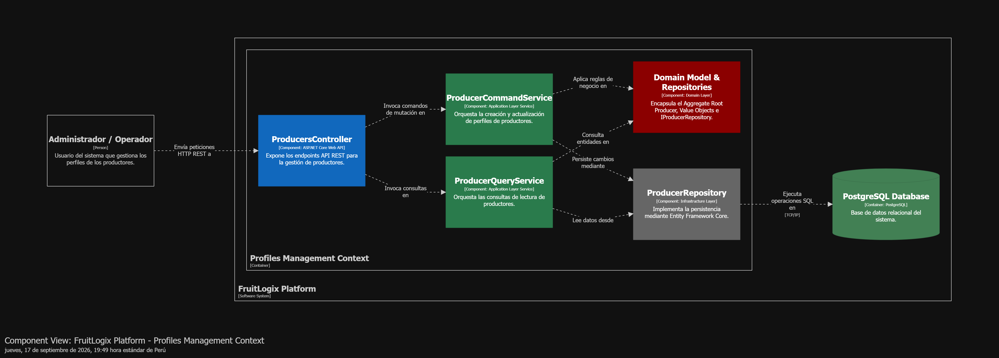
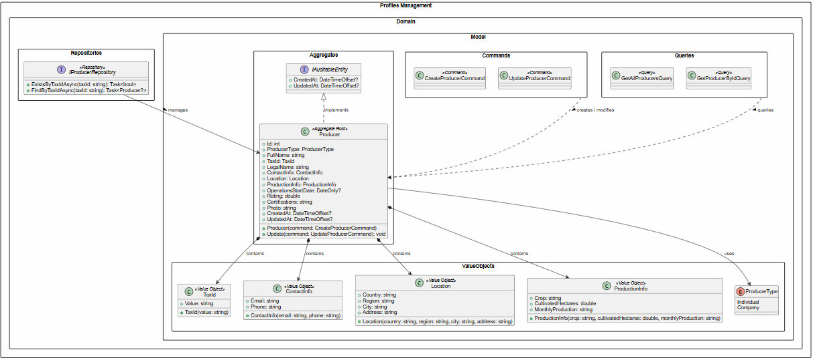
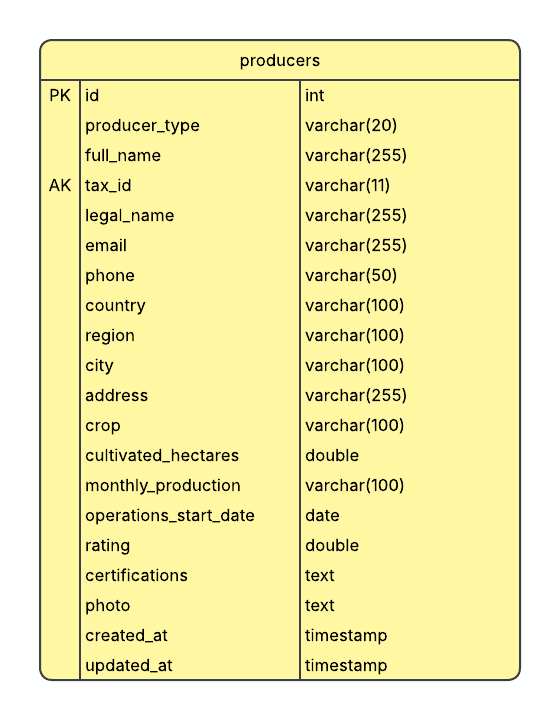
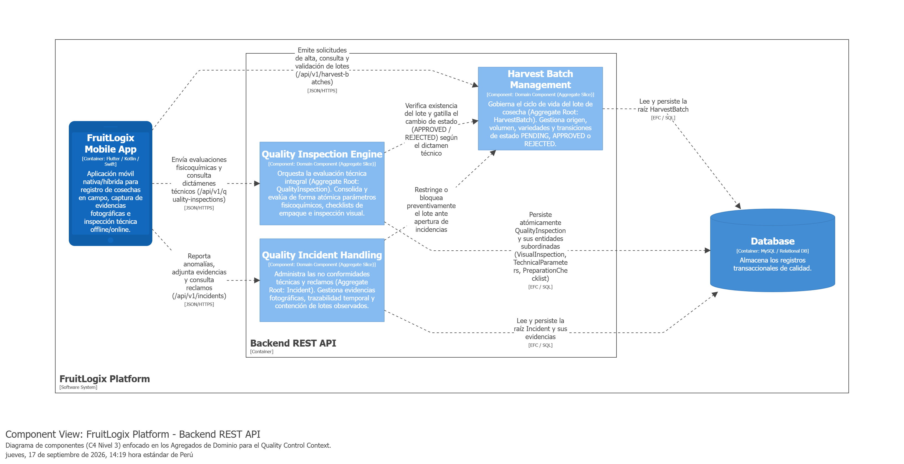
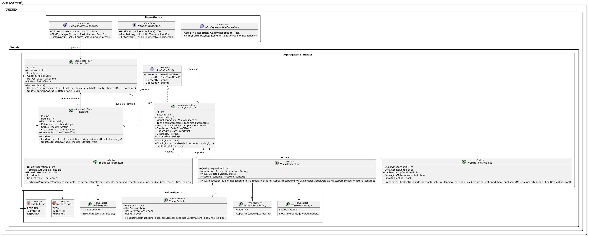
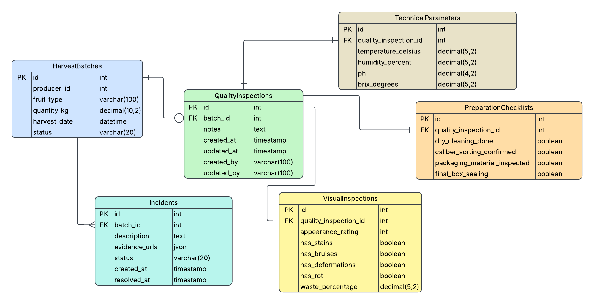

## 2.6 Tactical-Level Domain-Driven Design

En este capítulo se formaliza la arquitectura de software del sistema FruitLogix a partir de los hallazgos identificados en el análisis del dominio y el mapeo de contextos estratégicos. El propósito fundamental es trasladar los requerimientos funcionales y las reglas de negocio hacia una estructura modular, desacoplada y escalable, capaz de garantizar la interoperabilidad fluida entre Productores Agrícolas, Distribuidores y Clientes Comerciales.

Para lograrlo, se adopta un enfoque guiado por los patrones tácticos de Domain-Driven Design (DDD) y una arquitectura de capas. Esta combinación aísla la lógica central del negocio de los detalles de infraestructura, frameworks y servicios externos como pasarelas de pago o APIs de mapas.

### 2.6.1 Bounded Context: Profiles Management

El Profiles Management Context administra los perfiles de los actores agrícolas en FruitLogix, enfocándose principalmente en la gestión integral de los productores (Producer). Su frontera arquitectónica aísla la información legal, operativa, de contacto y de producción del agricultor respecto a los contextos transaccionales y de transporte.

#### 2.6.1.1 Domain Layer

Las entidades e identificadores en este Bounded Context son:

**Aggregate Roots**:

- Producer: Gobierna el perfil del productor, sus credenciales tributarias, ubicación geográfica, detalles de contacto y capacidad productiva.

**Value Objects**:

- TaxId: Encapsula el número de identificación fiscal (RUC/NIT) con reglas de validación de formato.

- ContactInfo: Agrupa los canales de comunicación principal (teléfono, correo electrónico, persona de contacto).

- Location: Estructura la dirección física, departamento, provincia y coordenadas de las instalaciones.

- ProductionInfo: Define la capacidad operativa, hectáreas de cultivo, tipos de fruta producida y certificaciones.

- ProducerType: Enumeración que clasifica el tipo de productor (e.g., Smallholder, MediumCommercial, ExportCooperative).
**Repositories**:

- IProducerRepository: Contrato de persistencia para las operaciones del agregado Producer.
- 
**Commands**:

- CreateProducerCommand

- UpdateProducerCommand

**Queries**:

- GetAllProducersQuery

- GetProducerByIdQuery

#### 2.6.1.2 Interfaces Layer

**Controladores API**:

- ProducersController: Expone los endpoints HTTP RESTful para el registro, actualización y consulta de productores.

**Resources (DTOs)**:

- CreateProducerResource

- UpdateProducerResource

- ProducerResource

**Assemblers (Mappers)**:

- ProducerResourceAssembler: Transforma los recursos DTO a comandos del dominio y mapea la entidad Producer hacia ProducerResource.

#### 2.6.1.3 Application Layer

**Command Services**:

- IProducerCommandService: Interfaz pública para procesar mutaciones.

- ProducerCommandService: Implementación de la lógica para procesar la creación y actualización de perfiles de productores.

**Query Services**:

- IProducerQueryService: Interfaz pública para lectura.

- ProducerQueryService: Implementación para coordinar las consultas de lectura (GetAllProducersQuery, GetProducerByIdQuery).

#### 2.6.1.4 Infrastructure Layer

**Persistencia Relacional (EFC)**:

- ProducerRepository: Implementación sobre Entity Framework Core encargada de la persistencia y mapeo relacional del agregado Producer y sus objetos de valor embebidos.

#### 2.6.1.5 Bounded Context Software Architecture Component Level Diagram

El diagrama de componentes de la arquitectura de software para el Bounded Context Profiles Management describe la organización interna y la interacción entre las capas tácticas de Domain-Driven Design (DDD) e infraestructura en C# (.NET). Se enfatiza la separación estricta entre el flujo de mutación de comandos (ProducerCommandService) y el flujo de consultas de lectura (ProducerQueryService), garantizando un desacoplamiento limpio alineado a Clean Architecture / Hexagonal Architecture.

#### 2.6.x.6. Bounded Context Software Architecture Code Level Diagrams

##### 2.6.1.6.1. Bounded Context Domain Layer Class Diagram

El diagrama de clases de la capa de dominio describe la estructura estática del Bounded Context Profiles Management en C# (.NET). En la cúspide se encuentra la interfaz de persistencia IProducerRepository, que extiende el repositorio base de la plataforma e incorpora métodos especializados (ExistsByTaxIdAsync, FindByTaxIdAsync) para la validación de unicidad fiscal.

En el núcleo del dominio, la raíz de agregado Producer implementa el contrato IAuditableEntity para el sellado de tiempo (CreatedAt, UpdatedAt). Encapsula la lógica de negocio mediante sus constructores y métodos mutadores (Update), integrando de forma inmutable los Value Objects TaxId (validación de RUC de 11 dígitos), ContactInfo (correo y teléfono), Location (coordenadas políticas y dirección) y ProductionInfo (métricas de cultivo y hectáreas), además de apoyarse en la enumeración ProducerType (Individual, Company). Finalmente, los objetos inmutables de las capas de Commands y Queries coordinan la mutación y consulta de perfiles bajo el patrón CQRS.

##### 2.6.1.6.2. Bounded Context Database Design Diagram

El diagrama de base de datos relacional para el Bounded Context Profiles Management modela la persistencia física del Aggregate Root Producer. La tabla física producers actúa como el repositorio centralizado del perfil del agricultor, aplanando los Objetos de Valor de dominio en columnas relacionales directas (tax_id, email, phone, country, region, crop, cultivated_hectares, etc.) para agilizar el rendimiento I/O y evitar uniones complejas en lectura.

La columna tax_id se configura con una restricción de unicidad (UK) para garantizar que no existan duplicidades en el registro tributario (RUC) dentro del sistema. La columna operations_start_date maneja el tipo date para el tiempo de inicio de actividades, mientras que certifications y photo se almacenan como cadenas de texto extendidas. Finalmente, la tabla cuenta con las columnas de auditoría created_at y updated_at exigidas por el contrato IAuditableEntity.

### 2.6.4. Quality Control

El Quality Control Context aísla el ciclo de evaluación técnica, auditoría paramétrica y resolución de disconformidades sobre lotes de fruta perecible. Su límite arquitectónico asegura que la lógica de inspección organoléptica, fisicoquímica y empaque permanezca desacoplada de la facturación y del seguimiento de rutas de entrega.
#### 2.6.4.1 Domain Layer

Las entidades indentificadas en este Bounded Context son:

**Aggregate Roots**:
- HarvestBatch: Gobierna el lote recolectado en campo, encapsulando productor, variedad, volumen en kilogramos, fecha y su ciclo transaccional mediante el objeto de valor BatchStatus (PENDING, APPROVED, REJECTED).
- Incident: Administra no conformidades y reclamos de calidad asociados a un lote (BatchId), gestionando descripción técnica, evidencias fotográficas y estado (IncidentStatus: OPEN, IN_REVIEW, RESOLVED).
- QualityInspection: Entidad auditable que centraliza la evaluación global del lote, orquestando de manera atómica sus entidades internas subordinadas.

**Entities**:
- VisualInspection: Entidad dependiente que encapsula los resultados de la apariencia externa (AppearanceRating), defectos visibles detectados y el porcentaje de desperdicio estimado (WastePercentage).
- TechnicalParameters: Entidad dependiente encargada de registrar métricas fisicoquímicas y ambientales directas: temperatura en grados Celsius, porcentaje de humedad relativa, nivel de pH y sólidos solubles en grados Brix (BrixDegrees).
- PreparationChecklist: Entidad dependiente que valida el cumplimiento operativo previo al despacho (limpieza en seco, confirmación de selección por calibre, inspección del material de embalaje y sellado final de cajas).

**Value Objects**:
- BatchStatus: Representa los estados permitidos del lote agrícola (PENDING, APPROVED, REJECTED).
- IncidentStatus: Representa los estados resolutivos de una incidencia (OPEN, IN_REVIEW, RESOLVED).
- AppearanceRating: Escala de calificación visual del estado físico del producto perecible.
- VisualDefects: Encapsula los indicadores booleanos de imperfecciones físicas (manchas, golpes/magulladuras, deformaciones y presencia de pudrición).
- WastePercentage: Cuantifica la proporción numérica calculada de desperdicio o merma en el lote inspeccionado.
- BrixDegrees: Modela la concentración de azúcares y nivel de madurez organoléptica de la fruta.

**Commands**:
- CreateHarvestBatchCommand y UpdateHarvestBatchStatusCommand.
- CreateIncidentCommand y UpdateIncidentStatusCommand.
- CreateQualityInspectionCommand. 

**Queries**:
- GetAllHarvestBatchesQuery.
- GetAllIncidentsQuery.
- GetQualityInspectionByBatchIdQuery.

**Domain Repositories**:
- IHarvestBatchRepository, IIncidentRepository, IQualityInspectionRepository.

#### 2.6.4.2 Interfaces Layer

Expone contratos HTTP RESTful documentados para ser consumidos por el Frontend y aplicaciones cliente.

**Controladores API**:
- HarvestBatchesController
- IncidentsController
- QualityInspectionsController.

**Resources (DTOs)**:
- HarvestBatchResource
- CreateHarvestBatchResource
- UpdateHarvestBatchStatusResource
- IncidentResource
- CreateIncidentResource
- UpdateIncidentStatusResource
- QualityInspectionResource
- CreateQualityInspectionResource.

**Assemblers (Mappers)**:
Clases estáticas de transformación limpia (HarvestBatchResourceAssembler, IncidentResourceAssembler, QualityInspectionResourceAssembler) que convierten entidades de dominio a Resources sin filtrar detalles internos del modelo.

#### 2.6.4.3 Application Layer

Implementa el patrón de segregación de responsabilidades mediante servicios dedicados de comandos y consultas, orquestando transacciones a través de la unidad de trabajo y repositorios.

**Command Services**:
HarvestBatchCommandService, IncidentCommandService, QualityInspectionCommandService (con sus interfaces públicas IHarvestBatchCommandService, etc.). 

**Query Services**:
HarvestBatchQueryService, IncidentQueryService, QualityInspectionQueryService (con sus interfaces públicas IHarvestBatchQueryService, etc.).

#### 2.6.4.4 Infrastructure Layer

Persistencia Relacional (EFC): Implementación de los repositorios sobre Entity Framework Core (HarvestBatchRepository, IncidentRepository, QualityInspectionRepository).

Mapeo de Owned Entities: En el contexto de datos, QualityInspection mapea a VisualInspection, TechnicalParameters y PreparationChecklist como entidades dependientes ligadas a la misma transacción mediante la clave foránea asignada tras la creación del Aggregate Root.

#### 2.6.4.5 Bounded Context Software Architecture Component Level Diagram

El diagrama de componentes del Quality Control Context ilustra la arquitectura interna del Quality Control Context dentro de la API backend, modelada bajo un enfoque de rebanadas verticales (vertical slices) centradas en el dominio. En este diseño, la aplicación móvil empleada por productores e inspectores en campo interactúa mediante peticiones HTTPS/JSON con tres componentes modulares que encapsulan la lógica transaccional de sus respectivos Aggregates de negocio: Harvest Batch Management, encargado del ciclo de vida y trazabilidad de los cargamentos recolectados; Quality Inspection Engine, responsable de coordinar y evaluar de manera atómica las mediciones fisicoquímicas, listas de empaque y defectos visuales; y Quality Incident Handling, enfocado en registrar reclamos y evidencias fotográficas para aplicar restricciones preventivas sobre lotes observados. Finalmente, estos componentes colaboran internamente para sincronizar los estados de aptitud comercial del producto y se comunican con el motor de base de datos relacional mediante Entity Framework Core, garantizando persistencia aislada, alta cohesión y un desacoplamiento estricto frente a las operaciones comerciales del sistema.

#### 2.6.4.6 Bounded Context Software Architecture Code Level Diagram

##### 2.6.4.6.1 Bounded Context Domain Layer Class Diagram

El diagrama de clases de la capa de dominio detalla la estructura estática y las reglas tácticas del Quality Control Context estructuradas bajo los principios de Domain-Driven Design y Clean Architecture. En el paquete superior de repositorios se declaran las interfaces de persistencia (IHarvestBatchRepository, IIncidentRepository e IQualityInspectionRepository), las cuales definen contratos asíncronos para desacoplar las operaciones de lectura y escritura respecto a la infraestructura relacional. En el núcleo del modelo, el Aggregate Root HarvestBatch gobierna la identidad y los estados operativos del lote (BatchStatus), mientras que Incident administra las no conformidades y enlaces de evidencias fotográficas bajo su propio ciclo de resolución (IncidentStatus), referenciando al cargamento de forma débil mediante el identificador primitivo BatchId. Por su parte, la entidad QualityInspection implementa el contrato de trazabilidad temporal IAuditableEntity y compone de forma exclusiva a las entidades subordinadas TechnicalParameters, VisualInspection y PreparationChecklist. Finalmente, el paquete inferior aísla los objetos de valor inmutables (AppearanceRating, VisualDefects, WastePercentage y BrixDegrees), asegurando la encapsulación rigurosa de las validaciones fisicoquímicas y organolépticas requeridas durante la evaluación de la fruta.

##### 2.6.4.6.2 Bounded Context Database Diagram

El diagrama de base de datos relacional para el Quality Control Context modela la persistencia de las entidades y raíces de agregado garantizando integridad referencial y consistencia transaccional. La tabla principal HarvestBatches actúa como el pivote central del dominio, vinculándose mediante una relación de uno a muchos (1:N) con Incidents para el registro ilimitado de disconformidades y evidencias fotográficas sobre un lote. A su vez, se asocia de forma opcional y única (1:0..1) con QualityInspections, asegurando una auditoría formal consolidada por lote de cosecha. Por último, para reflejar fielmente la composición atómica del agregado, QualityInspections se descompone en tres tablas hijas especializadas (VisualInspections, TechnicalParameters y PreparationChecklists) conectadas bajo una cardinalidad estricta de uno a uno (1:1) mediante la clave foránea quality_inspection_id con restricción de unicidad, desacoplando limpiamente los parámetros fisicoquímicos, las listas de empaque y la evaluación organoléptica.

### 2.6.6 Bounded Context: Logistics and Monitoring

El Logistics and Monitoring Context gestiona el seguimiento en tiempo real, despacho y monitoreo de entregas de lotes agrícolas. Su límite arquitectónico aísla la telemetría GPS, la gestión de alertas operativas y la trazabilidad de rutas, asegurando que la logística de transporte permanezca desacoplada de la autenticación de usuarios y del control de calidad en origen.

#### 2.6.6.1 Domain Layer

Las entidades, objetos de valor e interfaces identificadas en este Bounded Context son:

**Aggregate Roots**:
* **Alert**: Gobierna el ciclo de vida de las incidencias operativas y desviaciones en ruta, centralizando su tipo, nivel de severidad y estado de resolución.
* **Delivery**: Administra la orden de despacho y transporte del lote, orquestando los estados de tránsito, la asignación de conductor/vehículo y la trazabilidad telegráfica.

**Entities**:
* **TrackingLog**: Entidad dependiente asignada a una entrega (Delivery) que registra eventos cronológicos de telemetría, capturando coordenadas GPS y marcas de tiempo durante el trayecto.

**Value Objects**:
* **AlertSeverity**: Representa la escala de criticidad de las alertas en ruta (e.g., LOW, MEDIUM, HIGH, CRITICAL).
* **AlertType**: Clasifica la naturaleza de la alerta registrada (e.g., DELAY, TEMPERATURE_EXCEEDED, ROUTE_DEVIATION).
* **DeliveryStatus**: Define los estados permitidos dentro del flujo logístico (e.g., PENDING, IN_TRANSIT, DELIVERED, DELAYED).
* **DriverInfo**: Encapsula los datos de identificación del conductor asignado a la unidad de transporte.
* **GpsCoordinates**: Modela la ubicación geográfica mediante pares numéricos de latitud y longitud.
* **RouteInfo**: Encapsula la información del punto de origen, destino y estimación de ruta.
* **VehicleInfo**: Agrupa las especificaciones operativas de la unidad de transporte asignada (placa y tipo de vehículo).

**Commands**:
* CreateAlertCommand
* CreateDeliveryCommand
* CreateTrackingLogCommand
* ReportDelayCommand
* ResolveAlertCommand
* StartDispatchCommand

**Queries**:
* GetAllActiveAlertsQuery
* GetAllDeliveriesQuery
* GetTrackingLogsByDeliveryIdQuery

**Domain Repositories**:
* IAlertRepository
* IDeliveryRepository
* ITrackingLogRepository

#### 2.6.6.2 Interfaces Layer

Expone contratos HTTP RESTful documentados para ser consumidos por el Frontend y aplicaciones cliente, permitiendo la interacción con la lógica de logística y monitoreo en tiempo real.

**Controladores API**:
* AlertsController
* DeliveriesController
* TrackingLogsController

**Resources (DTOs)**:
* AlertResource
* CreateDeliveryResource
* CreateTrackingLogResource
* DeliveryResource
* ReportDelayResource
* TrackingLogResource

**Assemblers (Mappers)**:
Clases de transformación limpia (AlertResourceFromEntityAssembler, CreateDeliveryCommandFromResourceAssembler, CreateTrackingLogCommandFromResourceAssembler, DeliveryResourceFromEntityAssembler, TrackingLogResourceFromEntityAssembler) que convierten entidades de dominio a Resources y DTOs a Comandos sin filtrar detalles internos del modelo.

#### 2.6.6.3 Application Layer

Implementa el patrón de segregación de responsabilidades de consulta y comando (CQRS) mediante servicios dedicados de comandos y consultas, orquestando las transacciones del flujo logístico a través de la unidad de trabajo y repositorios de dominio.

**Command Services**:
* IAlertCommandService: Interfaz pública para la gestión de comandos de alertas operativas.
* IDeliveryCommandService: Interfaz pública para la gestión del ciclo de vida de órdenes de entrega.
* ITrackingLogCommandService: Interfaz pública para el registro transaccional de puntos de rastreo.
* AlertCommandService: Servicio interno encargado de procesar comandos de resolución y creación de alertas (CreateAlertCommand, ResolveAlertCommand).
* DeliveryCommandService: Servicio interno responsable de procesar la creación, despacho y reporte de retrasos en las entregas (CreateDeliveryCommand, StartDispatchCommand, ReportDelayCommand).
* TrackingLogCommandService: Servicio interno que coordina la persistencia de logs de telemetría e incidencias geográficas (CreateTrackingLogCommand).

**Query Services**:
* IAlertQueryService: Interfaz pública para la consulta de alertas en ruta.
* IDeliveryQueryService: Interfaz pública para la consulta de entregas registradas.
* ITrackingLogQueryService: Interfaz pública para la lectura de la trazabilidad y logs de posicionamiento.
* AlertQueryService: Servicio interno encargado de ejecutar las lecturas de alertas activas (GetAllActiveAlertsQuery).
* DeliveryQueryService: Servicio interno responsable de coordinar la obtención general de órdenes de despacho (GetAllDeliveriesQuery).
* TrackingLogQueryService: Servicio interno que procesa el historial de localización por entrega (GetTrackingLogsByDeliveryIdQuery).

#### 2.6.6.4 Infrastructure Layer

**Persistencia Relacional (EFC)**:
Implementación de los repositorios de dominio sobre Entity Framework Core mediante AlertRepository, DeliveryRepository y TrackingLogRepository. 

Esta capa gestiona la persistencia física de los Aggregate Roots (Delivery y Alert) junto a sus entidades dependientes (TrackingLog) y objetos de valor asociados (GpsCoordinates, RouteInfo, VehicleInfo, DriverInfo), encapsulando las consultas y operaciones I/O a la base de datos relacional sin acoplar las reglas de negocio de la capa de dominio.

