## 2.6 Tactical-Level Domain-Driven Design

En este capítulo se formaliza la arquitectura de software del sistema FruitLogix a partir de los hallazgos identificados en el análisis del dominio y el mapeo de contextos estratégicos. El propósito fundamental es trasladar los requerimientos funcionales y las reglas de negocio hacia una estructura modular, desacoplada y escalable, capaz de garantizar la interoperabilidad fluida entre Productores Agrícolas, Distribuidores y Clientes Comerciales.

Para lograrlo, se adopta un enfoque guiado por los patrones tácticos de Domain-Driven Design (DDD) y una arquitectura de capas. Esta combinación aísla la lógica central del negocio de los detalles de infraestructura, frameworks y servicios externos como pasarelas de pago o APIs de mapas.

### 2.6.1 Bounded Context: Profiles Management

El Profiles Management Context administra los perfiles de los actores agrícolas en FruitLogix, enfocándose principalmente en la gestión integral de los productores (Producer). Su frontera arquitectónica aísla la información legal, operativa, de contacto y de producción del agricultor respecto a los contextos transaccionales y de transporte.

#### 2.6.1.1 Domain Layer

Las entidades e identificadores en este Bounded Context son:

**Aggregate Roots**:

- Producer: Gobierna el perfil del productor, sus credenciales tributarias, ubicación geográfica, detalles de contacto y capacidad productiva.

**Value Objects**:

- TaxId: Encapsula el número de identificación fiscal (RUC/NIT) con reglas de validación de formato.

- ContactInfo: Agrupa los canales de comunicación principal (teléfono, correo electrónico, persona de contacto).

- Location: Estructura la dirección física, departamento, provincia y coordenadas de las instalaciones.

- ProductionInfo: Define la capacidad operativa, hectáreas de cultivo, tipos de fruta producida y certificaciones.

- ProducerType: Enumeración que clasifica el tipo de productor (e.g., Smallholder, MediumCommercial, ExportCooperative).
  **Repositories**:

- IProducerRepository: Contrato de persistencia para las operaciones del agregado Producer.
-
**Commands**:

- CreateProducerCommand

- UpdateProducerCommand

**Queries**:

- GetAllProducersQuery

- GetProducerByIdQuery

#### 2.6.1.2 Interfaces Layer

**Controladores API**:

- ProducersController: Expone los endpoints HTTP RESTful para el registro, actualización y consulta de productores.

**Resources (DTOs)**:

- CreateProducerResource

- UpdateProducerResource

- ProducerResource

**Assemblers (Mappers)**:

- ProducerResourceAssembler: Transforma los recursos DTO a comandos del dominio y mapea la entidad Producer hacia ProducerResource.

#### 2.6.1.3 Application Layer

**Command Services**:

- IProducerCommandService: Interfaz pública para procesar mutaciones.

- ProducerCommandService: Implementación de la lógica para procesar la creación y actualización de perfiles de productores.

**Query Services**:

- IProducerQueryService: Interfaz pública para lectura.

- ProducerQueryService: Implementación para coordinar las consultas de lectura (GetAllProducersQuery, GetProducerByIdQuery).

#### 2.6.1.4 Infrastructure Layer

**Persistencia Relacional (EFC)**:

- ProducerRepository: Implementación sobre Entity Framework Core encargada de la persistencia y mapeo relacional del agregado Producer y sus objetos de valor embebidos.

#### 2.6.1.5 Bounded Context Software Architecture Component Level Diagram

El diagrama de componentes de la arquitectura de software para el Bounded Context Profiles Management describe la organización interna y la interacción entre las capas tácticas de Domain-Driven Design (DDD) e infraestructura en C# (.NET). Se enfatiza la separación estricta entre el flujo de mutación de comandos (ProducerCommandService) y el flujo de consultas de lectura (ProducerQueryService), garantizando un desacoplamiento limpio alineado a Clean Architecture / Hexagonal Architecture.

#### 2.6.1.6. Bounded Context Software Architecture Code Level Diagrams

##### 2.6.1.6.1. Bounded Context Domain Layer Class Diagram

El diagrama de clases de la capa de dominio describe la estructura estática del Bounded Context Profiles Management en C# (.NET). En la cúspide se encuentra la interfaz de persistencia IProducerRepository, que extiende el repositorio base de la plataforma e incorpora métodos especializados (ExistsByTaxIdAsync, FindByTaxIdAsync) para la validación de unicidad fiscal.

En el núcleo del dominio, la raíz de agregado Producer implementa el contrato IAuditableEntity para el sellado de tiempo (CreatedAt, UpdatedAt). Encapsula la lógica de negocio mediante sus constructores y métodos mutadores (Update), integrando de forma inmutable los Value Objects TaxId (validación de RUC de 11 dígitos), ContactInfo (correo y teléfono), Location (coordenadas políticas y dirección) y ProductionInfo (métricas de cultivo y hectáreas), además de apoyarse en la enumeración ProducerType (Individual, Company). Finalmente, los objetos inmutables de las capas de Commands y Queries coordinan la mutación y consulta de perfiles bajo el patrón CQRS.

##### 2.6.1.6.2. Bounded Context Database Design Diagram

El diagrama de base de datos relacional para el Bounded Context Profiles Management modela la persistencia física del Aggregate Root Producer. La tabla física producers actúa como el repositorio centralizado del perfil del agricultor, aplanando los Objetos de Valor de dominio en columnas relacionales directas (tax_id, email, phone, country, region, crop, cultivated_hectares, etc.) para agilizar el rendimiento I/O y evitar uniones complejas en lectura.

La columna tax_id se configura con una restricción de unicidad (UK) para garantizar que no existan duplicidades en el registro tributario (RUC) dentro del sistema. La columna operations_start_date maneja el tipo date para el tiempo de inicio de actividades, mientras que certifications y photo se almacenan como cadenas de texto extendidas. Finalmente, la tabla cuenta con las columnas de auditoría created_at y updated_at exigidas por el contrato IAuditableEntity.

### 2.6.2 Bounded Context: Fleet Management

#### 2.6.2.1 Domain Layer

Las entidades e identificadores en este Bounded Context son:

**Aggregate Roots**:

- Driver: Representa a un conductor de la flota del distribuidor, dueño de su ciclo de vida completo (registro, validación de licencia, activación). Encapsula la regla de negocio que impide activar a un conductor si su licencia no ha sido verificada y no se encuentra vigente.

- Vehicle: Representa un vehículo de transporte perteneciente a la flota del distribuidor, dueño de su ficha técnica y de la validación de su capacidad de carga. Encapsula las reglas de negocio de transición de estado (registro, registro de ficha técnica, validación o rechazo de capacidad, asignación a una operación logística).

**Entities**:

- VehicleTechnicalSheet: Representa la ficha técnica de un vehículo, con su documentación, estado de mantenimiento y fecha de revisión. Vive como parte del aggregate Vehicle, sin identidad ni ciclo de vida propio fuera de él.

**Value Objects**:

- LicenseNumber: Encapsula y valida el número de licencia de conducir del Driver, garantizando que tenga un formato válido y no se encuentre vacío. Se autovalida en su constructor.

- PlateNumber: Encapsula la placa del Vehicle, validando su formato antes de permitir el registro del vehículo.

- CapacityKg: Encapsula la capacidad de carga declarada de un Vehicle, validando que sea un valor positivo y sirviendo de base para su contraste contra los estándares del VehicleType correspondiente.

**Enumerations**:

- DriverStatus: Enumera los estados posibles del ciclo de vida del conductor (Registered, LicenseValidated, Active, Rejected).

- VehicleStatus: Enumera los estados posibles del ciclo de vida del vehículo (Registered, TechnicalSheetRegistered, CapacityValidated, CapacityRejected, Assigned).

- VehicleType: Catálogo de tipos de vehículo (por ejemplo Van, Truck, RefrigeratedTruck), utilizado como referencia para los estándares máximos de capacidad de carga contra los cuales se valida CapacityKg.

- FleetError: Catálogo de errores de negocio declarado en el dominio. Actualmente no se utiliza en las excepciones reales, ya que el sistema lanza InvalidOperationException genéricas en su lugar.

**Repositories**:

- IDriverRepository: Contrato de persistencia para las operaciones del aggregate Driver. Define FindByLicenseNumberAsync, GetAllActiveDriversAsync y GetDriverByIdAsync.

- IVehicleRepository: Contrato de persistencia para las operaciones del aggregate Vehicle. Define FindByPlateAsync, GetAllAvailableVehiclesAsync y GetVehicleByIdWithTechnicalSheetAsync.

**Domain Policies (Business Rules)**:

- "A Driver cannot be activated unless their LicenseNumber is verified and current": regla invocada dentro del método de negocio ActivateDriver() del aggregate Driver, evitando que un conductor pase al estado Active sin haber completado la validación de licencia.

- "Whenever a Vehicle is registered, its CapacityKg must be validated against the VehicleType standards": regla invocada dentro del método de negocio ValidateCapacity() del aggregate Vehicle, determinando si la transición resultante es hacia CapacityValidated o CapacityRejected.

#### 2.6.2.2 Interface Layer

- DriversController: Controlador REST del subdominio Driver, expone los endpoints para registrar un conductor, validar su licencia, activarlo, listarlo y obtenerlo por identificador.

- VehiclesController: Controlador REST del subdominio Vehicle, expone los endpoints para registrar un vehículo, registrar su ficha técnica, validar su capacidad, listarlo y obtenerlo por identificador.

**Resources**:

- RegisterDriverResource, ValidateDriverLicenseResource, ActivateDriverResource, DriverResource: DTOs que definen el contrato HTTP de entrada y salida del subdominio Driver, aislando al dominio del formato JSON externo.

- RegisterVehicleResource, RegisterVehicleTechnicalSheetResource, ValidateVehicleCapacityResource, VehicleResource: DTOs que definen el contrato HTTP de entrada y salida del subdominio Vehicle, aislando al dominio del formato JSON externo.

- AssignDriverAndVehicleResource: DTO que define el contrato HTTP para la asignación conjunta de un Driver validado y un Vehicle con capacidad validada a una operación logística, consumida posteriormente por el Bounded Context de Logistics & Monitoring.

**Assemblers**:

- RegisterDriverCommandFromResourceAssembler, ValidateDriverLicenseCommandFromResourceAssembler, ActivateDriverCommandFromResourceAssembler (y análogos por cada comando del subdominio Vehicle): traducen Resource a Command en la entrada, y Entity a Resource en la salida. Evitan que el Controller construya comandos o exponga entidades de dominio directamente.

#### 2.6.2.3 Application Layer

**Commands**:

- RegisterDriverCommand

- ValidateDriverLicenseCommand

- ActivateDriverCommand

- RegisterVehicleCommand

- RegisterVehicleTechnicalSheetCommand

- ValidateVehicleCapacityCommand

- AssignDriverAndVehicleCommand

**Queries**:

- GetAllDriversQuery

- GetDriverByIdQuery

- GetAllVehiclesQuery

- GetVehicleByIdQuery

- GetAvailableVehiclesQuery

**Command Services**:

- IDriverCommandService / DriverCommandService: Implementa los Command Handlers del subdominio Driver, un método Handle() sobrecargado por cada comando (RegisterDriverCommand, ValidateDriverLicenseCommand, ActivateDriverCommand). Cada handler sigue el mismo patrón: buscar el aggregate, invocar el método de negocio correspondiente, persistir vía repositorio y llamar a UnitOfWork.CompleteAsync().

- IVehicleCommandService / VehicleCommandService: Implementa los Command Handlers del subdominio Vehicle, un método Handle() sobrecargado por cada comando (RegisterVehicleCommand, RegisterVehicleTechnicalSheetCommand, ValidateVehicleCapacityCommand). Sigue el mismo patrón descrito arriba.

**Query Services**:

- IDriverQueryService / DriverQueryService: Implementa los Query Handlers de lectura pura del subdominio Driver, sin efectos secundarios.

- IVehicleQueryService / VehicleQueryService: Implementa los Query Handlers de lectura pura del subdominio Vehicle, sin efectos secundarios.

**Event Handlers**:

- No existen actualmente en este Bounded Context. Se documenta como hallazgo del estado actual del sistema, no como parte faltante del diseño ideal, ya que el Event Storming sí contempla estos flujos mediante políticas (por ejemplo, la asignación conjunta de Driver y Vehicle tras Driver Activated y Vehicle Capacity Validated se resuelve hoy mediante una invocación explícita de AssignDriverAndVehicleCommand, y no mediante una suscripción a eventos de dominio).

#### 2.6.2.4 Infrastructure Layer

**Repositories**:

- DriverRepository: Implementación concreta de IDriverRepository usando Entity Framework Core sobre el AppDbContext compartido.

- VehicleRepository: Implementación concreta de IVehicleRepository usando Entity Framework Core sobre el AppDbContext compartido. Utiliza .Include(v => v.TechnicalSheet) para cargar el aggregate completo (Vehicle junto con su VehicleTechnicalSheet) en una sola consulta, evitando el problema N+1.

**Integraciones externas**:

- No existe actualmente una integración en tiempo real con bases de datos gubernamentales para la verificación de identidad y de licencias de conducir. Este hallazgo fue identificado como Hotspot durante el Event Storming (sección 2.4, Paso 3), y se documenta como una limitación del estado actual del sistema, ya que la validación de LicenseNumber depende hoy de una verificación manual/administrativa en lugar de un servicio externo automatizado.

- No existe integración con Message Brokers ni servicios externos adicionales (correo, colas) en este Bounded Context, consecuencia directa de la ausencia de eventos de dominio implementados descrita en la sección 2.6.3.3.

#### 2.6.2.5 Bounded Context Software Architecture Component Level Diagram

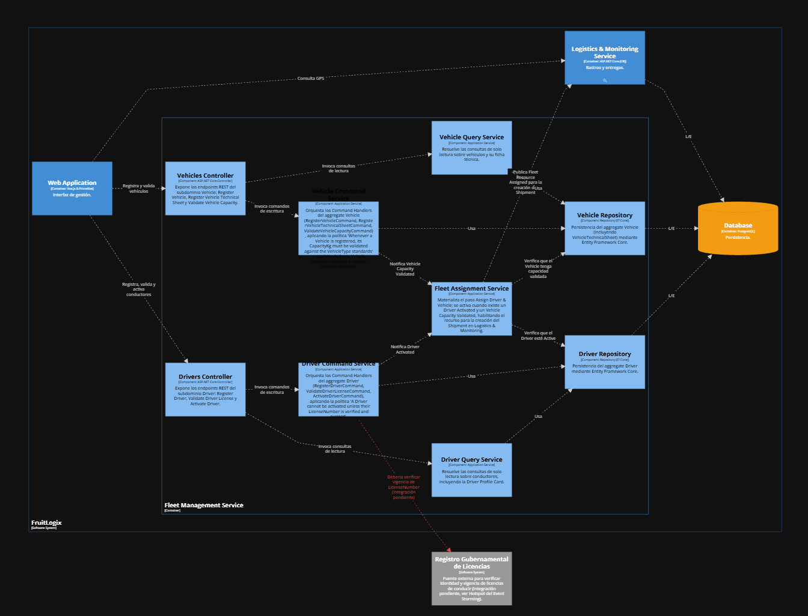

El diagrama de componentes descompone el container Fleet Management Service en sus bloques estructurales internos. Se distinguen dos subdominios independientes, Driver y Vehicle, cada uno con su propio Controller, Command Service, Query Service y Repository, además de un Fleet Assignment Service que coordina la asignación conjunta de ambos recursos hacia el Bounded Context de Logistics & Monitoring.

#### 2.6.2.6 Bounded Context Software Architecture Code Level Diagrams

##### 2.6.2.6.1 Bounded Context Domain Layer Class Diagram

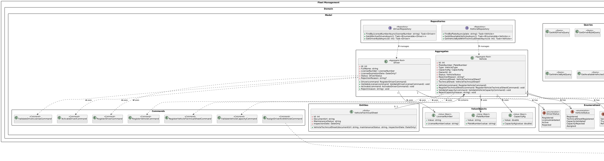

El diagrama de clases representa el modelo de dominio del Bounded Context Fleet Management. Se identifican dos Aggregate Roots, Driver y Vehicle, cada uno con sus reglas de negocio, Value Objects y estados propios, así como los Commands y Queries que los orquestan. La nota destaca la política que coordina la activación conjunta de ambos agregados durante la asignación de flota.

##### 2.6.3.6.2. Bounded Context Database Design Diagram

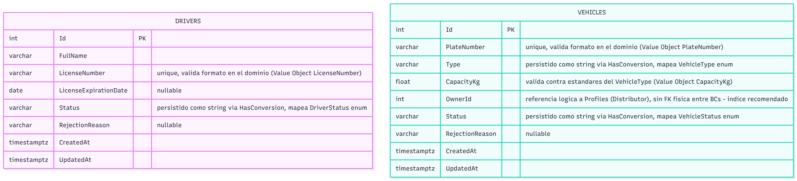

El diagrama entidad-relación traduce a nivel de persistencia los dos agregados del Bounded Context Fleet Management: drivers y vehicles. No existe una FK física entre ambas tablas, ya que la asignación conductor-vehículo se resuelve a nivel de aplicación y se materializa posteriormente en el Bounded Context de Logistics & Monitoring.

### 2.6.3 Bounded Context: Order Management

#### 2.6.3.1 Domain Layer

Las entidades e identificadores en este Bounded Context son:

**Aggregate Roots**:

- Order: Representa un pedido completo, dueño de su ciclo de vida y de sus ítems. Encapsula las reglas de negocio de transición de estado (asignación de productor, cancelación, marcado de tránsito y entrega, rechazo, confirmación de recepción).

**Entities**:

- OrderItem: Representa un producto o fruta específico dentro del pedido, con su cantidad, precio unitario y subtotal. Vive como parte del aggregate Order, sin identidad ni ciclo de vida propio fuera de él.

**Value Objects**:

- DeliveryDate: Encapsula y valida la fecha de entrega del pedido, garantizando que siempre sea una fecha futura. Se autovalida en su constructor.

- ProducerId: Encapsula la referencia al productor asignado al pedido, validando que el valor sea positivo.

**Enumerations**:

- OrderStatus: Enumera los estados posibles del ciclo de vida del pedido (Pending, InPreparation, InTransit, Delivered, Rejected, Cancelled, DeliveredWithIncidence).

- OrderError: Catálogo de errores de negocio declarado en el dominio. Actualmente no se utiliza en las excepciones reales, ya que el sistema lanza InvalidOperationException genéricas en su lugar.

**Repositories**:

- IOrderRepository: Contrato de persistencia para las operaciones del agregado Order. Define FindByClientIdAsync, FindByProducerIdAsync, GetAllOrdersWithItemsAsync y GetOrderByIdWithItemsAsync.

#### 2.6.3.2 Interface Layer

- OrdersController: Único controlador REST del contexto, expone los endpoints para crear, listar, obtener por cliente, obtener por productor, actualizar, asignar productor, cancelar, confirmar recepción y eliminar pedidos.

**Resources**:

- CreateOrderResource, UpdateOrderResource, AssignProducerResource, CancelOrderResource, ConfirmOrderReceptionResource, OrderResource, OrderItemResource: DTOs que definen el contrato HTTP de entrada y salida, aislando al dominio del formato JSON externo.

**Assemblers**:

- CreateOrderCommandFromResourceAssembler, AssignProducerCommandFromResourceAssembler (y análogos por cada comando): traducen Resource a Command en la entrada, y Entity a Resource en la salida. Evitan que el Controller construya comandos o exponga entidades de dominio directamente.

#### 2.6.3.3 Application Layer

**Commands**:

- CreateOrderCommand

- UpdateOrderCommand

- AssignProducerCommand

- CancelOrderCommand

- ConfirmOrderReceptionCommand

- DeleteOrderCommand

**Queries**:

- GetAllOrdersQuery

- GetOrderByIdQuery

- GetOrdersByClientIdQuery

- GetOrdersByProducerIdQuery

**Command Services**:

- IOrderCommandService / OrderCommandService: Implementa los Command Handlers, un método Handle() sobrecargado por cada comando. Cada handler sigue el mismo patrón: buscar el aggregate, invocar el método de negocio correspondiente, persistir vía repositorio y llamar a UnitOfWork.CompleteAsync().

**Query Services**:

- IOrderQueryService / OrderQueryService: Implementa los Query Handlers de lectura pura, sin efectos secundarios.

**Event Handlers**:

- No existen actualmente en este Bounded Context. Se documenta como hallazgo del estado actual del sistema, no como parte faltante del diseño ideal, ya que el Event Storming sí contempla estos flujos mediante políticas.

#### 2.6.3.4 Infrastructure Layer

**Repositories**:

- OrderRepository: Implementación concreta de IOrderRepository usando Entity Framework Core sobre el AppDbContext compartido. Utiliza .Include(o => o.Items) para cargar el aggregate completo (Order junto con sus OrderItems) en una sola consulta, evitando el problema N+1.

**Integraciones externas**:

- No existe integración con Message Brokers ni servicios externos (correo, colas) en este Bounded Context, consecuencia directa de la ausencia de eventos de dominio implementados.

#### 2.6.3.5 Bounded Context Software Architecture Component Level Diagram

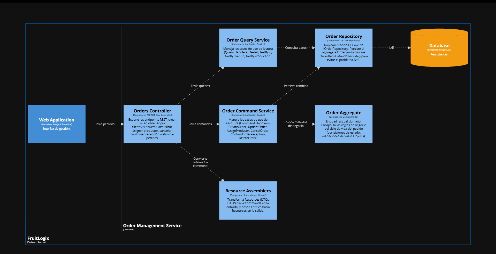

El Component Diagram del contenedor **Order Management Service** descompone el servicio en seis componentes que reflejan fielmente la arquitectura por capas implementada en el código: **Orders Controller** (capa de interfaz, expone los endpoints REST), **Resource Assemblers** (traduce DTOs hacia Commands y viceversa), **Order Command Service** y **Order Query Service** (capa de aplicación, separados siguiendo el patrón CQRS para aislar operaciones de escritura de las de lectura), **Order Aggregate** (capa de dominio, contiene las reglas de negocio del ciclo de vida del pedido) y **Order Repository** (capa de infraestructura, implementación EF Core de la persistencia).

Lo más importante a resaltar de este diagrama es la separación explícita entre comandos y queries: el `Orders Controller` enruta las peticiones de escritura hacia `Order Command Service` y las de lectura hacia `Order Query Service`, cada uno con su propio conjunto de casos de uso (Command Handlers y Query Handlers respectivamente). Ambos servicios de aplicación dependen del `Order Repository` para persistir o consultar datos, pero solo el `Order Command Service` invoca directamente los métodos de negocio del `Order Aggregate` — el flujo de lectura nunca toca el dominio, ya que las queries no requieren aplicar reglas de negocio, solo proyectar datos.

Otro punto relevante es que el diagrama no incluye ningún componente de mensajería o publicación de eventos, lo cual es consistente con un hallazgo documentado en este Bounded Context: actualmente no existen Domain Event Handlers implementados, por lo que el servicio no notifica a otros contextos (Logistics, Payment, Quality Control) cuando ocurre un cambio de estado relevante en un pedido. Esta ausencia debe entenderse como una limitación del estado actual del sistema, no como parte del diseño ideal, ya que el Event Storming sí contempla estos flujos mediante políticas que deberían traducirse en integración basada en eventos a futuro.

#### 2.6.3.6 Bounded Context Software Architecture Code Level Diagrams

##### 2.6.3.6.1 Bounded Context Domain Layer Class Diagram

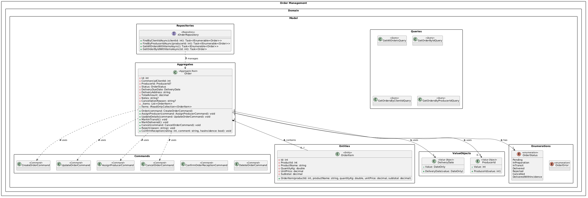

El Class Diagram del Domain Layer presenta la estructura interna del agregado `Order`, organizada en sub-paquetes que separan claramente cada tipo de elemento del modelo: `Repositories` (la interfaz `IOrderRepository`), `Aggregates` (`Order` como Aggregate Root), `Entities` (`OrderItem`), `Commands`, `Queries`, `ValueObjects` (`DeliveryDate` y `ProducerId`) y `Enumerations` (`OrderStatus` y `OrderError`).

##### 2.6.3.6.2. Bounded Context Database Design Diagram

  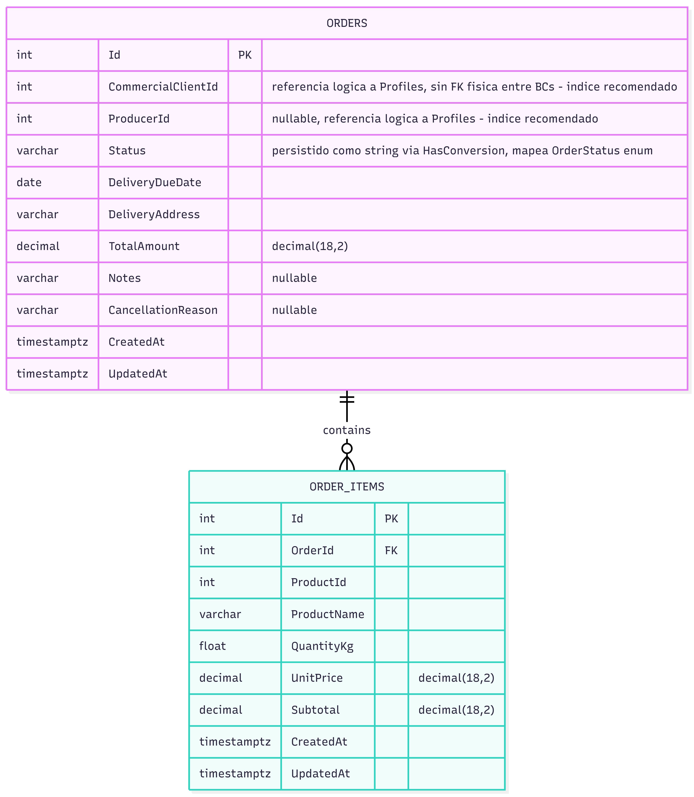

El Database Diagram muestra las dos tablas que EF Core genera a partir del aggregate `Order`: **ORDERS** y **ORDER_ITEMS**, unidas por una relación uno-a-muchos (`contains`) que corresponde directamente a la composición `Order`–`OrderItem` del modelo de dominio. `ORDER_ITEMS` tiene una Foreign Key física (`OrderId FK`) hacia `ORDERS`, ya que ambas tablas pertenecen al mismo aggregate y al mismo Bounded Context.

### 2.6.4 Bounded Context: Quality Control

El Quality Control Context aísla el ciclo de evaluación técnica, auditoría paramétrica y resolución de disconformidades sobre lotes de fruta perecible. Su límite arquitectónico asegura que la lógica de inspección organoléptica, fisicoquímica y empaque permanezca desacoplada de la facturación y del seguimiento de rutas de entrega.
#### 2.6.4.1 Domain Layer

Las entidades indentificadas en este Bounded Context son:

**Aggregate Roots**:
- HarvestBatch: Gobierna el lote recolectado en campo, encapsulando productor, variedad, volumen en kilogramos, fecha y su ciclo transaccional mediante el objeto de valor BatchStatus (PENDING, APPROVED, REJECTED).
- Incident: Administra no conformidades y reclamos de calidad asociados a un lote (BatchId), gestionando descripción técnica, evidencias fotográficas y estado (IncidentStatus: OPEN, IN_REVIEW, RESOLVED).
- QualityInspection: Entidad auditable que centraliza la evaluación global del lote, orquestando de manera atómica sus entidades internas subordinadas.

**Entities**:
- VisualInspection: Entidad dependiente que encapsula los resultados de la apariencia externa (AppearanceRating), defectos visibles detectados y el porcentaje de desperdicio estimado (WastePercentage).
- TechnicalParameters: Entidad dependiente encargada de registrar métricas fisicoquímicas y ambientales directas: temperatura en grados Celsius, porcentaje de humedad relativa, nivel de pH y sólidos solubles en grados Brix (BrixDegrees).
- PreparationChecklist: Entidad dependiente que valida el cumplimiento operativo previo al despacho (limpieza en seco, confirmación de selección por calibre, inspección del material de embalaje y sellado final de cajas).

**Value Objects**:
- BatchStatus: Representa los estados permitidos del lote agrícola (PENDING, APPROVED, REJECTED).
- IncidentStatus: Representa los estados resolutivos de una incidencia (OPEN, IN_REVIEW, RESOLVED).
- AppearanceRating: Escala de calificación visual del estado físico del producto perecible.
- VisualDefects: Encapsula los indicadores booleanos de imperfecciones físicas (manchas, golpes/magulladuras, deformaciones y presencia de pudrición).
- WastePercentage: Cuantifica la proporción numérica calculada de desperdicio o merma en el lote inspeccionado.
- BrixDegrees: Modela la concentración de azúcares y nivel de madurez organoléptica de la fruta.

**Commands**:
- CreateHarvestBatchCommand y UpdateHarvestBatchStatusCommand.
- CreateIncidentCommand y UpdateIncidentStatusCommand.
- CreateQualityInspectionCommand.

**Queries**:
- GetAllHarvestBatchesQuery.
- GetAllIncidentsQuery.
- GetQualityInspectionByBatchIdQuery.

**Domain Repositories**:
- IHarvestBatchRepository, IIncidentRepository, IQualityInspectionRepository.

#### 2.6.4.2 Interfaces Layer

Expone contratos HTTP RESTful documentados para ser consumidos por el Frontend y aplicaciones cliente.

**Controladores API**:
- HarvestBatchesController
- IncidentsController
- QualityInspectionsController.

**Resources (DTOs)**:
- HarvestBatchResource
- CreateHarvestBatchResource
- UpdateHarvestBatchStatusResource
- IncidentResource
- CreateIncidentResource
- UpdateIncidentStatusResource
- QualityInspectionResource
- CreateQualityInspectionResource.

**Assemblers (Mappers)**:
Clases estáticas de transformación limpia (HarvestBatchResourceAssembler, IncidentResourceAssembler, QualityInspectionResourceAssembler) que convierten entidades de dominio a Resources sin filtrar detalles internos del modelo.

#### 2.6.4.3 Application Layer

Implementa el patrón de segregación de responsabilidades mediante servicios dedicados de comandos y consultas, orquestando transacciones a través de la unidad de trabajo y repositorios.

**Command Services**:
HarvestBatchCommandService, IncidentCommandService, QualityInspectionCommandService (con sus interfaces públicas IHarvestBatchCommandService, etc.).

**Query Services**:
HarvestBatchQueryService, IncidentQueryService, QualityInspectionQueryService (con sus interfaces públicas IHarvestBatchQueryService, etc.).

#### 2.6.4.4 Infrastructure Layer

Persistencia Relacional (EFC): Implementación de los repositorios sobre Entity Framework Core (HarvestBatchRepository, IncidentRepository, QualityInspectionRepository).

Mapeo de Owned Entities: En el contexto de datos, QualityInspection mapea a VisualInspection, TechnicalParameters y PreparationChecklist como entidades dependientes ligadas a la misma transacción mediante la clave foránea asignada tras la creación del Aggregate Root.

#### 2.6.4.5 Bounded Context Software Architecture Component Level Diagram

El diagrama de componentes del Quality Control Context ilustra la arquitectura interna del Quality Control Context dentro de la API backend, modelada bajo un enfoque de rebanadas verticales (vertical slices) centradas en el dominio. En este diseño, la aplicación móvil empleada por productores e inspectores en campo interactúa mediante peticiones HTTPS/JSON con tres componentes modulares que encapsulan la lógica transaccional de sus respectivos Aggregates de negocio: Harvest Batch Management, encargado del ciclo de vida y trazabilidad de los cargamentos recolectados; Quality Inspection Engine, responsable de coordinar y evaluar de manera atómica las mediciones fisicoquímicas, listas de empaque y defectos visuales; y Quality Incident Handling, enfocado en registrar reclamos y evidencias fotográficas para aplicar restricciones preventivas sobre lotes observados. Finalmente, estos componentes colaboran internamente para sincronizar los estados de aptitud comercial del producto y se comunican con el motor de base de datos relacional mediante Entity Framework Core, garantizando persistencia aislada, alta cohesión y un desacoplamiento estricto frente a las operaciones comerciales del sistema.

#### 2.6.4.6 Bounded Context Software Architecture Code Level Diagram

##### 2.6.4.6.1 Bounded Context Domain Layer Class Diagram

El diagrama de clases de la capa de dominio detalla la estructura estática y las reglas tácticas del Quality Control Context estructuradas bajo los principios de Domain-Driven Design y Clean Architecture. En el paquete superior de repositorios se declaran las interfaces de persistencia (IHarvestBatchRepository, IIncidentRepository e IQualityInspectionRepository), las cuales definen contratos asíncronos para desacoplar las operaciones de lectura y escritura respecto a la infraestructura relacional. En el núcleo del modelo, el Aggregate Root HarvestBatch gobierna la identidad y los estados operativos del lote (BatchStatus), mientras que Incident administra las no conformidades y enlaces de evidencias fotográficas bajo su propio ciclo de resolución (IncidentStatus), referenciando al cargamento de forma débil mediante el identificador primitivo BatchId. Por su parte, la entidad QualityInspection implementa el contrato de trazabilidad temporal IAuditableEntity y compone de forma exclusiva a las entidades subordinadas TechnicalParameters, VisualInspection y PreparationChecklist. Finalmente, el paquete inferior aísla los objetos de valor inmutables (AppearanceRating, VisualDefects, WastePercentage y BrixDegrees), asegurando la encapsulación rigurosa de las validaciones fisicoquímicas y organolépticas requeridas durante la evaluación de la fruta.

##### 2.6.4.6.2 Bounded Context Database Diagram

El diagrama de base de datos relacional para el Quality Control Context modela la persistencia de las entidades y raíces de agregado garantizando integridad referencial y consistencia transaccional. La tabla principal HarvestBatches actúa como el pivote central del dominio, vinculándose mediante una relación de uno a muchos (1:N) con Incidents para el registro ilimitado de disconformidades y evidencias fotográficas sobre un lote. A su vez, se asocia de forma opcional y única (1:0..1) con QualityInspections, asegurando una auditoría formal consolidada por lote de cosecha. Por último, para reflejar fielmente la composición atómica del agregado, QualityInspections se descompone en tres tablas hijas especializadas (VisualInspections, TechnicalParameters y PreparationChecklists) conectadas bajo una cardinalidad estricta de uno a uno (1:1) mediante la clave foránea quality_inspection_id con restricción de unicidad, desacoplando limpiamente los parámetros fisicoquímicos, las listas de empaque y la evaluación organoléptica.

### 2.6.5 Bounded Context: Infrastructure & IoT

`Infrastructure & IoT` tiene como propósito registrar dispositivos, conectar sensores y procesar lecturas de telemetría inmutables[cite: 11]. Este contexto detecta desviaciones aplicando reglas de umbrales y genera alertas técnicas, pero no decide el estado logístico del envío, lo cual delega a *Logistics and Monitoring*[cite: 11].

#### 2.6.5.1 Domain Layer

El dominio garantiza que los dispositivos estén calibrados y que las reglas de alerta se evalúen sin depender de las operaciones logísticas[cite: 11]. `VehicleId` es únicamente una referencia de ubicación tipada.

| Clase | Categoría | Propósito | Atributos / inputs clave | Operaciones principales | Relaciones / ownership |
| :--- | :--- | :--- | :--- | :--- | :--- |
| `IoTDevice` | Aggregate Root | Administrar ciclo de vida del hardware. | `DeviceId`, `VehicleId`, status, connectionStatus. | `register`, `calibrate`, `updateConnection`. | Referencia `VehicleId` de BC Fleet. |
| `RecordedReading` | Aggregate Root | Mantener historial de telemetría inmutable. | `ReadingId`, `DeviceId`, payload, timestamp, status. | `record`, `markOutOfRange`. | Compone `SensorReading` interno. |
| `SensorReading` | Value Object | Capturar valor físico inmutable. | temperatura, humedad, timestamp. | `validate`. | Producido por sensores físicos. |
| `AlertRule` | Aggregate Root | Configurar umbrales de detección. | `RuleId`, métrica, threshold, status. | `create`, `modifyThreshold`, `deactivate`. | Define evaluación lógica. |
| `Alert` | Aggregate Root | Mantener alerta técnica generada. | `AlertId`, `DeviceId`, `ReadingId`, mensaje, status. | `generate`, `resolve`. | Referencia lectura causante. |
| `IoTDeviceRepository`, `RecordedReadingRepository` | Repository interfaces | Cargar y guardar roots de hardware y telemetría. | IDs tipados y roots. | `byId`, `save`. | Implementaciones MySQL con EF Core. |
| `AlertRepository` | Repository interfaces | Cargar y guardar reglas y alertas generadas. | IDs tipados y roots. | `byId`, `save`. | Dispara eventos de dominio al persistir. |

#### 2.6.5.2 Interface Layer

La interfaz captura tanto configuración HTTP tradicional como flujos de datos de alta velocidad provenientes de los brokers MQTT de los dispositivos.

| Clase | Categoría | Propósito | Inputs clave | Operaciones principales | Colaboradores |
| :--- | :--- | :--- | :--- | :--- | :--- |
| `IoTDeviceController` | REST Controller | Administrar inventario de hardware y calibración. | actor, `DeviceId`, detalles técnicos. | `registerDevice`, `calibrateDevice`. | Handlers de dispositivos. |
| `AlertRuleController` | REST Controller | Configurar umbrales para telemetría. | actor, métrica, límite, versión. | `createRule`, `updateThreshold`. | Handlers de alertas. |
| `TelemetryMqttListener` | Message Listener | Ingerir flujo constante de lecturas de sensores. | MQTT payload, topic. | `receiveSensorData`. | Handlers de telemetría. |

#### 2.6.5.3 Application Layer

Application aísla la ingesta masiva de datos y evalúa cada lectura contra las `AlertRules` activas, generando alertas si se cruzan los límites configurados[cite: 11].

| Clase | Categoría | Propósito | Inputs clave | Operaciones principales | Colaboradores |
| :--- | :--- | :--- | :--- | :--- | :--- |
| `RegisterIoTDeviceCommandHandler` | Command Handler | Habilitar nuevo dispositivo en la plataforma. | datos técnicos, `VehicleId`. | `handle`. | `IoTDeviceRepository`. |
| `RecordSensorReadingCommandHandler` | Command Handler | Persistir lectura inmutable desde el broker. | `DeviceId`, valores del sensor, timestamp. | `handle`. | `RecordedReadingRepository`, `RuleEvaluatorService`. |
| `EvaluateAlertRuleCommandHandler` | Command Handler | Analizar lectura contra umbrales y generar alerta. | `ReadingId`, `SensorReading`. | `handle`. | `AlertRuleRepository`, `AlertRepository`. |
| `DispatchNotificationCommandHandler`| Command Handler | Notificar técnicamente a los actores relevantes. | `AlertId`, mensaje, destinatarios. | `handle`. | `NotificationServiceAdapter`. |

#### 2.6.5.4 Infrastructure Layer

Infrastructure maneja la persistencia transaccional y los conectores críticos hacia el broker MQTT y Firebase/APNs para notificaciones push[cite: 11].

| Clase | Categoría | Propósito | Inputs / datos | Operaciones principales | Colaboradores |
| :--- | :--- | :--- | :--- | :--- | :--- |
| `MySqlIoTDeviceRepository` | Repository implementation | Mapear estado y conexión de dispositivos. | device records. | `byId`, `save`. | `IoTDeviceRepository`, AppDbContext (EF Core). |
| `MySqlRecordedReadingRepository` | Repository implementation | Persistir series temporales de telemetría. | reading records. | `byId`, `save`. | `RecordedReadingRepository`, AppDbContext. |
| `MqttSensorDataAdapter` | External System Adapter | Recibir ráfagas de telemetría del hardware físico. | strings/JSON payloads, topics. | `subscribe`, `parsePayload`. | Broker MQTT externo (ej. AWS IoT). |
| `FirebaseNotificationAdapter` | External System Adapter | Enviar alertas operativas push a móviles. | device tokens, payload alerta. | `sendPushNotification`. | Firebase Cloud Messaging (FCM). |

#### 2.6.5.5 Bounded Context Software Architecture Component Level Diagrams

La vista C4 L3 muestra la dualidad del contexto: una API REST para configuración y un Listener MQTT para ingesta de datos asíncrona.

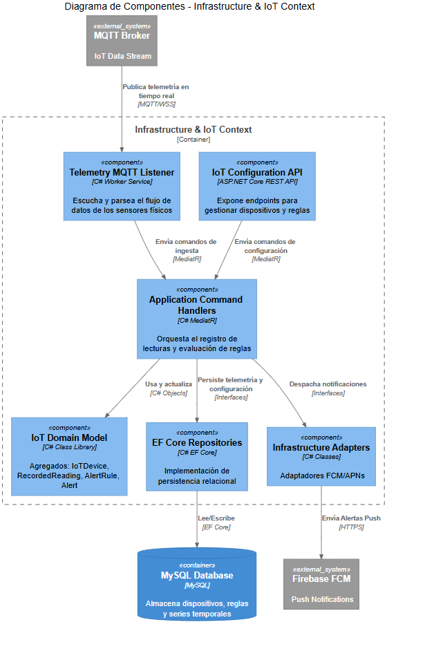

*Nota. Elaboración propia.*

#### 2.6.5.6 Bounded Context Software Architecture Code Level Diagrams

Los diagramas detallan cómo las lecturas son ingeridas, evaluadas mediante reglas de umbral y persistidas de manera escalable.

##### 2.6.5.6.1 Bounded Context Domain Layer Class Diagrams

El UML resalta cómo `RecordedReading` es evaluado a través de `AlertRule` para generar una `Alert` técnica.

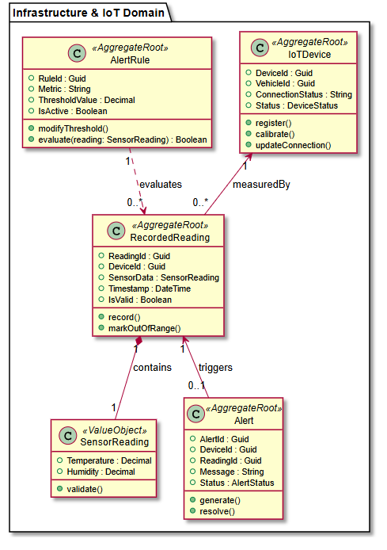

*Nota. Elaboración propia.*

##### 2.6.5.6.2 Bounded Context Database Design Diagram

El diseño lógico asocia lecturas con dispositivos de forma eficiente, separando las reglas de negocio de los registros masivos de series temporales (telemetría).

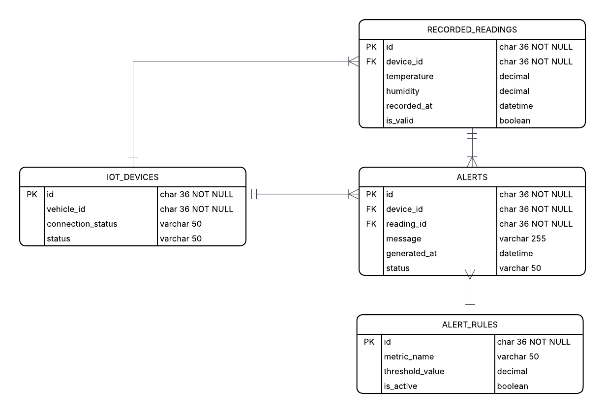

*Nota. Elaboración propia.*

### 2.6.6 Bounded Context: Logistics and Monitoring

El Logistics and Monitoring Context gestiona el seguimiento en tiempo real, despacho y monitoreo de entregas de lotes agrícolas. Su límite arquitectónico aísla la telemetría GPS, la gestión de alertas operativas y la trazabilidad de rutas, asegurando que la logística de transporte permanezca desacoplada de la autenticación de usuarios y del control de calidad en origen.

#### 2.6.6.1 Domain Layer

Las entidades, objetos de valor e interfaces identificadas en este Bounded Context son:

**Aggregate Roots**:
* **Alert**: Gobierna el ciclo de vida de las incidencias operativas y desviaciones en ruta, centralizando su tipo, nivel de severidad y estado de resolución.
* **Delivery**: Administra la orden de despacho y transporte del lote, orquestando los estados de tránsito, la asignación de conductor/vehículo y la trazabilidad telegráfica.

**Entities**:
* **TrackingLog**: Entidad dependiente asignada a una entrega (Delivery) que registra eventos cronológicos de telemetría, capturando coordenadas GPS y marcas de tiempo durante el trayecto.

**Value Objects**:
* **AlertSeverity**: Representa la escala de criticidad de las alertas en ruta (e.g., LOW, MEDIUM, HIGH, CRITICAL).
* **AlertType**: Clasifica la naturaleza de la alerta registrada (e.g., DELAY, TEMPERATURE_EXCEEDED, ROUTE_DEVIATION).
* **DeliveryStatus**: Define los estados permitidos dentro del flujo logístico (e.g., PENDING, IN_TRANSIT, DELIVERED, DELAYED).
* **DriverInfo**: Encapsula los datos de identificación del conductor asignado a la unidad de transporte.
* **GpsCoordinates**: Modela la ubicación geográfica mediante pares numéricos de latitud y longitud.
* **RouteInfo**: Encapsula la información del punto de origen, destino y estimación de ruta.
* **VehicleInfo**: Agrupa las especificaciones operativas de la unidad de transporte asignada (placa y tipo de vehículo).

**Commands**:
* CreateAlertCommand
* CreateDeliveryCommand
* CreateTrackingLogCommand
* ReportDelayCommand
* ResolveAlertCommand
* StartDispatchCommand

**Queries**:
* GetAllActiveAlertsQuery
* GetAllDeliveriesQuery
* GetTrackingLogsByDeliveryIdQuery

**Domain Repositories**:
* IAlertRepository
* IDeliveryRepository
* ITrackingLogRepository

#### 2.6.6.2 Interfaces Layer

Expone contratos HTTP RESTful documentados para ser consumidos por el Frontend y aplicaciones cliente, permitiendo la interacción con la lógica de logística y monitoreo en tiempo real.

**Controladores API**:
* AlertsController
* DeliveriesController
* TrackingLogsController

**Resources (DTOs)**:
* AlertResource
* CreateDeliveryResource
* CreateTrackingLogResource
* DeliveryResource
* ReportDelayResource
* TrackingLogResource

**Assemblers (Mappers)**:
Clases de transformación limpia (AlertResourceFromEntityAssembler, CreateDeliveryCommandFromResourceAssembler, CreateTrackingLogCommandFromResourceAssembler, DeliveryResourceFromEntityAssembler, TrackingLogResourceFromEntityAssembler) que convierten entidades de dominio a Resources y DTOs a Comandos sin filtrar detalles internos del modelo.

#### 2.6.6.3 Application Layer

Implementa el patrón de segregación de responsabilidades de consulta y comando (CQRS) mediante servicios dedicados de comandos y consultas, orquestando las transacciones del flujo logístico a través de la unidad de trabajo y repositorios de dominio.

**Command Services**:
* IAlertCommandService: Interfaz pública para la gestión de comandos de alertas operativas.
* IDeliveryCommandService: Interfaz pública para la gestión del ciclo de vida de órdenes de entrega.
* ITrackingLogCommandService: Interfaz pública para el registro transaccional de puntos de rastreo.
* AlertCommandService: Servicio interno encargado de procesar comandos de resolución y creación de alertas (CreateAlertCommand, ResolveAlertCommand).
* DeliveryCommandService: Servicio interno responsable de procesar la creación, despacho y reporte de retrasos en las entregas (CreateDeliveryCommand, StartDispatchCommand, ReportDelayCommand).
* TrackingLogCommandService: Servicio interno que coordina la persistencia de logs de telemetría e incidencias geográficas (CreateTrackingLogCommand).

**Query Services**:
* IAlertQueryService: Interfaz pública para la consulta de alertas en ruta.
* IDeliveryQueryService: Interfaz pública para la consulta de entregas registradas.
* ITrackingLogQueryService: Interfaz pública para la lectura de la trazabilidad y logs de posicionamiento.
* AlertQueryService: Servicio interno encargado de ejecutar las lecturas de alertas activas (GetAllActiveAlertsQuery).
* DeliveryQueryService: Servicio interno responsable de coordinar la obtención general de órdenes de despacho (GetAllDeliveriesQuery).
* TrackingLogQueryService: Servicio interno que procesa el historial de localización por entrega (GetTrackingLogsByDeliveryIdQuery).

#### 2.6.6.4 Infrastructure Layer

**Persistencia Relacional (EFC)**:
Implementación de los repositorios de dominio sobre Entity Framework Core mediante AlertRepository, DeliveryRepository y TrackingLogRepository.

Esta capa gestiona la persistencia física de los Aggregate Roots (Delivery y Alert) junto a sus entidades dependientes (TrackingLog) y objetos de valor asociados (GpsCoordinates, RouteInfo, VehicleInfo, DriverInfo), encapsulando las consultas y operaciones I/O a la base de datos relacional sin acoplar las reglas de negocio de la capa de dominio.

### 2.6.6.5 Bounded Context Software Architecture Component Level Diagram

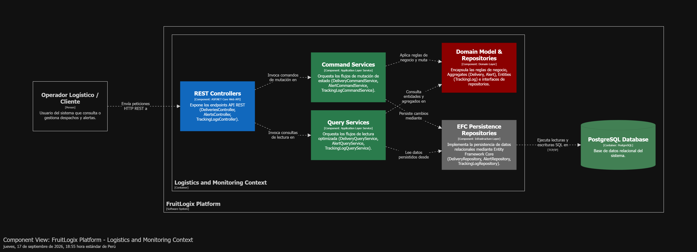

El diagrama de componentes de la arquitectura de software para el Bounded Context Logistics and Monitoring describe la organización interna y la interacción entre las capas tácticas de Domain-Driven Design (DDD) e infraestructura en C# (.NET). Se enfatiza la separación estricta entre el flujo de escritura y comandos (CommandServices) y el flujo de consulta y lectura (QueryServices), garantizando un desacoplamiento limpio alineado a la arquitectura Hexagonal/Clean Architecture.

#### 2.6.6.6 Bounded Context Software Architecture Code Level Diagrams

##### 2.6.6.6.1 Bounded Context Domain Layer Class Diagram

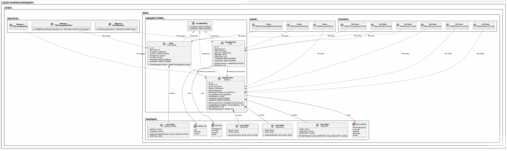

En el paquete superior de repositorios se declaran las interfaces IDeliveryRepository, IAlertRepository e ITrackingLogRepository, las cuales encapsulan las consultas asíncronas especializadas (FindActiveAlertsAsync, FindByDeliveryIdAsync) aislando la lógica de negocio de las operaciones de persistencia. En el núcleo del modelo, el Aggregate Root Delivery gobierna el flujo operativo del despacho (PendingDispatch, InTransit, Delayed, etc.) integrando los Value Objects inmutables DriverInfo, VehicleInfo y RouteInfo.

A su vez, la raíz de agregado Alert gestiona las incidencias en tiempo real acopladas al tipo y nivel de severidad (AlertType, AlertSeverity), mientras que la entidad TrackingLog registra las lecturas de telemetría e hidrotermia compuestas con el Value Object GpsCoordinates. Todas las entidades principales extienden IAuditableEntity para mantener la trazabilidad temporal (CreatedAt, UpdatedAt). Finalmente, los paquetes Commands y Queries orquestan las intenciones de mutación y lectura bajo el patrón CQRS, desacoplando los servicios de aplicación del modelo de dominio.

##### 2.6.6.6.2 Bounded Context Database Design Diagram

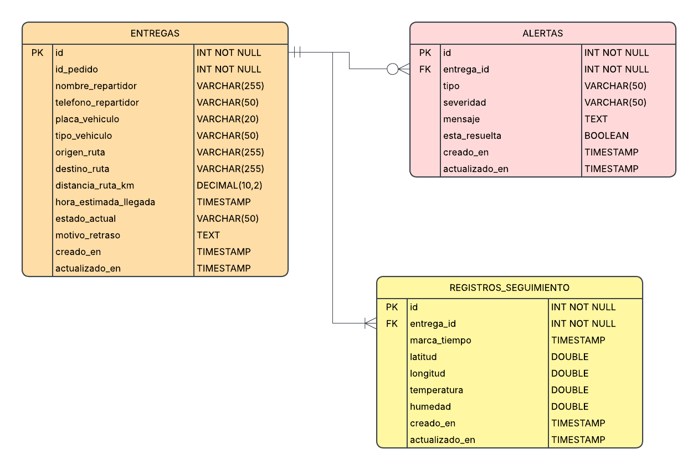

El diagrama de base de datos relacional para el Bounded Context Logistics and Monitoring modela la persistencia física de las raíces de agregado y entidades subordinadas del dominio operativo, garantizando la consistencia transaccional y la integridad referencial de los despachos.

La tabla principal deliveries actúa como la entidad central del contexto, aplanando los Objetos de Valor inmutables (driver_name, driver_phone, vehicle_plate, route_origin, etc.) directamente en columnas de la tabla para optimizar la velocidad I/O y simplificar las consultas relacionales. Se vincula mediante una relación de uno a muchos (1:N) con la tabla alerts a través de la clave foránea delivery_id, permitiendo el registro auditor de incidencias clasificadas por severidad y tipo.

Asimismo, la tabla deliveries se relaciona con cardinalidad de uno a muchos (1:N) con la tabla tracking_logs, la cual almacena de forma cronológica la telemetría GPS (latitude, longitude) y las lecturas ambientales de temperatura y humedad registradas durante el trayecto. Cada una de estas tablas incorpora las columnas auditables created_at y updated_at para respaldar los sellos de tiempo exigidos por el contrato IAuditableEntity, manteniendo un esquema de datos relacional altamente indexado y alineado a las necesidades de monitoreo en tiempo real.

### 2.6.7 Bounded Context: Payment Management

`Payment Management` conserva la facturación, los métodos de pago, el procesamiento de transacciones y los reembolsos[cite: 11]. Una operación comercial en *Order Management* inicia la facturación, pero el ciclo de vida del pago, la interacción con la pasarela y la emisión del comprobante PDF son responsabilidad exclusiva de este contexto[cite: 11].

#### 2.6.7.1 Domain Layer

El dominio protege el ciclo de vida de la factura, el procesamiento de la transacción y las reglas financieras[cite: 11]. Las referencias a pedidos (`OrderId`) o clientes (`CommercialClientId`) son identificadores externos; este contexto no administra sus ciclos de vida operativos.

| Clase | Categoría | Propósito | Atributos / inputs clave | Operaciones principales | Relaciones / ownership |
| :--- | :--- | :--- | :--- | :--- | :--- |
| `Invoice` | Aggregate Root | Mantener facturación de operaciones. | `InvoiceId`, `OrderId`, monto total, fecha, status. | `issue`, `markAsPaid`, `void`. | Compone `InvoicePDF` referencial. |
| `BillingInformation` | Aggregate Root | Mantener datos fiscales y métodos de pago. | `BillingInfoId`, `CommercialClientId`, datos fiscales. | `registerPaymentMethod`, `updateDetails`. | `CommercialClientId` tipado de Profiles BC. |
| `Transaction` | Aggregate Root | Registrar ejecución inmutable de un pago. | `TransactionId`, `InvoiceId`, método, monto, status. | `confirm`, `fail`. | Referencia `Invoice` por ID; no es hijo. |
| `Refund` | Entity | Mantener estado de solicitud de reembolso. | `RefundId`, monto, razón, status. | `request`, `approve`, `reject`. | Propiedad de `Transaction`. |
| `PaymentPolicy` | Domain Policy | Evaluar viabilidad de pago y límites de reembolso. | estado de factura, monto transaccional. | `canProcessPayment`, `canRefund`. | Pura; sin I/O ni llamadas externas. |
| `InvoiceRepository`, `BillingInformationRepository` | Repository interfaces | Cargar y guardar roots de facturación independientes. | IDs tipados y roots. | `byId`, `save`. | Implementaciones MySQL con EF Core. |
| `TransactionRepository` | Repository interfaces | Cargar y guardar historial de pagos y transacciones. | IDs tipados y roots. | `byId`, `save`. | No accede a la pasarela externa directamente. |

#### 2.6.7.2 Interface Layer

La interfaz recibe comandos financieros con autorización del servidor. Delega la integración con sistemas externos (como Stripe) a la capa de infraestructura.

| Clase | Categoría | Propósito | Inputs clave | Operaciones principales | Colaboradores |
| :--- | :--- | :--- | :--- | :--- | :--- |
| `InvoiceController` | REST Controller | Exponer ciclo de vida de facturación. | actor, scope, `OrderId`, versión. | `issueInvoice`, `getInvoiceDetails`. | Handlers de facturación. |
| `PaymentController` | REST Controller | Iniciar y confirmar pagos vía Webhooks. | payload de pasarela, firma, `InvoiceId`. | `initiatePayment`, `handlePaymentWebhook`. | Handlers de transacción. |
| `BillingController` | REST Controller | Administrar perfiles de facturación de clientes. | actor, `CommercialClientId`, datos. | `updateBillingInfo`, `addPaymentMethod`. | Handlers de facturación. |

#### 2.6.7.3 Application Layer

Application orquesta los roots independientes, valida reglas de negocio financieras y coordina las llamadas a servicios de infraestructura externos (S3, Email, Pasarela)[cite: 11].

| Clase | Categoría | Propósito | Inputs clave | Operaciones principales | Colaboradores |
| :--- | :--- | :--- | :--- | :--- | :--- |
| `IssueInvoiceCommandHandler` | Command Handler | Generar y emitir factura basada en un pedido. | `OrderId`, monto, actor. | `handle`. | `InvoiceRepository`, `PdfGenerationService`. |
| `InitiatePaymentTransactionCommandHandler`| Command Handler | Crear transacción pendiente e invocar pasarela. | `InvoiceId`, método de pago, actor. | `handle`. | `TransactionRepository`, `PaymentGateway`. |
| `ConfirmTransactionCommandHandler` | Command Handler | Confirmar pago desde webhook seguro. | `TransactionId`, confirmación externa. | `handle`. | `TransactionRepository`, `InvoiceRepository`. |
| `RequestRefundCommandHandler` | Command Handler | Registrar y evaluar solicitud de reembolso. | `TransactionId`, monto, razón. | `handle`. | `TransactionRepository`, `PaymentPolicy`. |
| `SendInvoiceEmailCommandHandler` | Command Handler | Despachar PDF al cliente tras pago exitoso. | `InvoiceId`, email destino. | `handle`. | `EmailService`, `DocumentStorage`. |

#### 2.6.7.4 Infrastructure Layer

Infrastructure implementa los repositorios con Entity Framework Core (MySQL) y contiene los adaptadores reales que interactúan con la pasarela de pagos, S3 y servicios de correo electrónico[cite: 11].

| Clase | Categoría | Propósito | Inputs / datos | Operaciones principales | Colaboradores |
| :--- | :--- | :--- | :--- | :--- | :--- |
| `MySqlInvoiceRepository` | Repository implementation | Mapear Invoice y referencias a PDF. | invoice records. | `byId`, `save`. | `InvoiceRepository`, AppDbContext (EF Core). |
| `MySqlTransactionRepository` | Repository implementation | Mapear transacciones y reembolsos. | transaction records. | `byId`, `save`. | `TransactionRepository`, AppDbContext (EF Core). |
| `StripePaymentGatewayAdapter`| External System Adapter | Procesar cargos y validar webhooks financieros. | tokens, montos, firmas webhooks. | `charge`, `validateSignature`. | API de Stripe. |
| `S3DocumentStorageAdapter` | External System Adapter | Almacenar y recuperar Invoice PDFs. | byte array, object key. | `uploadPdf`, `getPresignedUrl`. | AWS S3 SDK. |
| `SmtpEmailServiceAdapter` | External System Adapter | Entregar comprobantes al cliente comercial. | plantilla, email, adjuntos. | `sendEmail`. | Servidor SMTP / SendGrid. |

#### 2.6.7.5 Bounded Context Software Architecture Component Level Diagrams

La vista C4 L3 separa la API financiera, los casos de uso, el modelo de dominio y la persistencia en MySQL. Las interacciones con Stripe y AWS S3 se manejan a través de puertos y adaptadores.

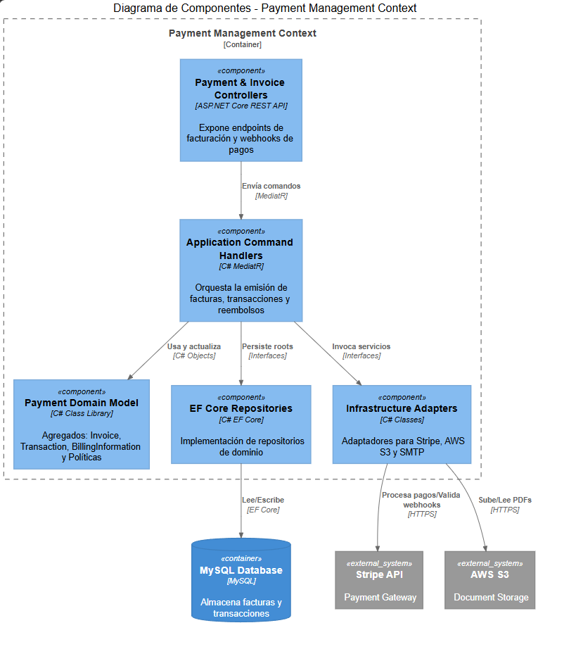

#### 2.6.7.6 Bounded Context Software Architecture Code Level Diagrams

Los diagramas muestran los roots financieros y cómo las entidades se relacionan sin acoplarse directamente a otros contextos mediante bases de datos.

##### 2.6.7.6.1 Bounded Context Domain Layer Class Diagrams

El UML mantiene `Invoice`, `Transaction` y `BillingInformation` como raíces independientes con un ciclo de vida financiero.

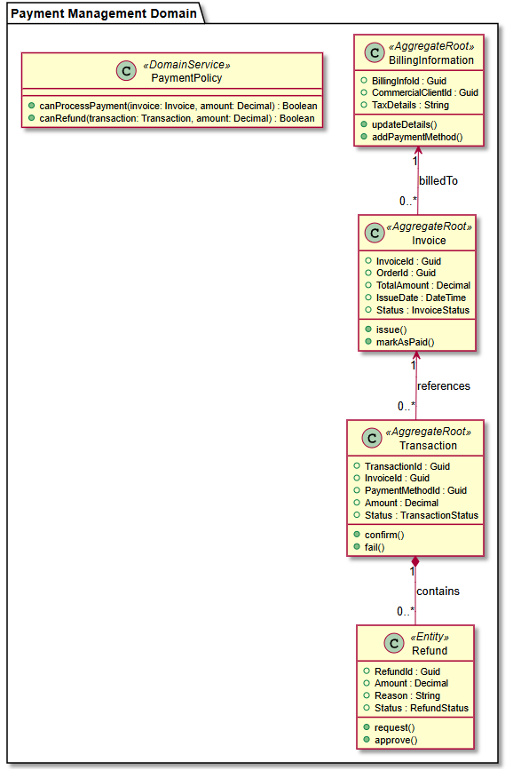

##### 2.6.7.6.2 Bounded Context Database Design Diagram

El diagrama lógico conserva las claves foráneas (FK) para relaciones locales; `order_id` y `commercial_client_id` permanecen como identificadores externos de otros contextos.

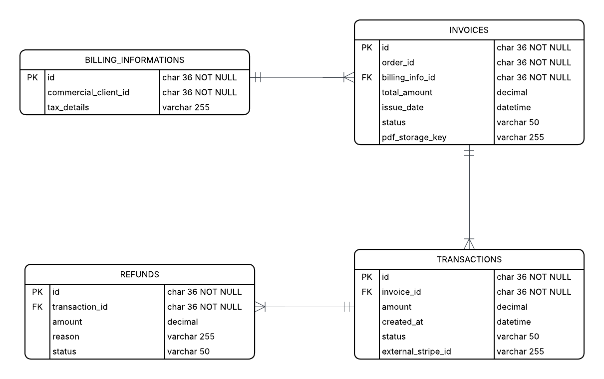

