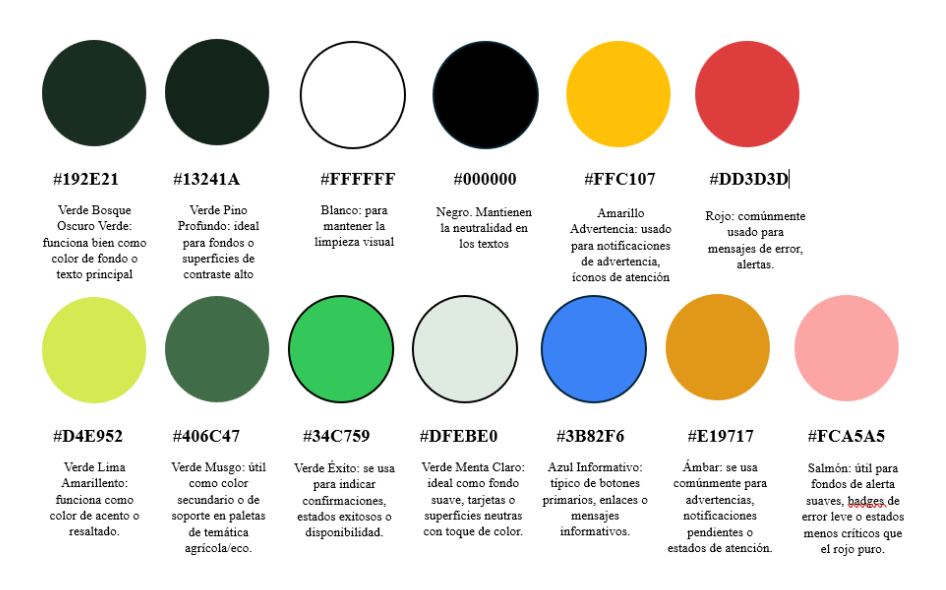

### 3.1.1. Style Guidelines

Las Style Guidelines de FruitLogix establecen una base visual común para los productos digitales de la solución: la Landing Page, la aplicación móvil nativa para Android y la aplicación móvil cross-platform. El objetivo es mantener una identidad consistente entre productos, facilitar el reconocimiento de los elementos de interfaz y reducir la carga cognitiva durante las tareas operativas.

#### 3.1.1.1. General Style Guidelines

##### Identidad visual

La identidad visual de FruitLogix se orienta al contexto agrícola y logístico del producto. Se busca transmitir confianza, control y claridad mediante una combinación de tonos verdes asociados al sector agrícola, colores neutros para superficies y texto, y colores semánticos para comunicar estados del sistema.

La interfaz debe mantener una apariencia limpia y funcional, evitando elementos decorativos que compitan con la información operativa. Las decisiones visuales se aplican de manera consistente tanto en la Landing Page como en las aplicaciones móviles.

##### Principios de diseño

**Simplicidad.**  
Las interfaces priorizan las tareas principales y reducen la cantidad de elementos visibles de manera simultánea. La información secundaria se presenta de forma progresiva para facilitar la comprensión en pantallas móviles.

**Consistencia.**  
Los colores, tipografías, iconos, espaciados, estados y componentes mantienen criterios uniformes entre las distintas experiencias de FruitLogix. Esto permite que los usuarios reconozcan patrones de interacción y disminuye la curva de aprendizaje.

**Jerarquía visual.**  
La información se organiza según su importancia. Estados críticos como retrasos, incidencias, rechazos o alertas de telemetría deben distinguirse de la información complementaria mediante contraste, posición, tipografía y color.

**Accesibilidad.**  
Se priorizan tamaños de texto legibles, contraste suficiente entre contenido y fondo, etiquetas comprensibles y áreas táctiles adecuadas. La información relevante no debe depender únicamente del color, sino apoyarse también en texto, iconos o estados explícitos.

**Adaptación móvil.**  
Las experiencias móviles priorizan contenido vertical, interacción táctil y acciones de uso frecuente. Las interfaces deben conservar claridad en diferentes tamaños de pantalla sin trasladar directamente patrones propios de aplicaciones web de escritorio.

##### Paleta de colores

La paleta heredada de FruitLogix se conserva como base de la identidad visual y se organiza según su función dentro de la interfaz.

| Category | Color | Hex | Uso principal |
|---|---|---|---|
| Primary | Verde Bosque Oscuro | `#192E21` | Identidad principal, fondos o elementos de alto énfasis |
| Primary Dark | Verde Pino Profundo | `#13241A` | Fondos oscuros y superficies de alto contraste |
| Secondary | Verde Musgo | `#406C47` | Elementos secundarios relacionados con la identidad agrícola |
| Accent | Verde Lima | `#D4E952` | Acentos y elementos que requieren resalte |
| Success | Verde Éxito | `#34C759` | Confirmaciones y estados satisfactorios |
| Surface | Verde Menta Claro | `#DFEBE0` | Fondos suaves y superficies secundarias |
| Information | Azul Informativo | `#3B82F6` | Acciones informativas, enlaces o elementos destacados |
| Warning | Amarillo | `#FFC107` | Advertencias y llamadas de atención |
| Attention | Ámbar | `#E19717` | Estados pendientes o de atención |
| Error | Rojo | `#DD3D3D` | Errores, rechazos o estados críticos |
| Error Surface | Salmón | `#FCA5A5` | Fondos de alertas o estados de error de menor intensidad |
| Neutral | Blanco / Negro | `#FFFFFF` / `#000000` | Superficies, texto y contraste |

El uso de colores semánticos debe ser consistente: verde para estados satisfactorios, amarillo o ámbar para advertencias y pendientes, rojo para errores o rechazos, y azul para información o acciones de navegación.

##### Tipografía

FruitLogix adopta **Poppins** y **Roboto** como familias tipográficas principales. Poppins se utiliza principalmente en títulos y elementos de mayor jerarquía, mientras que Roboto se utiliza en contenido de lectura, formularios, etiquetas y mensajes de la interfaz.

| Text style | Typeface | Uso |
|---|---|---|
| Display / Heading | Poppins | Títulos principales y encabezados de pantalla |
| Section Title | Poppins | Títulos de secciones, cards y agrupaciones |
| Body | Roboto | Texto principal, descripciones y contenido operativo |
| Label | Roboto | Botones, campos, estados y etiquetas breves |
| Supporting Text | Roboto | Información secundaria, ayudas y mensajes complementarios |

En aplicaciones móviles los tamaños deben implementarse mediante unidades escalables de texto y estilos tipográficos del sistema de diseño correspondiente, evitando depender de valores fijos en píxeles. En Android con Jetpack Compose, la jerarquía tipográfica se integrará mediante el sistema de temas de Material Design 3.

##### Spacing

Se mantiene un sistema de espaciado basado en múltiplos de 8 para conservar ritmo y consistencia visual:

- **8** → separación mínima entre elementos relacionados.
- **16** → separación estándar entre componentes.
- **24** → separación entre grupos o secciones.
- **32 o más** → separación de bloques principales.

En las aplicaciones móviles estos valores se implementan mediante unidades independientes de densidad o su equivalente en el framework utilizado.

##### Tono de comunicación

El tono de FruitLogix se define de la siguiente manera:

- **Serio pero accesible**, debido al contexto operativo y logístico.
- **Formal pero claro**, evitando tecnicismos innecesarios en la interfaz.
- **Respetuoso**, considerando los distintos perfiles y niveles de experiencia digital.
- **Sereno y funcional**, priorizando la comprensión de estados, acciones y resultados.

Los mensajes de error deben explicar qué ocurrió y qué acción puede realizar el usuario. Las confirmaciones deben ser breves y directas, mientras que las advertencias deben señalar claramente el impacto de continuar con una acción.

##### Referencia de diseño

FruitLogix toma como referencia **Material Design 3** para la experiencia nativa Android, especialmente en el uso de temas, componentes, jerarquía visual, estados y patrones de interacción. Esta referencia se adapta a la identidad propia del producto y se mantiene coherente con la aplicación cross-platform y la Landing Page, sin trasladar automáticamente patrones de escritorio a las experiencias móviles.
