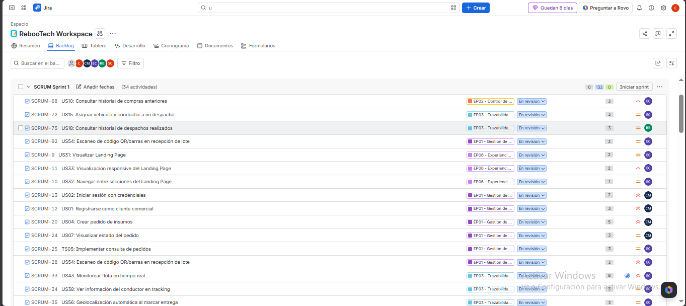
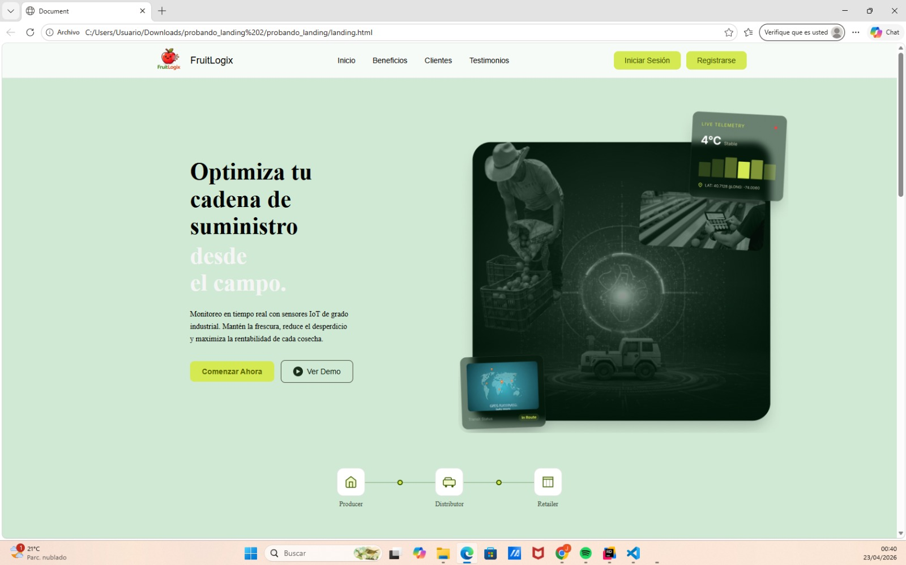
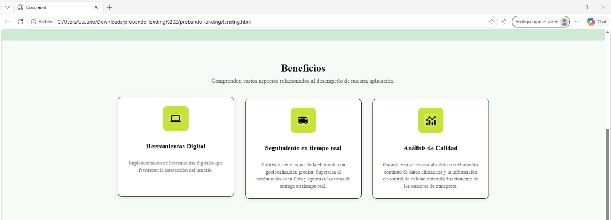
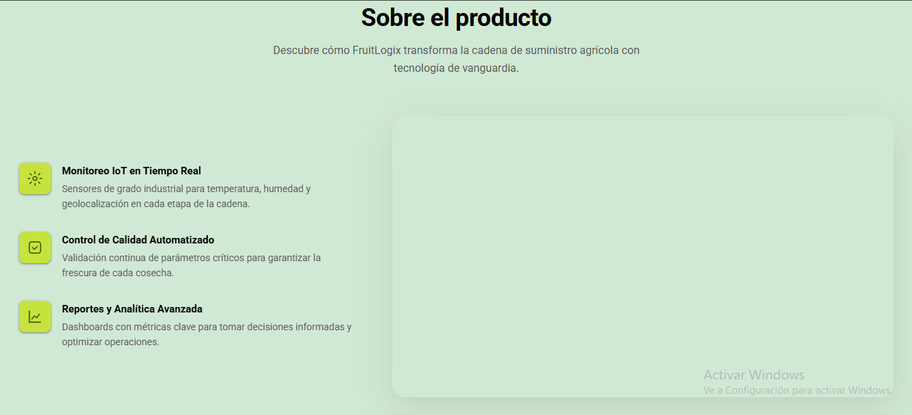
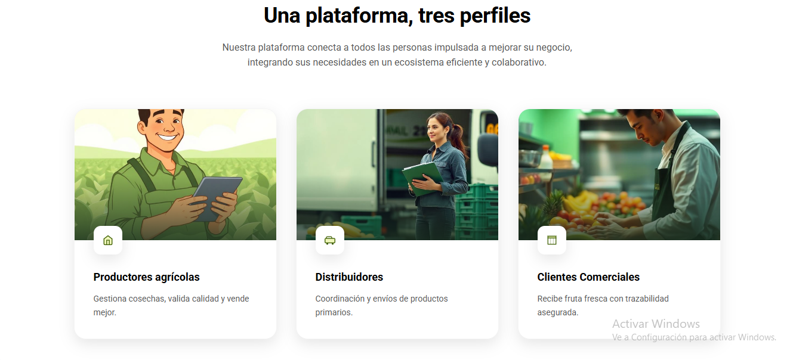
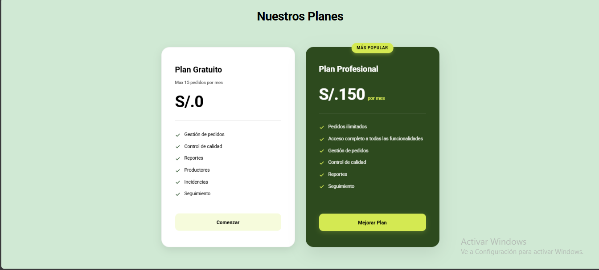
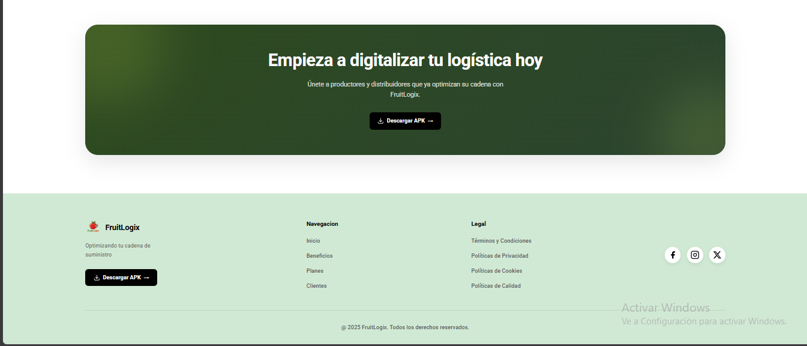

## 4.2. Landing Page, Services & Applications Implementation.
En esta sección se describe el proceso de implementación del producto FruitLogix, incluyendo el desarrollo del sitio web estático, la integración de servicios y el despliegue de las aplicaciones; pues todas ellas constituyen etapas críticas del proyecto. Esta fase permite materializar los requerimientos técnicos y funcionales en código ejecutable, transformando conceptos iniciales en un producto robusto y orientado a satisfacer las necesidades de los usuarios objetivo.

### 4.2.1. Sprint 1
El primer sprint de nuestro proyecto posee una gran importancia en lo que refiere al proceso de desarrollo ágil. A lo largo de este periodo, se ha dado un enfoque con mayor énfasis en la implementación de componentes fundamentales para el producto, siendo estos la Landing Page, el Backend y una versión inicial de la aplicación móvil nativa.

#### 4.2.1.1. Sprint Planning 1.

La sesión de Sprint Planning tiene como fin analizar el rendimiento previo y establecer las metas técnicas de esta iteración. El equipo definirá y estimará las historias prioritarias del backlog para asignar responsabilidades. Esto garantizará la alineación operativa, una integración técnica continua y un plan de entrega bien estructurado

| Campo / Sección | Detalle |
| :--- | :--- |
| Sprint # | Sprint 1 |
| Sprint Planning Background | |
| Date | 2026-09-30 |
| Time | 4:00 PM |
| Location | Google Meet |
| Prepared By | Bojórquez Bustinza, Renzo Alejandro |
| Attendees (to planning meeting) | Bojórquez Bustinza, Renzo Alejandro / Chavez Bardales, Esteban Eduardo / Cochachi Chagua, Sebastián Josué / Marin Cueva, Cesar Fernando / Otiniano Rosales, Camila Alizée |
| Sprint Review Summary | Al tratarse del primer sprint, no se cuenta con iteraciones previas. En su lugar, el alcance y las metas se establecieron a partir de los requerimientos estructurados en el Product Backlog y los artefactos de diseño de la Landing Page desarrollados con anterioridad. |
| Sprint Retrospective Summary | No aplica para esta iteración. No obstante, el equipo estableció como compromiso transversal asegurar una distribución equitativa de las cargas de trabajo y fomentar una comunicación continua y transparente desde el inicio de la etapa de desarrollo. |
| Sprint 1 Goal | Nuestro enfoque se centra en establecer el canal de captación digital y habilitar el núcleo operativo de la plataforma conectando los flujos móviles clave con los servicios backend desplegados. Creemos que esto entregará una Landing Page terminada y orientada a la conversión, un backend con al menos el 70% de sus funcionalidades base operativas en entorno de despliegue, y las pantallas core de la app móvil listas para la interacción del usuario.  Esto será confirmado cuando la Landing Page registre interacción en sus llamados a la acción y se demuestre un flujo operativo fluido en la aplicación móvil al comunicarse con la API desplegada. |
| Sprint 1 Velocity | El equipo ha establecido un Velocity de ## Story Points, que representa la capacidad máxima de esfuerzo que los developers pueden aceptar de manera realista para este Sprint 1. |
| Sum of Story Points | 132 |

#### 4.2.1.2 Aspect Leaders and Collaborators

En esta sección se define la matriz de liderazgo y colaboración (LACX) del Sprint 1, la cual permite identificar
claramente las responsabilidades de cada integrante del equipo en los distintos aspectos del desarrollo.

Para este sprint, los principales aspectos considerados están relacionados con la implementación del Landing Page, despliegue del backend, y creación de la primera versión de
la aplicación móvil.

| Team Member (Last Name, First Name) | GitHub Username | UX/UI Design | Landing Page | Documentation | Modeling |
|------------------------------------|----------------|-------------|-------------|--------------|----------|
| Bojórquez Bustinza, Renzo Alejandro | DeterminedSoul7 | C | C | C | L |
| Chavez Bardales, Esteban Eduardo | ECEB0704 | C | L | L | C |
| Cochachi Chagua, Sebastian Josue | sebastiancochachi02-cmd | C | C | C | C |
| Pinedo Sanchez, Sebastián Martín | Cmarin2802 | L | C | C | C |
| Otiniano Rosales, Camila Alizée | CamilaaAlizee | L | C | C | C |

#### 4.2.1.3 Sprint Backlog 1

El objetivo del presente Sprint fue el diseño y desarrollo de la landing page del sistema Aquanetix, enfocándose en la comunicación efectiva de la propuesta de valor, la presentación de funcionalidades clave y la facilitación del contacto con potenciales usuarios.

Durante este Sprint, el equipo trabajó de manera colaborativa en la construcción de las diferentes secciones de la landing page, asegurando una experiencia de usuario clara, intuitiva y alineada con los objetivos del sistema.

  

Enlace a la herramienta utilizada: [...](https://rebootech-fruitlogix-202620.atlassian.net/jira/software/projects/SCRUM/boards/1/backlog?atlOrigin=eyJpIjoiOWFlZjE1OWMzMWU3NGMxOGJkYjM2ZDI2NmZhZTkyYTAiLCJwIjoiaiJ9)

A continuación, se detallan las User Stories priorizadas y las tareas asociadas:

| US Id | Title | Task Id | Task Title | Description | Estimation (Hours) | Assigned To | Status |
|---|---|---|---|---|---|---|---|
| US10 | Consultar historial de compras anteriores | SCRUM-68 | Consultar historial de compras anteriores | Muestra el listado de compras previas realizadas por el usuario con detalles y fechas. | 3 | Esteban Chavez| Done |
| US15 | Asignar vehículo y conductor a un despacho | SCRUM-72 | Asignar vehículo y conductor a un despacho | Permite vincular una unidad de transporte y un chofer asignado a una orden de despacho. | 3 |Esteban Chavez | Done |
| US18 | Consultar historial de despachos realizados | SCRUM-75 | Consultar historial de despachos realizados | Despliega el registro histórico de todos los envíos finalizados con sus estados. | 3 | Renzo Bojorquez| Done |
| US54 | Escaneo de código QR/barras en recepción de lote | SCRUM-92 | Escaneo de código QR/barras en recepción de lote | Habilita la lectura de códigos de barras o QR para validar la entrada de un lote. | 3 | Esteban Chavez| Done |
| US31 | Visualizar Landing Page | SCRUM-9 | Visualizar Landing Page | Pagina principal informativa de la plataforma orientada a usuarios no autenticados. | 2 |Esteban Chavez | Done |
| US33 | Visualización responsive del Landing Page | SCRUM-11 | Visualización responsive del Landing Page | Adaptación del diseño y componentes de la Landing Page para dispositivos móviles y tablets. | 2 | Esteban Chavez| Done |
| US32 | Navegar entre secciones del Landing Page | SCRUM-10 | Navegar entre secciones del Landing Page | Menú de navegación suave y accesos directos dentro de la Landing Page. | 1 |Esteban Chavez | Done |
| US02 | Iniciar sesión con credenciales | SCRUM-13 | Iniciar sesión con credenciales | Formulario de autenticación con correo y contraseña con validación de seguridad. | 2 | Cesar Marin | Done |
| US01 | Registrarse como cliente comercial | SCRUM-12 | Registrarse como cliente comercial | Formulario de registro para empresas o clientes comerciales para crear cuenta. | 3 |Cesar Marin | Done |
| US04 | Crear pedido de insumos | SCRUM-20 | Crear pedido de insumos | Interfaz para solicitar nuevos insumos seleccionando catálogo y cantidades. | 5 |Cesar Marin | Done |
| US07 | Visualizar estado del pedido | SCRUM-24 | Visualizar estado del pedido | Seguimiento en tiempo real de las fases y estado actual de una solicitud. | 3 | Cesar Marin | Done |
| TS05 | Implementar consulta de pedidos | SCRUM-25 | Implementar consulta de pedidos | Servicio backend y visualización de búsqueda filtrada de pedidos realizados. | 3 |Esteban Chavez | Done |
| US54 | Escaneo de código QR/barras en recepción de lote | SCRUM-28 | Escaneo de código QR/barras en recepción de lote | Módulo secundario/tarea para integración de la cámara en el escaneo de recepciones. | 3 |Esteban Chavez | Done |
| US43 | Monitorear flota en tiempo real | SCRUM-33 | Monitorear flota en tiempo real | Mapa interactivo con la ubicación en vivo de todos los vehículos de la flota. | 8 |Esteban Chavez | Done |
| US38 | Ver información del conductor en tracking | SCRUM-34 | Ver información del conductor en tracking | Ficha de información del chofer visible desde la vista de seguimiento del envío. | 3 |Esteban Chavez | Done |
| US56 | Geolocalización automática al marcar entrega | SCRUM-35 | Geolocalización automática al marcar entrega | Captura automática de coordenadas GPS en el instante que el repartidor confirma la entrega. | 3 | Esteban Chavez| Done |
| US46 | Ver detalle de despacho con telemetría | SCRUM-39 | Ver detalle de despacho con telemetría | Visualización gráfica de datos de telemetría (velocidad, ruta) asociados a un despacho. | 5 | Esteban Chavez| Done |
| US45 | Monitorear sensores IoT | SCRUM-40 | Monitorear sensores IoT | Panel de telemetría e indicadores en tiempo real capturados por sensores en ruta. | 8 | Renzo Bojorquez| Done |
| US12 | Ver reportes de calidad dinámicos | SCRUM-41 | Ver reportes de calidad dinámicos | Generación de gráficos y reportes interactivos sobre métricas de calidad de lotes. | 5 | Esteban Chavez| Done |
| US44 | Gestionar incidencias operativas | SCRUM-42 | Gestionar incidencias operativas | Panel para reportar, categorizar y dar seguimiento a problemas en la operación. | 5 | Esteban Chavez| Done |
| US57 | Nota de voz para reportar incidencias | SCRUM-43 | Nota de voz para reportar incidencias | Funcionalidad de grabación y envío de audio para registro rápido de novedades. | 5 | Camila Otiniano | Done |
| US55 | Sincronización automática de datos offline | SCRUM-45 | Sincronización automática de datos offline | Mecanismo que sincroniza datos guardados localmente cuando se recupera conexión. | 8 | Camila Otiniano | In Process |
| US53 | Formulario de inspección de campo offline | SCRUM-46 | Formulario de inspección de campo offline | Formulario de evaluación utilizable sin conexión a internet en zonas remotas. | 5 |Camila Otiniano | Done |
| US20 | Ver dashboard general de distribución | SCRUM-52 | Ver dashboard general de distribución | Panel centralizado con métricas clave y métricas de desempeño de la red de distribución. | 5 | Esteban Chavez| Done |
| US41 | Invitar productor a la red | SCRUM-53 | Invitar productor a la red | Envío de invitaciones vía correo/enlace para incorporar productores a la plataforma. | 3 | Camila Otiniano | Done |
| US47 | Gestionar facturación | SCRUM-60 | Gestionar facturación | Módulo para consultar, emitir y registrar comprobantes de pago/facturas. | 5 |Esteban Chavez | Done |
| US42 | Ver KPIs de gestión de productores | SCRUM-61 | Ver KPIs de gestión de productores | Métricas de rendimiento, cumplimiento y producción de cada productor registrado. | 5 |Esteban Chavez | Done |
| US13 | Configurar alertas de temperatura y humedad | SCRUM-70 | Configurar alertas de temperatura y humedad | Definición de umbrales límite para emitir notificaciones automáticas en transporte. | 3 |Esteban Chavez | Done |
| US17 | Registrar incidencia en la entrega | SCRUM-74 | Registrar incidencia en la entrega | Permite al transportista notificar contratiempos o daños al entregar el pedido. | 3 |Esteban Chavez | Done |
| US22 | Actualizar estado de un lote | SCRUM-77 | Actualizar estado de un lote | Modificación del estado actual de un lote en el flujo de procesamiento/cadena. | 2 |Esteban Chavez | Done |
| US27 | Configurar perfil de usuario | SCRUM-82 | Configurar perfil de usuario | Sección para editar datos personales, foto de perfil y preferencias de la cuenta. | 2 | Camila Otiniano | Done |
| SS01 | Integración de Telemetría IoT | SCRUM-93 | Integración de Telemetría IoT | Sección de Telemetría IoT | 8 |Renzo Bojorquez | Done |
| US08 | Filtrar catálogo  | SCRUM-66 | Filtrar catálogo por categoría y disponibilidad | Sección donde se filtra el catálogo por categoría y disponibilidad. | 2 |Cesar Marin | Done |
| US03 | Recuperar contraseña mediante correo  | SCRUM-31 | Recuperar contraseña mediante correo | Sección donde se puede recuperar contraseña mediante correo. | 3 |Cesar Marin | Done |

#### 5.2.1.4 Development Evidence for Sprint Review

En este Sprint se logró la implementación del Landing Page de FruitLogix, desarrollando su estructura principal en HTML y CSS, así como la navegación entre secciones y avances en su diseño responsive. De forma paralela, se avanzó en el desarrollo de la aplicación móvil en Android con Jetpack Compose, estructurando la arquitectura por Bounded Contexts e implementando módulos clave como la gestión de pedidos, facturación, monitoreo de infraestructura IoT, perfil de distribuidores, recepción logística y reporte de incidencias con grabación de audio.

El desarrollo se organizó mediante ramas de tipo feature en GitHub, permitiendo el trabajo coordinado e independiente en las distintas funcionalidades del ecosistema web y móvil. Los commits reflejan la construcción progresiva de las interfaces, la integración de lógica de dominio y el refinamiento de la experiencia de usuario.

A continuación, se presentan los commits más relevantes asociados al desarrollo del Sprint 1 para ambos repositorios.

| Repository | Branch | Commit Ids | Commit Message | Commit Message Body | Committed on (Date) |
|------------|--------|-----------|----------------|---------------------|---------------------|
| Fruitlogix-website | main | 1247d2895eb4c5a2f7ea4fd780f4f00fb5ca54a8 | chore: initial commit |  | 25/09/2026 |
| Fruitlogix-website | develop | 4f9d8344d561c1be443ff58bb1e874d80e6e85fa | fix: add APK download button to CTA section | Added a button to download the APK in the footer section. | 6/10/2026 |
|Fruitlogix-AppMobile  | main | 6bfa1959bf99b9e973187e353bf294f7f674e15a |chore: initial commit  |  | 2/10/2026 |
|Fruitlogix-AppMobile  | main  | 1f7e0009cf3f529a104d0ec32472463d9fbbedc5 | feat(bottom-navigation-more): update more button in bottom bar |  | 4/10/2026 |
| Fruitlogix-AppMobile | main | 0725fa8e00fc787de0b358ef7bef14cdccdfe10b | feat(order-management): implement order registration screen |  | 4/10/2026 |
|Fruitlogix-AppMobile  |  main | 9345654526bc0e6f5a7de236ab83a695bcb767ef|feat(order-management): implement order history screen|  | 4/10/2026 |
|Fruitlogix-AppMobile  | main | 8c9a5d39856f19e94d85c832c7bfb0cb85bc8861 | feat(payment-management): add billing domain and state|  |  4/10/2026|
|Fruitlogix-AppMobile  | main | bafe335bfba9c7930534f6e57d2d4994be335eca | feat(distributor-profile-management):implement distributor profile view and editing interface |  |5/10/2026  |
| Fruitlogix-AppMobile | main |  de42717db9c79c299d12135cca465ceb1a58e42c| feat(incident-report-audio): implement incident reporting with audio note recording and attachment |  | 5/10/2026 |
|Fruitlogix-AppMobile  | main | b07d2b446ddace7380f5b6a9cbe6d717b1e10eba | feat(logistics-arrivals): add inbound arrivals screen and geofence alert sheet |  |  5/10/2026|
|Fruitlogix-AppMobile  |main  |  0ad3befd9168ea2e2b57a534cc7e66cb62a5f927| feat(logistics-arrivals): add inbound arrivals screen and geofence alert sheet|  |  5/10/2026|
|Fruitlogix-AppMobile  | main|  93bb641ae1c6480b2d9517e04d853b95e4606add| refactor(payment-management): make invoice detail repository injectable |  |  5/10/2026|
|Fruitlogix-AppMobile  | main |  14993ab0c350e898bc880f825192f53d196f2812| feat(infrastructureIot):update strings for iot bounded context. |  |  5/10/2026|
|Fruitlogix-AppMobile  | main| b19edcd4913c75a1dd6855cafafdb314b52de051 | feat(infrastructureIot):implement sensors alerts ui state. |  |  5/10/2026|
|Fruitlogix-AppMobile  | main| f7dbafe6e437c5a4ead92bb53434f24ad03db5d6 | feat(fleet-drivers-vehicles): add drivers tab with driver cards, filters and license validity |  |  5/10/2026|

#### 4.2.1.5 Execution Evidence for Sprint Review

En esta sección se presentan evidencias de la ejecución de la landing page desarrollada durante el Sprint.

**Figura 1. Sección principal de la landing page**

  

**Figura 2. Sección beneficios**

  

**Figura 3. Sección de funcionalidades**

  

**Figura 4. Sección de clientes**

  

**Figura 5. Sección de testimonios**

  

**Figura 6. Sección de planes**

  

**Figura 7. Sección de del equipo**

  

**Figura 8. Sección final y llamado a la acción**

  

#### 4.2.1.6 Services Documentation Evidence for Sprint Review

En el presente Sprint no se implementaron Web Services ni endpoints backend funcionales, debido a que el alcance estuvo enfocado en la construcción de la primera versión del Landing Page estático y en el desarrollo de la arquitectura e interfaz gráfica del cliente móvil Android en Jetpack Compose.

Sin embargo, como parte del análisis de arquitectura e integración, se definieron los modelos de datos y la estructura de dominio necesaria para consumir futuros servicios RESTful. 
Estos servicios permitirán sincronizar la información del cliente móvil con los servidores de FruitLogix en iteraciones posteriores (incluyendo autenticación, sincronización offline de insumos e inspecciones de calidad, y descarga de reportes), los cuales serán documentados formalmente utilizando el estándar OpenAPI (Swagger) en los Sprints subsiguientes.

#### 4.2.1.7. Software Deployment Evidence for Sprint Review.

Para el Sprint 1, la estrategia de despliegue abarcó los dos entregables del ecosistema **FruitLogix**: la publicación del **Landing Page web estático** a través de GitHub Pages y la distribución de la **primera versión ejecutable de la aplicación móvil (APK de desarrollo)** para validación en dispositivos Android reales y simuladores.

### A. Despliegue de la Landing Page Web

El despliegue de la Landing Page de FruitLogix se realizó utilizando **GitHub Pages**, aprovechando sus capacidades para publicar sitios web estáticos de forma automatizada directamente desde el repositorio de código fuente.

* **Repositorio de código fuente:** GitHub (`Fruitlogix-website`)
* **Plataforma de despliegue:** GitHub Pages
* **Tipo de aplicación:** Landing Page estática (HTML5, CSS3, JavaScript)
* **URL de acceso público:** [https://github.com/UPC-RebooTech/Fruitlogix-website](https://github.com/UPC-RebooTech/Fruitlogix-website)

#### Proceso de Despliegue Web:
1. **Creación y Organización del Repositorio:** Se estructuró el repositorio en GitHub con los archivos web principales (`index.html`, hojas de estilo CSS y recursos multimedia), garantizando el correcto uso de rutas relativas.
2. **Subida de Código:** Se realizó el *push* a la rama principal (`main`) tras verificar la integridad de las secciones informativas y botones de acción.
3. **Configuración de GitHub Pages:** En la sección *Settings* del repositorio, se activó la opción de publicación de GitHub Pages asignando la rama `main` y la carpeta raíz (`/root`) como origen de la compilación.
4. **Publicación y Despliegue Continuo:** GitHub Pages procesó el repositorio y generó la URL pública de forma automática. Cada nuevo envío de cambios a la rama `main` actualiza la versión del sitio de forma transparente sin intervención manual.

### B. Despliegue y Distribución de la Aplicación Móvil (Android APK)

Para el cliente móvil de FruitLogix, se configuró la compilación nativa en Android Studio/Gradle para generar el paquete instalable binario (`.apk`), habilitando la prueba directa de las pantallas e interfaces construidas en Jetpack Compose.

* **Repositorio de código fuente:** GitHub (`Fruitlogix-AppMobile`)
* **Plataforma / Entorno de ejecución:** Android 8.0+ (API Level 26+)
* **Tecnología:** Kotlin / Jetpack Compose
* **Mecanismo de distribución:** Compilación de artefacto binario (`app-debug.apk`) y vinculación directa a los botones de descarga en la Landing Page web.

#### Proceso de Despliegue Móvil:
1. **Compilación de Artefactos de Desarrollo:** Se ejecutó el proceso de construcción en Gradle (`./gradlew assembleDebug`) para empaquetar los recursos del proyecto, dependencias y la navegación por *Bounded Contexts*.
2. **Generación del APK Ejecutable:** Se obtuvo el binario instalable con los módulos activos de *Profiles Management*, *Quality Control*, *Order Management* y *Payment Management*.
3. **Distribución Integrada:** El archivo binario APK se alojó y vinculó a la sección *Call-to-Action* (CTA) y botones del Landing Page, permitiendo a los evaluadores y miembros del equipo descargar e instalar la aplicación en dispositivos móviles para las pruebas del Sprint Review.

#### 4.2.1.8. Team Collaboration Insights during Sprint

Para el desarrollo de este primer sprint, todos los miembros del equipo desarrollaron y colaboraron de manera activa y continua. De tal modo, se muestra como evidencia los insights de cada miembro del equipo.

   

